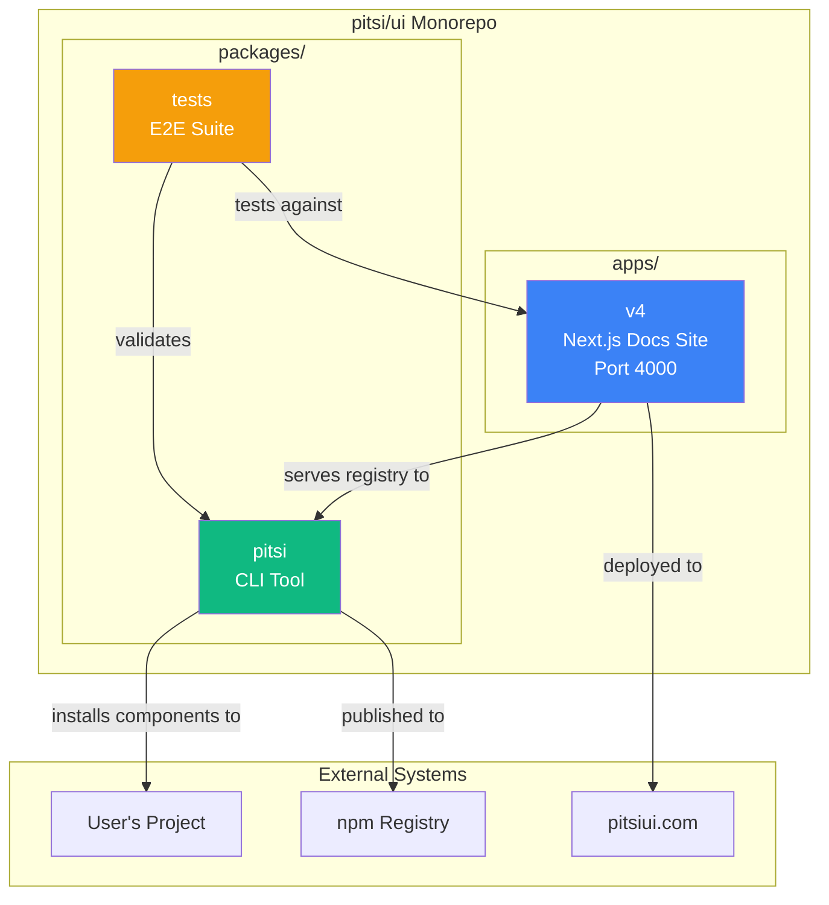

# pitsi/ui Internal Documentation

> Comprehensive technical documentation for contributors and maintainers

## Quick Navigation

### Architecture (Start Here)

| Document | Description |
|----------|-------------|
| [System Overview](./architecture/overview.md) | High-level architecture, package relationships, C4 diagrams |
| [Registry System](./architecture/registry-system.md) | Deep dive into the core registry architecture |
| [CLI Architecture](./architecture/cli-architecture.md) | CLI tool internals and design |
| [Documentation Site](./architecture/docs-site.md) | apps/v4 architecture and patterns |
| [Lib Utilities](./architecture/lib.md) | lib/ module architecture and APIs |
| [Turborepo](./architecture/turborepo.md) | Build orchestration and task pipelines |
| [Next.js Rendering](./architecture/nextjs-rendering.md) | Rendering strategy and caching |
| [Optimizations](./architecture/optimizations.md) | Performance optimizations across codebase |

### Subsystem Reference

#### apps/v4 (Documentation Site)

| Document | Description |
|----------|-------------|
| [Directory Structure](./subsystems/apps-v4/structure.md) | Every directory and file explained |
| [Lib Utilities](./subsystems/apps-v4/lib.md) | All utility functions documented |
| [Registry Format](./subsystems/apps-v4/registry-format.md) | Registry item schema reference |
| [API Routes](./subsystems/apps-v4/api-routes.md) | All API endpoints documented |

#### packages/pitsi (CLI Tool)

| Document | Description |
|----------|-------------|
| [Commands](./subsystems/cli/commands.md) | All CLI commands with options |
| [Dependency Resolution](./subsystems/cli/resolution.md) | How dependencies are resolved |
| [Registry API](./subsystems/cli/registry-api.md) | Registry fetching internals |

#### Scripts & Automation

| Document | Description |
|----------|-------------|
| [Build Registry](./subsystems/scripts/build-registry.md) | Registry build process |
| [Automation](./subsystems/scripts/automation.md) | CI/CD and other scripts |

### Registry Items

| Document | Description |
|----------|-------------|
| [Theming](./registry-items/theming.md) | How CSS variable theming works |
| [Design Guidelines](./registry-items/design-guidelines.md) | Visual design standards |
| [Blocks Best Practices](./registry-items/blocks-best-practices.md) | Creating high-quality blocks |
| [Block Props](./registry-items/block-props.md) | Block props architecture |

### Workflow Guides

| Document | Description |
|----------|-------------|
| [Adding a Component](./workflows/adding-component.md) | End-to-end component creation |
| [Development Setup](./workflows/development.md) | Local development workflow |
| [Publishing](./workflows/publishing.md) | CLI and registry publishing |
| [Contributing](./workflows/contributing.md) | How to contribute to pitsi/ui |
| [Automated Workflows](./workflows/automated-workflows.md) | Screenshots, image optimization, registry build |

### Personal

| Document | Description |
|----------|-------------|
| [TODO](./TODO.md) | Active tasks and priorities |
| [TODO_DONE](./TODO_DONE.md) | Completed task archive |
| [Personal Notes](./personal.md) | Private development notes |

---

## System at a Glance

## Core Concepts

### What is pitsi/ui?

pitsi/ui is a **component distribution system** that takes a different approach from traditional npm packages:

- **Copy, don't install**: Components are copied into your project's source code
- **Full ownership**: You own and can customize every line of code
- **No version lock-in**: Update components when you want, how you want
- **Schema-driven**: Registry defines components, dependencies, and metadata

### The Three Pillars

1. **Registry** - Declarative component definitions with schema validation
2. **CLI** - User-facing tool that fetches and installs components
3. **Documentation** - Live showcase and API reference

### Key Technologies

| Layer | Technology | Purpose |
|-------|------------|---------|
| Runtime | Bun | Package management, script execution |
| Build | Turborepo | Monorepo orchestration, caching |
| Frontend | Next.js 16 | Documentation site |
| Styling | Tailwind CSS 4 | Component styling with CSS variables |
| UI Primitives | Radix UI | Accessible component foundations |
| Schema | Zod | Runtime validation |
| CLI | Commander.js | Command-line interface |

---

## Reading Order for New Contributors

1. **[System Overview](./architecture/overview.md)** - Understand the big picture
2. **[Registry System](./architecture/registry-system.md)** - Learn the core architecture
3. **[Directory Structure](./subsystems/apps-v4/structure.md)** - Navigate the codebase
4. **[Development Setup](./workflows/development.md)** - Get running locally
5. **[Adding a Component](./workflows/adding-component.md)** - Make your first contribution

---

## Diagram Legend

Throughout these docs, you'll see various diagram types:

| Type | Purpose | Tool |
|------|---------|------|
| Flowchart | Data/control flow | Mermaid |
| Sequence | Request/response timing | Mermaid |
| State | State machines, lifecycles | Mermaid |
| C4 | System context and containers | Mermaid |
| Entity Relationship | Data schemas | Mermaid |
| Class | Code structure | Mermaid |

All diagrams use [Mermaid](https://mermaid.js.org/) syntax and render in GitHub/VS Code.
