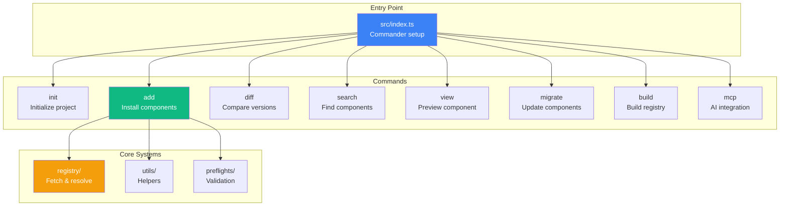
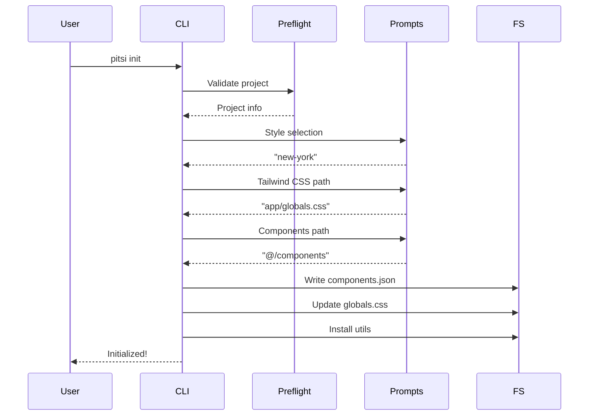
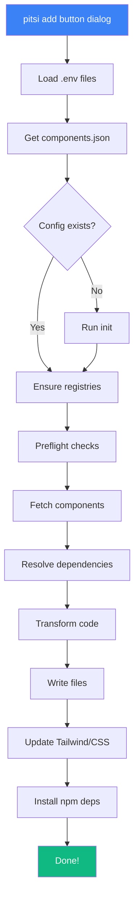
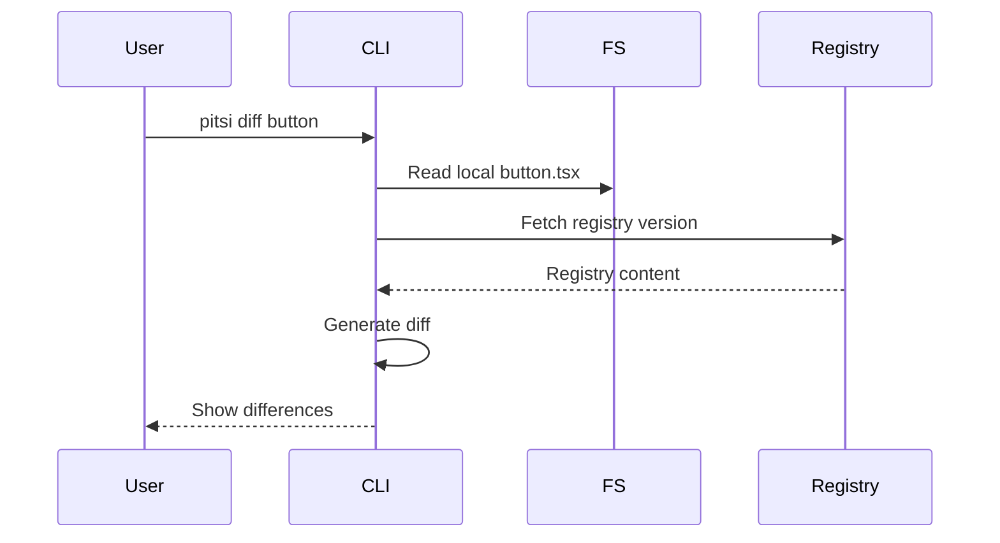
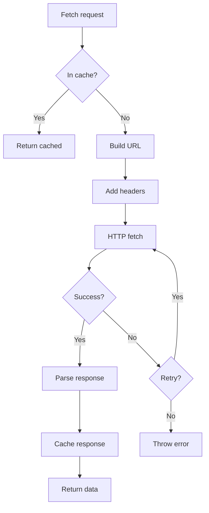
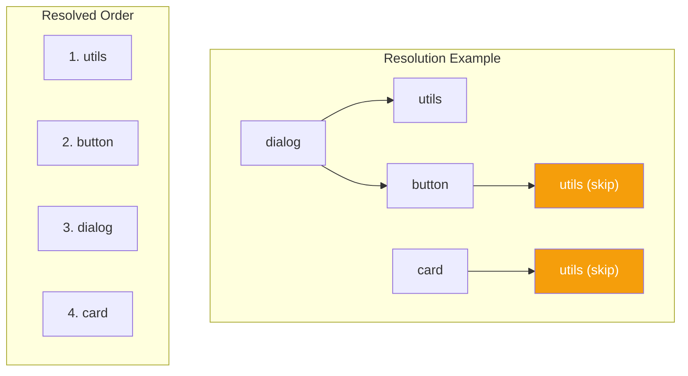
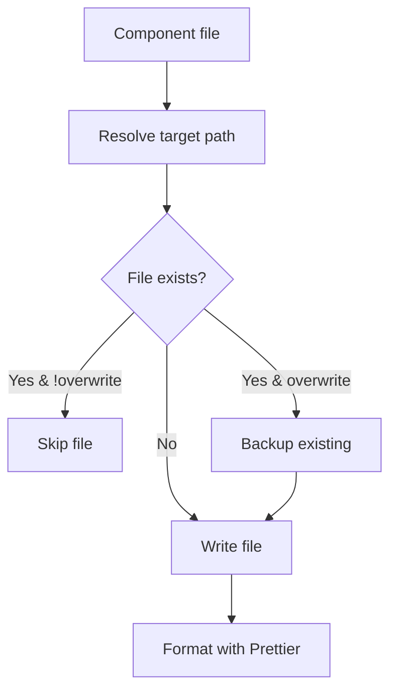
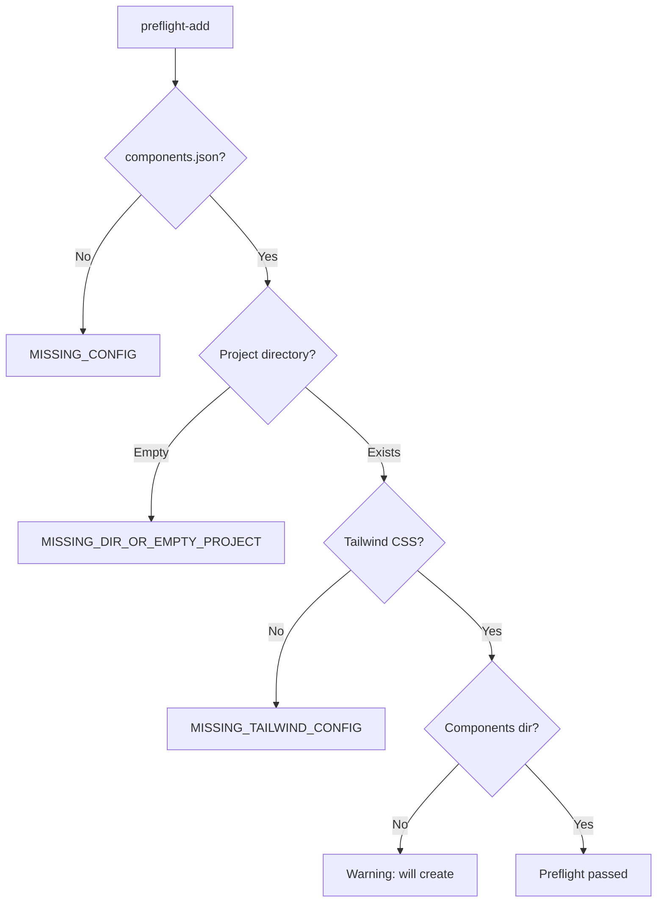
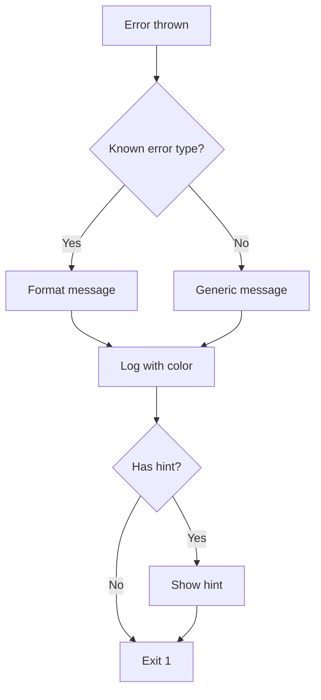

# CLI Architecture

> How the pitsi CLI tool works internally

## Overview

The CLI (`packages/pitsi`) is the user-facing tool that installs components from registries into user projects. It's built with:

- **Commander.js** - Command-line argument parsing
- **Zod** - Runtime validation
- **ts-morph** - AST manipulation for code transforms
- **@antfu/ni** - Package manager detection



---

## Directory Structure

```
packages/pitsi/src/
├── index.ts                 # CLI entry point
├── commands/
│   ├── init.ts              # Initialize project
│   ├── add.ts               # Add components
│   ├── diff.ts              # Show differences
│   ├── search.ts            # Search registry
│   ├── view.ts              # Preview component
│   ├── migrate.ts           # Migrate components
│   ├── build.ts             # Build local registry
│   ├── mcp.ts               # MCP server
│   ├── info.ts              # Project info
│   └── registry/
│       ├── build.ts         # Registry build command
│       └── mcp.ts           # Registry MCP
├── registry/
│   ├── api.ts               # Public API
│   ├── schema.ts            # Zod schemas
│   ├── fetcher.ts           # HTTP client
│   ├── resolver.ts          # Dependency resolution
│   ├── builder.ts           # URL building
│   ├── constants.ts         # Built-in registries
│   ├── context.ts           # Request context
│   ├── config.ts            # Config handling
│   ├── parser.ts            # Response parsing
│   ├── validator.ts         # Schema validation
│   ├── search.ts            # Search functionality
│   ├── namespaces.ts        # @scope handling
│   ├── env.ts               # Environment vars
│   ├── errors.ts            # Error types
│   ├── utils.ts             # Utilities
│   └── index.ts             # Re-exports
├── utils/
│   ├── add-components.ts    # Component installation
│   ├── get-config.ts        # Config loading
│   ├── get-project-info.ts  # Project detection
│   ├── get-package-manager.ts
│   ├── get-package-info.ts
│   ├── logger.ts            # CLI logging
│   ├── highlighter.ts       # Syntax highlighting
│   ├── errors.ts            # Error definitions
│   ├── handle-error.ts      # Error handling
│   ├── spinner.ts           # Progress spinner
│   ├── frameworks.ts        # Framework detection
│   ├── templates.ts         # Project templates
│   ├── icon-libraries.ts    # Icon handling
│   ├── env-loader.ts        # .env loading
│   ├── env-helpers.ts       # Env utilities
│   ├── registries.ts        # Registry helpers
│   ├── resolve-import.ts    # Import resolution
│   ├── file-helper.ts       # File operations
│   ├── is-safe-target.ts    # Path validation
│   ├── create-project.ts    # Project scaffolding
│   ├── update-app-index.ts  # Update page.tsx
│   ├── compare.ts           # Version comparison
│   ├── transformers/
│   │   ├── index.ts         # Transform pipeline
│   │   ├── transform-import.ts
│   │   ├── transform-rsc.ts
│   │   ├── transform-css-vars.ts
│   │   ├── transform-icons.ts
│   │   ├── transform-jsx.ts
│   │   ├── transform-next.ts
│   │   └── transform-tw-prefix.ts
│   └── updaters/
│       ├── update-files.ts
│       ├── update-dependencies.ts
│       ├── update-css-vars.ts
│       ├── update-css.ts
│       ├── update-env-vars.ts
│       ├── update-tailwind-config.ts
│       └── update-tailwind-content.ts
├── preflights/
│   ├── preflight-init.ts
│   ├── preflight-add.ts
│   ├── preflight-migrate.ts
│   ├── preflight-registry.ts
│   └── preflight-build.ts
├── migrations/
│   ├── migrate-icons.ts
│   └── migrate-radix.ts
├── mcp/
│   ├── index.ts             # MCP server
│   └── utils.ts             # MCP utilities
└── schema/
    └── index.ts             # Re-exports schemas
```

---

## Command Reference

### `pitsi init`

Initialize a project with pitsi configuration.



**Options:**
```
-y, --yes           Skip prompts, use defaults
-d, --defaults      Use default config
-f, --force         Overwrite existing config
-c, --cwd <path>    Working directory
-s, --silent        Mute output
--src-dir           Use src directory
--base-style        Include base styles
```

---

### `pitsi add`

Add components to your project.



**Options:**
```
-y, --yes           Skip prompts
-o, --overwrite     Overwrite existing
-c, --cwd <path>    Working directory
-a, --all           Add all components
-p, --path <path>   Custom install path
-s, --silent        Mute output
--src-dir           Use src directory
--css-variables     Use CSS variables (default: true)
```

**Examples:**
```bash
# Single component
pitsi add button

# Multiple components
pitsi add button dialog card

# From custom registry
pitsi add @acme/custom-button

# All components
pitsi add -a

# With overwrite
pitsi add button -o
```

---

### `pitsi diff`

Show differences between local and registry versions.



---

### `pitsi search`

Search for components across registries.

```bash
pitsi search button
pitsi search chart --registry @v0
```

---

### `pitsi view`

Preview a component in the browser.

```bash
pitsi view button
```

---

### `pitsi migrate`

Migrate components to new versions.

```bash
# Migrate icons
pitsi migrate icons

# Migrate Radix updates
pitsi migrate radix
```

---

### `pitsi build`

Build a local registry from JSON.

```bash
pitsi build registry.json --output ./public/r
```

---

### `pitsi mcp`

Start the MCP (Model Context Protocol) server for AI integration.

```bash
pitsi mcp
```

---

## Registry API

The `registry/` module handles all communication with registries.

### Public API (`registry/api.ts`)

```typescript
// Get the pitsi registry index
export async function getpitsiRegistryIndex(): Promise<RegistryItem[]>

// Get specific items from registry
export async function getRegistryItems(
  items: string[],
  options: { config: Config }
): Promise<RegistryItem[]>

// Search across registries
export async function searchRegistries(
  query: string,
  options: SearchOptions
): Promise<SearchResults>

// Get item tree with resolved dependencies
export async function getItemTargetTree(
  items: string[],
  config: Config
): Promise<ResolvedTree>
```

### Fetcher (`registry/fetcher.ts`)

HTTP client with caching and retry logic:



### Resolver (`registry/resolver.ts`)

Dependency resolution algorithm:

```typescript
async function resolveTree(
  items: string[],
  config: Config,
  options: ResolveOptions
): Promise<ResolvedTree> {
  const visited = new Set<string>()
  const result: ResolvedTree = {
    dependencies: [],
    devDependencies: [],
    files: [],
    tailwind: {},
    cssVars: {},
  }

  async function resolve(name: string) {
    if (visited.has(name)) return
    visited.add(name)

    const item = await fetchItem(name, config)

    // Resolve registry dependencies first (depth-first)
    for (const dep of item.registryDependencies ?? []) {
      await resolve(dep)
    }

    // Merge item into result
    merge(result, item)
  }

  for (const item of items) {
    await resolve(item)
  }

  return result
}
```



---

## Code Transformers

Transformers modify component source code to match user's project configuration.

### Transform Pipeline

```mermaid
flowchart LR
    INPUT["Raw component code"]

    INPUT --> IMPORT["transform-import<br/>Fix import paths"]
    IMPORT --> RSC["transform-rsc<br/>Add 'use client'"]
    RSC --> ICONS["transform-icons<br/>Icon library"]
    ICONS --> CSS["transform-css-vars<br/>CSS variables"]
    CSS --> PREFIX["transform-tw-prefix<br/>Tailwind prefix"]
    PREFIX --> JSX["transform-jsx<br/>TSX → JSX"]

    JSX --> OUTPUT["Transformed code"]

    style INPUT fill:#3b82f6,color:#fff
    style OUTPUT fill:#10b981,color:#fff
```



### transform-import

Rewrites import paths to match user's aliases:

```typescript
// Before (registry)
import { cn } from "@/lib/utils"
import { Button } from "@/components/ui/button"

// After (user project)
import { cn } from "~/lib/utils"
import { Button } from "~/components/ui/button"
```

### transform-rsc

Adds `"use client"` directive for React Server Components:

```typescript
// Config: rsc: true
// Before
export function Button() { ... }

// After
"use client"

export function Button() { ... }
```

### transform-icons

Rewrites icon imports based on user's icon library:

```typescript
// Before (registry uses lucide-react)
import { Check } from "lucide-react"

// After (user uses @radix-ui/react-icons)
import { CheckIcon as Check } from "@radix-ui/react-icons"
```

### transform-css-vars

Toggles between CSS variables and inline colors:

```typescript
// CSS variables mode
className="bg-primary text-primary-foreground"

// Inline colors mode
className="bg-zinc-900 text-zinc-50 dark:bg-zinc-50 dark:text-zinc-900"
```

### transform-tw-prefix

Adds Tailwind prefix for custom configurations:

```typescript
// Before
className="bg-primary p-4"

// After (prefix: "tw-")
className="tw-bg-primary tw-p-4"
```

---

## Updaters

Updaters modify user's project configuration.

### update-files

Writes component files to the correct paths:



### update-dependencies

Updates package.json with required dependencies:

```typescript
// Component definition
{
  dependencies: ["@radix-ui/react-dialog", "class-variance-authority"],
  devDependencies: ["@types/react"]
}

// Updates package.json
{
  "dependencies": {
    "@radix-ui/react-dialog": "^1.0.0",
    "class-variance-authority": "^0.7.0"
  },
  "devDependencies": {
    "@types/react": "^18.0.0"
  }
}
```

### update-css-vars

Adds CSS variables to the user's CSS file:

```css
/* Added to globals.css */
@layer base {
  :root {
    --sidebar-background: 0 0% 98%;
    --sidebar-foreground: 240 5.3% 26.1%;
  }
  .dark {
    --sidebar-background: 240 5.9% 10%;
    --sidebar-foreground: 240 4.8% 95.9%;
  }
}
```

### update-tailwind-config

Merges component Tailwind config:

```typescript
// Component definition
{
  tailwind: {
    config: {
      theme: {
        extend: {
          keyframes: { "accordion-down": { ... } }
        }
      }
    }
  }
}

// Merged into tailwind.config.ts
```

---

## Preflights

Preflights validate the environment before running commands.

### preflight-add



---

## Configuration

### components.json

```json
{
  "$schema": "https://pitsiui.com/schema/components.json",
  "style": "new-york",
  "rsc": true,
  "tsx": true,
  "tailwind": {
    "config": "tailwind.config.ts",
    "css": "app/globals.css",
    "baseColor": "slate",
    "cssVariables": true,
    "prefix": ""
  },
  "iconLibrary": "lucide-react",
  "aliases": {
    "components": "@/components",
    "utils": "@/lib/utils",
    "ui": "@/components/ui",
    "lib": "@/lib",
    "hooks": "@/hooks"
  },
  "registries": {
    "@pitsi": "https://pitsiui.com/r/{name}.json",
    "@acme": {
      "url": "https://registry.acme.com/r/{name}.json",
      "headers": {
        "Authorization": "Bearer ${ACME_TOKEN}"
      }
    }
  }
}
```

### Config Schema

```typescript
export const rawConfigSchema = z.object({
  $schema: z.string().optional(),
  style: z.string(),
  rsc: z.coerce.boolean().default(false),
  tsx: z.coerce.boolean().default(true),
  tailwind: z.object({
    config: z.string().optional(),
    css: z.string(),
    baseColor: z.string(),
    cssVariables: z.boolean().default(true),
    prefix: z.string().default("").optional(),
  }),
  iconLibrary: z.string().optional(),
  aliases: z.object({
    components: z.string(),
    utils: z.string(),
    ui: z.string().optional(),
    lib: z.string().optional(),
    hooks: z.string().optional(),
  }),
  registries: registryConfigSchema.optional(),
})
```

---

## MCP Integration

The CLI includes an MCP (Model Context Protocol) server for AI tool integration.

### Available Tools

| Tool | Description |
|------|-------------|
| `search` | Search for components |
| `view` | Get component details |
| `add` | Add component to project |
| `list` | List available components |

### Starting MCP Server

```bash
# Standalone
pitsi mcp

# With Claude Desktop
# Add to claude_desktop_config.json:
{
  "mcpServers": {
    "pitsi": {
      "command": "pitsi",
      "args": ["mcp"]
    }
  }
}
```

---

## Error Handling

### Error Types

```typescript
// utils/errors.ts
export const MISSING_CONFIG = "MISSING_CONFIG"
export const MISSING_TAILWIND_CONFIG = "MISSING_TAILWIND_CONFIG"
export const MISSING_DIR_OR_EMPTY_PROJECT = "MISSING_DIR_OR_EMPTY_PROJECT"
export const COMPONENT_NOT_FOUND = "COMPONENT_NOT_FOUND"
export const REGISTRY_FETCH_ERROR = "REGISTRY_FETCH_ERROR"
```

### Error Handling Flow



---

## Build & Distribution

### tsup Configuration

```typescript
// tsup.config.ts
export default defineConfig({
  entry: ["src/index.ts"],
  format: ["esm"],
  dts: true,
  clean: true,
  sourcemap: true,
  external: ["typescript"],
})
```

### Package Exports

```json
{
  "exports": {
    ".": {
      "import": "./dist/index.js",
      "types": "./dist/index.d.ts"
    },
    "./registry": {
      "import": "./dist/registry/api.js",
      "types": "./dist/registry/api.d.ts"
    },
    "./schema": {
      "import": "./dist/schema/index.js",
      "types": "./dist/schema/index.d.ts"
    },
    "./mcp": {
      "import": "./dist/mcp/index.js",
      "types": "./dist/mcp/index.d.ts"
    }
  },
  "bin": {
    "pitsi": "dist/index.js"
  }
}
```

---

## Next Steps

- **[Commands Reference](../subsystems/cli/commands.md)** - Detailed command docs
- **[Dependency Resolution](../subsystems/cli/resolution.md)** - Resolution algorithm
- **[Registry API](../subsystems/cli/registry-api.md)** - API internals
