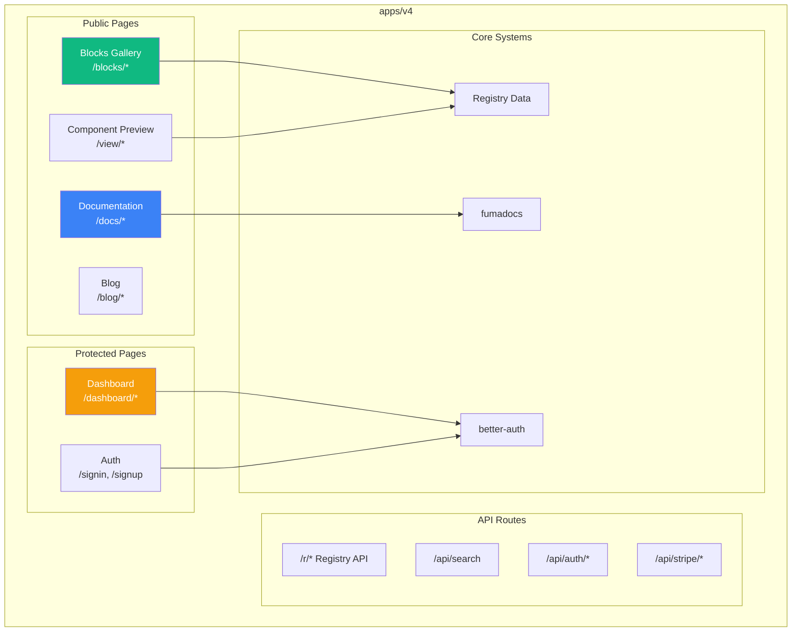
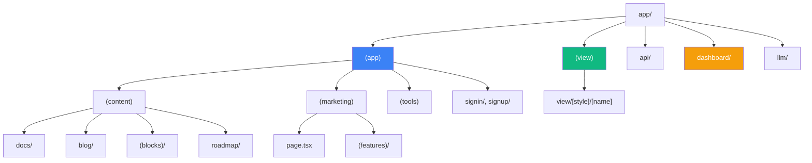
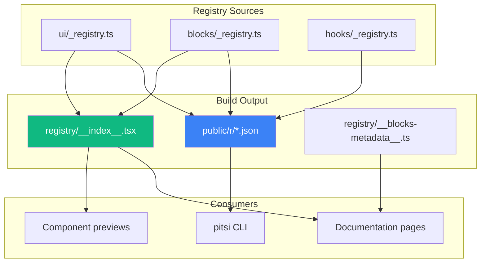
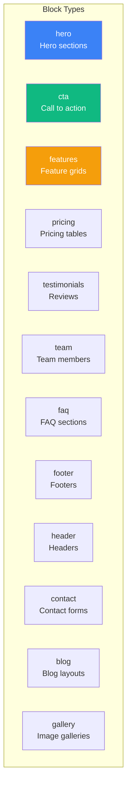

# Documentation Site Architecture

> Architecture of apps/v4 - the Next.js documentation and component showcase

## Overview

The documentation site (`apps/v4`) serves multiple purposes:

1. **Documentation** - MDX-based docs using fumadocs
2. **Component Showcase** - Live previews of all components
3. **Registry API** - Serves component definitions to the CLI
4. **Marketing Site** - Landing pages and pricing
5. **User Dashboard** - Account management and subscriptions



---

## Directory Structure Overview

```
apps/v4/
├── app/                          # Next.js App Router
│   ├── (app)/                    # Main app routes
│   │   ├── (content)/            # Documentation content
│   │   │   ├── docs/             # Component docs
│   │   │   ├── blog/             # Blog posts
│   │   │   ├── (blocks)/         # Blocks gallery
│   │   │   └── roadmap/          # Roadmap page
│   │   ├── (marketing)/          # Marketing pages
│   │   │   ├── page.tsx          # Landing page
│   │   │   └── (features)/       # Feature pages
│   │   ├── (tools)/              # Design tools
│   │   ├── signin/               # Auth pages
│   │   └── signup/
│   ├── (view)/                   # Component preview routes
│   ├── api/                      # API routes
│   ├── dashboard/                # User dashboard
│   ├── llm/                      # LLM documentation routes
│   └── og/                       # OG image generation
├── components/                   # Site-specific components
├── content/                      # MDX content
├── lib/                          # Utility functions
├── registry/                     # Component registry
├── scripts/                      # Build scripts
├── public/                       # Static assets
└── styles/                       # Global styles
```

---

## App Router Structure

### Route Groups



### Key Route Patterns

| Route | Purpose | Features |
|-------|---------|----------|
| `/` | Landing page | Marketing, animations |
| `/docs/*` | Documentation | MDX, fumadocs |
| `/docs/components/[component]` | Component docs | Live preview, code |
| `/blocks/*` | Blocks gallery | Filtering, preview |
| `/view/[style]/[name]` | Isolated preview | Full-screen, theming |
| `/dashboard/*` | User account | Auth required |
| `/r/*` | Registry API | JSON responses |

---

## Parallel Routes & Intercepting

### Authentication Modal

```
app/(app)/
├── @auth/
│   ├── (.)signin/page.tsx    # Intercepted signin modal
│   ├── (.)signup/page.tsx    # Intercepted signup modal
│   └── default.tsx           # Default (no modal)
├── signin/page.tsx           # Full signin page
└── signup/page.tsx           # Full signup page
```

**Behavior:**
- Soft navigation → Modal appears
- Hard navigation → Full page loads
- `default.tsx` prevents errors when modal isn't active

### Component Documentation

```
app/(app)/(content)/docs/components/[component]/
├── layout.tsx
├── @content/
│   ├── page.tsx              # Component documentation
│   └── default.tsx
└── @paywall/
    ├── page.tsx              # Paywall for pro components
    └── default.tsx
```

---

## Key Systems

### 1. Registry System

The registry is the data layer for all components:



**Key files:**
- `registry/new-york-v4/registry.ts` - Main registry export
- `registry/__index__.tsx` - Lazy-loaded component map
- `registry/__blocks-metadata__.ts` - Pre-computed category data

### 2. fumadocs Documentation

MDX documentation framework:

```typescript
// lib/source.ts
import { loader } from "fumadocs-core/source"
import { createMDXSource } from "fumadocs-mdx"

export const { getPage, getPages, pageTree } = loader({
  baseUrl: "/docs",
  source: createMDXSource(/*...*/),
})
```

**Features:**
- MDX compilation
- Syntax highlighting
- Table of contents
- Search integration
- Versioning support

### 3. Authentication (better-auth)

```typescript
// lib/server/auth.ts
import { betterAuth } from "better-auth"

export const auth = betterAuth({
  database: drizzle,
  socialProviders: {
    github: { clientId, clientSecret },
    google: { clientId, clientSecret },
  },
})
```

**Features:**
- OAuth (GitHub, Google)
- Session management
- Database-backed users
- Email verification

### 4. Payments (Stripe)

```typescript
// lib/server/stripe.ts
import Stripe from "stripe"

export const stripe = new Stripe(process.env.STRIPE_PRIVATE_KEY)
```

**Features:**
- Subscription management
- Webhook handling
- Pro tier access

---

## lib/ Directory

### Utility Categories

```
lib/
├── Core
│   ├── utils.ts              # cn() and common utilities
│   ├── format.ts             # Date/number formatting
│   └── colors.ts             # Color manipulation
│
├── Registry
│   ├── registry.ts           # Registry loading
│   ├── registry-utils.ts     # Registry helpers
│   ├── blocks.ts             # Block utilities
│   └── blocks-storage.ts     # Block state management
│
├── Content
│   ├── source.ts             # fumadocs source
│   ├── docs/                 # Documentation helpers
│   ├── blog/                 # Blog content
│   └── changelog/            # Changelog parsing
│
├── Server
│   ├── server/auth.ts        # Authentication
│   ├── server/stripe.ts      # Payments
│   ├── server/user.ts        # User management
│   ├── server/team.ts        # Team management
│   └── server/db/            # Database (Drizzle)
│
├── Client
│   ├── client/auth.ts        # Client-side auth
│   └── local-storage.ts      # Local storage helpers
│
├── Config
│   ├── config/index.ts       # Site configuration
│   ├── config/themes.ts      # Theme definitions
│   └── config/fonts.ts       # Font configuration
│
├── Pages
│   ├── pages/blocks.ts       # Block page helpers
│   ├── pages/docs.ts         # Docs page helpers
│   └── pages/view.ts         # View page helpers
│
├── Types (blocks/)
│   ├── blocks/types.ts       # Common block types
│   ├── blocks/hero.types.ts  # Hero block types
│   ├── blocks/cta.types.ts   # CTA block types
│   └── ...                   # Other block types
│
└── Misc
    ├── icons/                # Icon utilities
    ├── og/                   # OG image fonts
    ├── sitemap/              # Sitemap generation
    ├── llm.ts                # LLM documentation
    └── events.ts             # Analytics events
```

### Key Utilities

#### `utils.ts`
```typescript
import { clsx, type ClassValue } from "clsx"
import { twMerge } from "tailwind-merge"

export function cn(...inputs: ClassValue[]) {
  return twMerge(clsx(inputs))
}
```

#### `registry.ts`
```typescript
export async function getRegistryComponent(name: string) {
  const { Index } = await import("@/registry/__index__")
  return Index["new-york-v4"][name]
}
```

#### `blocks.ts`
```typescript
export async function getAllBlocks() {
  const { BLOCK_CATEGORIES } = await import("@/registry/__blocks-metadata__")
  return Object.entries(BLOCK_CATEGORIES).flatMap(([category, blocks]) =>
    blocks.map(name => ({ name, category }))
  )
}
```

---

## API Routes

### Registry API (`/r/*`)

Serves component JSON to the CLI:

```
public/r/
├── styles.json                          # Available styles
├── styles/new-york-v4/
│   ├── registry.json                    # Full registry
│   ├── button.json                      # Individual component
│   ├── dialog.json
│   └── ...
└── index.json
```

### Search API (`/api/search`)

Provides component search:

```typescript
// app/api/search/route.ts
export async function GET(request: Request) {
  const { searchParams } = new URL(request.url)
  const query = searchParams.get("q")

  // Search across registry
  const results = await searchRegistry(query)

  return Response.json(results)
}
```

### Auth API (`/api/auth/*`)

Handles authentication:

```typescript
// app/api/auth/[...all]/route.ts
import { auth } from "@/lib/server/auth"
import { toNextJsHandler } from "better-auth/next-js"

export const { GET, POST } = toNextJsHandler(auth)
```

### Stripe API (`/api/stripe/webhook`)

Handles Stripe webhooks:

```typescript
// app/api/stripe/webhook/route.ts
export async function POST(request: Request) {
  const payload = await request.text()
  const signature = request.headers.get("stripe-signature")

  const event = stripe.webhooks.constructEvent(payload, signature, secret)

  switch (event.type) {
    case "checkout.session.completed":
      // Handle successful payment
      break
    case "customer.subscription.deleted":
      // Handle cancellation
      break
  }

  return new Response("OK")
}
```

---

## Component Preview System

### Preview Routes

```
app/(view)/view/[style]/[name]/page.tsx
```

Renders components in isolation:

```typescript
export default async function ViewPage({ params }) {
  const { style, name } = await params

  const { Index } = await import("@/registry/__index__")
  const component = Index[style]?.[name]

  if (!component) notFound()

  const Component = component.component

  return (
    <div className="preview-container">
      <Suspense fallback={<Skeleton />}>
        <Component />
      </Suspense>
    </div>
  )
}
```

### Theme Support

URL parameters control theming:

```
/view/new-york-v4/button?theme=dark&radius=0.5
```

```typescript
// app/(view)/_components/theme-from-url.tsx
export function ThemeFromUrl() {
  const searchParams = useSearchParams()
  const theme = searchParams.get("theme")
  const radius = searchParams.get("radius")

  useEffect(() => {
    if (theme) document.documentElement.classList.toggle("dark", theme === "dark")
    if (radius) document.documentElement.style.setProperty("--radius", `${radius}rem`)
  }, [theme, radius])

  return null
}
```

---

## Block System

### Block Categories



### Block Metadata

Pre-computed for fast navigation:

```typescript
// registry/__blocks-metadata__.ts
export const BLOCK_CATEGORIES: Record<string, string[]> = {
  hero: ["hero-plants-1", "hero-fitness-1", ...],
  cta: ["cta-plants-1", "cta-fitness-1", ...],
  features: ["features-plants-1", ...],
}

export const COMPUTED_TEMPLATES: Record<string, ComputedTemplate> = {
  plants: {
    slug: "plants",
    name: "Plant Shop",
    blocks: [
      { name: "hero-plants-1", blockType: "hero", order: 1 },
      { name: "features-plants-1", blockType: "features", order: 2 },
    ]
  }
}
```

---

## Database Schema

Using Drizzle ORM:

```typescript
// lib/server/db/schema.ts
export const users = pgTable("users", {
  id: text("id").primaryKey(),
  email: text("email").notNull().unique(),
  name: text("name"),
  createdAt: timestamp("created_at").defaultNow(),
})

export const subscriptions = pgTable("subscriptions", {
  id: text("id").primaryKey(),
  userId: text("user_id").references(() => users.id),
  stripeCustomerId: text("stripe_customer_id"),
  stripePriceId: text("stripe_price_id"),
  status: text("status"),
  currentPeriodEnd: timestamp("current_period_end"),
})

export const teams = pgTable("teams", {
  id: text("id").primaryKey(),
  name: text("name").notNull(),
  ownerId: text("owner_id").references(() => users.id),
})
```

---

## Performance Patterns

### 1. Lazy Loading Components

```typescript
// registry/__index__.tsx
component: React.lazy(async () => {
  const mod = await import("@/registry/new-york-v4/ui/button")
  return { default: mod.default || mod["Button"] }
})
```

### 2. Pre-computed Metadata

```typescript
// Avoid loading full registry (1.2MB) for navigation
import { BLOCK_CATEGORIES } from "@/registry/__blocks-metadata__"
```

### 3. Parallel Data Fetching

```typescript
// Fetch component and docs in parallel
const [component, docs] = await Promise.all([
  getRegistryComponent(name),
  getComponentDocs(name),
])
```

### 4. Suspense Boundaries

```tsx
<Suspense fallback={<ComponentSkeleton />}>
  <ComponentPreview name={name} />
</Suspense>
```

---

## Next Steps

- **[Directory Structure](../subsystems/apps-v4/structure.md)** - Detailed file tree
- **[Lib Utilities](../subsystems/apps-v4/lib.md)** - All utilities documented
- **[API Routes](../subsystems/apps-v4/api-routes.md)** - API reference
