# Hosting Architecture

This document explains the serverless hosting architecture, deployment strategies, and infrastructure configuration for pitsi-ui.

## Table of Contents

- [Serverless Architecture Overview](#serverless-architecture-overview)
- [Vercel Deployment](#vercel-deployment)
- [Serverless Functions](#serverless-functions)
- [Edge vs Serverless](#edge-vs-serverless)
- [Database Architecture](#database-architecture)
- [CI/CD Pipeline](#cicd-pipeline)
- [Environment Configuration](#environment-configuration)
- [Caching Strategy](#caching-strategy)
- [Static Asset Delivery](#static-asset-delivery)

---

## Serverless Architecture Overview

### What is Serverless?

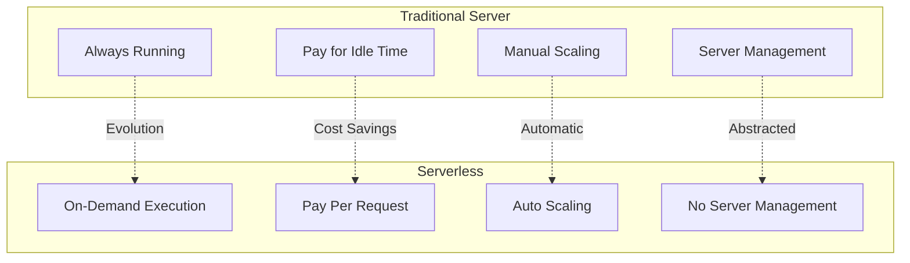
```mermaid
flowchart TD
    subgraph "Traditional Server"
        A[Always Running]
        B[Pay for Idle Time]
        C[Manual Scaling]
        D[Server Management]
    end

    subgraph "Serverless"
        E[On-Demand Execution]
        F[Pay Per Request]
        G[Auto Scaling]
        H[No Server Management]
    end

    A -.->|Evolution| E
    B -.->|Cost Savings| F
    C -.->|Automatic| G
    D -.->|Abstracted| H
```

### Serverless Request Flow

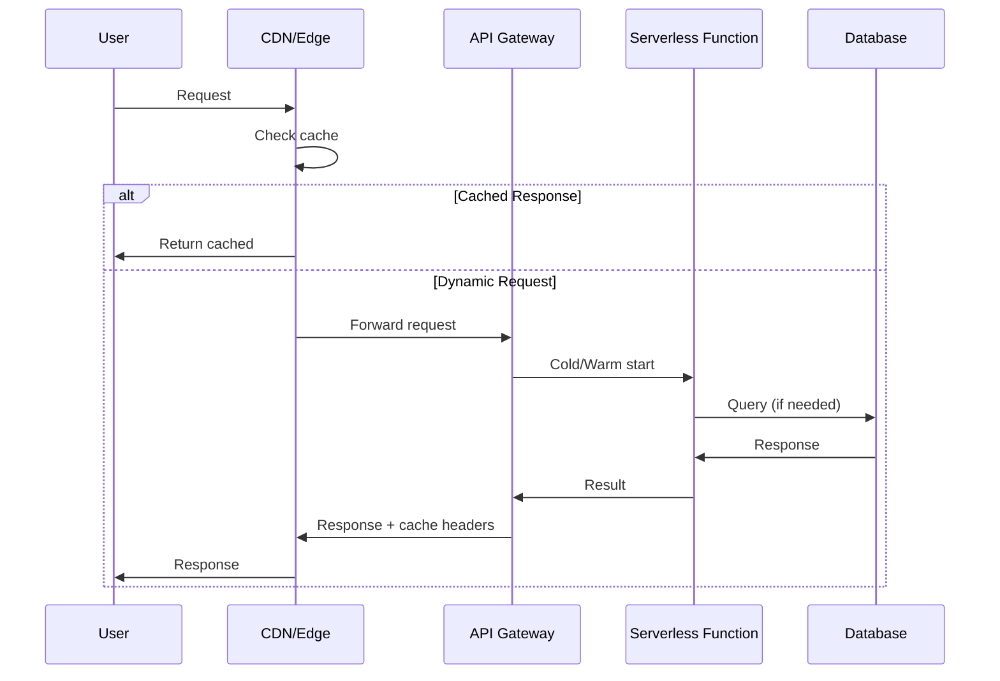
```mermaid
sequenceDiagram
    participant User
    participant CDN as CDN/Edge
    participant Gateway as API Gateway
    participant Function as Serverless Function
    participant DB as Database

    User->>CDN: Request
    CDN->>CDN: Check cache

    alt Cached Response
        CDN->>User: Return cached
    else Dynamic Request
        CDN->>Gateway: Forward request
        Gateway->>Function: Cold/Warm start
        Function->>DB: Query (if needed)
        DB->>Function: Response
        Function->>Gateway: Result
        Gateway->>CDN: Response + cache headers
        CDN->>User: Response
    end
```

### pitsi-ui Serverless Architecture

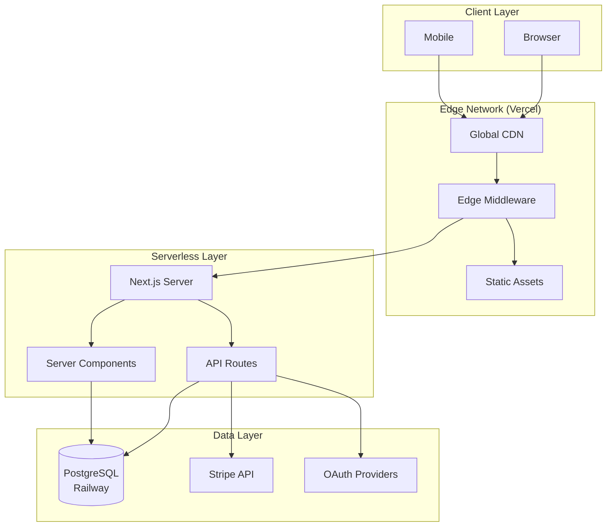
```mermaid
graph TD
    subgraph "Client Layer"
        A[Browser]
        B[Mobile]
    end

    subgraph "Edge Network (Vercel)"
        C[Global CDN]
        D[Edge Middleware]
        E[Static Assets]
    end

    subgraph "Serverless Layer"
        F[Next.js Server]
        G[API Routes]
        H[Server Components]
    end

    subgraph "Data Layer"
        I[(PostgreSQL<br/>Railway)]
        J[Stripe API]
        K[OAuth Providers]
    end

    A --> C
    B --> C
    C --> D
    D --> E
    D --> F
    F --> G
    F --> H
    G --> I
    G --> J
    H --> I
    G --> K
```

---

## Vercel Deployment

### Deployment Model

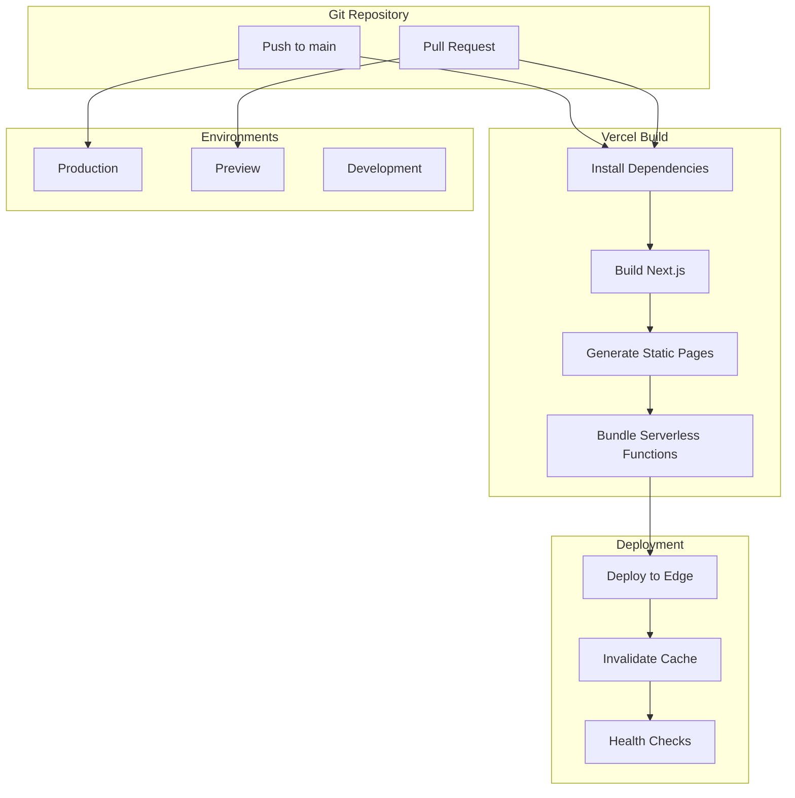
```mermaid
flowchart TD
    subgraph "Git Repository"
        A[Push to main]
        B[Pull Request]
    end

    subgraph "Vercel Build"
        C[Install Dependencies]
        D[Build Next.js]
        E[Generate Static Pages]
        F[Bundle Serverless Functions]
    end

    subgraph "Deployment"
        G[Deploy to Edge]
        H[Invalidate Cache]
        I[Health Checks]
    end

    subgraph "Environments"
        J[Production]
        K[Preview]
        L[Development]
    end

    A --> C
    B --> C
    C --> D --> E --> F
    F --> G --> H --> I
    A --> J
    B --> K
```

### Build Output Structure

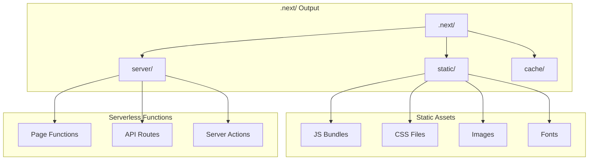
```mermaid
graph TD
    subgraph ".next/ Output"
        A[.next/]
        B[static/]
        C[server/]
        D[cache/]
    end

    subgraph "Static Assets"
        E[JS Bundles]
        F[CSS Files]
        G[Images]
        H[Fonts]
    end

    subgraph "Serverless Functions"
        I[Page Functions]
        J[API Routes]
        K[Server Actions]
    end

    A --> B --> E
    B --> F
    B --> G
    B --> H
    A --> C --> I
    C --> J
    C --> K
    A --> D
```

### Vercel Configuration

pitsi-ui uses default Vercel settings with Next.js-specific optimizations:

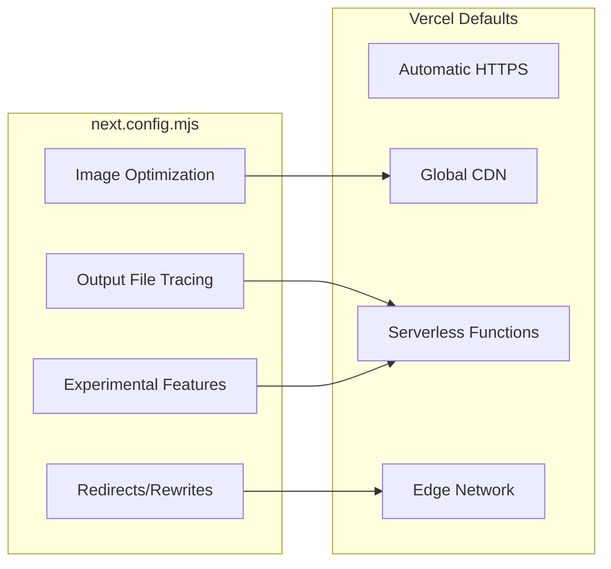
```mermaid
flowchart LR
    subgraph "next.config.mjs"
        A[Output File Tracing]
        B[Image Optimization]
        C[Redirects/Rewrites]
        D[Experimental Features]
    end

    subgraph "Vercel Defaults"
        E[Automatic HTTPS]
        F[Global CDN]
        G[Serverless Functions]
        H[Edge Network]
    end

    A --> G
    B --> F
    C --> H
    D --> G
```

**Output File Tracing Configuration:**

```js
// next.config.mjs
outputFileTracingIncludes: {
  "/*": ["./registry/**/*", "./content/**/*"],
}
```

This ensures registry and content files are included in serverless function bundles.

---

## Serverless Functions

### Function Types in pitsi-ui

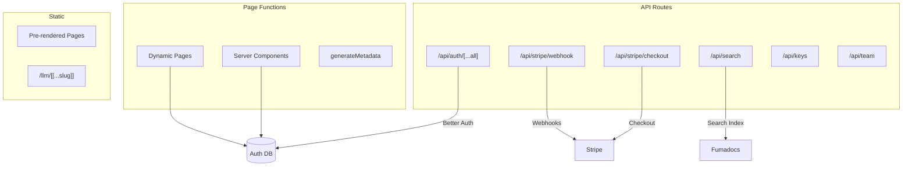
```mermaid
graph TD
    subgraph "API Routes"
        A["/api/auth/[...all]"]
        B["/api/stripe/webhook"]
        C["/api/stripe/checkout"]
        D["/api/search"]
        E["/api/keys"]
        F["/api/team"]
    end

    subgraph "Page Functions"
        G[Dynamic Pages]
        H[Server Components]
        I[generateMetadata]
    end

    subgraph "Static"
        J[Pre-rendered Pages]
        K["/llm/[[...slug]]"]
    end

    A --> |"Better Auth"| L[(Auth DB)]
    B --> |"Webhooks"| M[Stripe]
    C --> |"Checkout"| M
    D --> |"Search Index"| N[Fumadocs]
    G --> L
    H --> L
```

### API Route Architecture

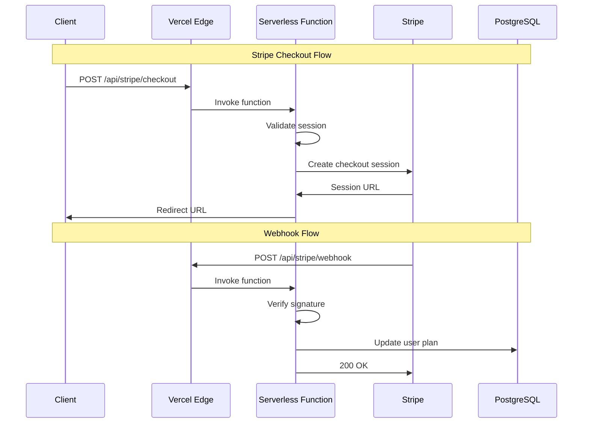
```mermaid
sequenceDiagram
    participant Client
    participant Vercel as Vercel Edge
    participant Function as Serverless Function
    participant Stripe
    participant DB as PostgreSQL

    Note over Client,DB: Stripe Checkout Flow
    Client->>Vercel: POST /api/stripe/checkout
    Vercel->>Function: Invoke function
    Function->>Function: Validate session
    Function->>Stripe: Create checkout session
    Stripe->>Function: Session URL
    Function->>Client: Redirect URL

    Note over Client,DB: Webhook Flow
    Stripe->>Vercel: POST /api/stripe/webhook
    Vercel->>Function: Invoke function
    Function->>Function: Verify signature
    Function->>DB: Update user plan
    Function->>Stripe: 200 OK
```

### Function Cold Starts

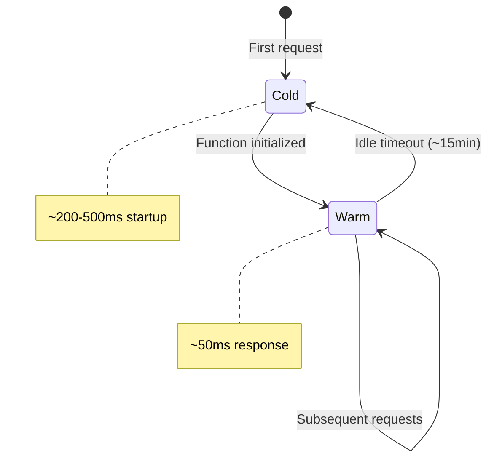
```mermaid
stateDiagram-v2
    [*] --> Cold: First request
    Cold --> Warm: Function initialized
    Warm --> Warm: Subsequent requests
    Warm --> Cold: Idle timeout (~15min)

    note right of Cold: ~200-500ms startup
    note right of Warm: ~50ms response
```

**Minimizing Cold Starts:**
- Keep function bundles small
- Use `optimizePackageImports` for tree-shaking
- Prefer Edge Runtime for latency-critical routes

---

## Edge vs Serverless

### Comparison

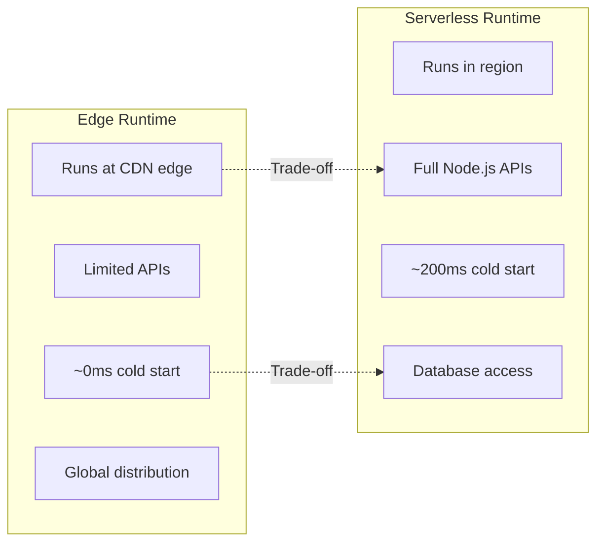
```mermaid
flowchart LR
    subgraph "Edge Runtime"
        A[Runs at CDN edge]
        B[Limited APIs]
        C[~0ms cold start]
        D[Global distribution]
    end

    subgraph "Serverless Runtime"
        E[Runs in region]
        F[Full Node.js APIs]
        G[~200ms cold start]
        H[Database access]
    end

    A -.->|Trade-off| F
    C -.->|Trade-off| H
```

### When to Use Each

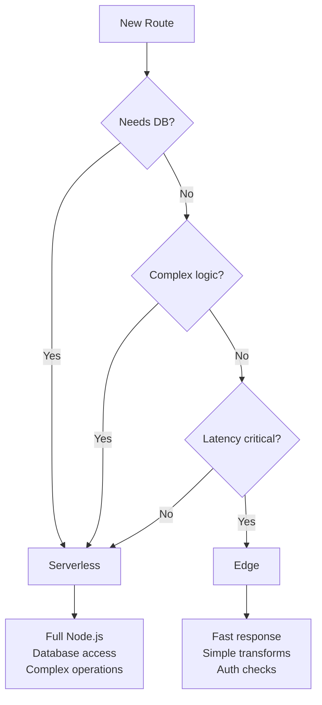
```mermaid
graph TD
    A[New Route] --> B{Needs DB?}
    B -->|Yes| C[Serverless]
    B -->|No| D{Complex logic?}
    D -->|Yes| C
    D -->|No| E{Latency critical?}
    E -->|Yes| F[Edge]
    E -->|No| C

    C --> G[Full Node.js<br/>Database access<br/>Complex operations]
    F --> H[Fast response<br/>Simple transforms<br/>Auth checks]
```

### pitsi-ui Runtime Distribution

| Route | Runtime | Reason |
|-------|---------|--------|
| `/api/auth/*` | Serverless | Database access |
| `/api/stripe/*` | Serverless | Webhook processing |
| `/api/search` | Serverless | Index queries |
| Static pages | Edge/CDN | Pre-rendered |
| Dynamic pages | Serverless | User data |

---

## Database Architecture

### Serverless Database Pattern

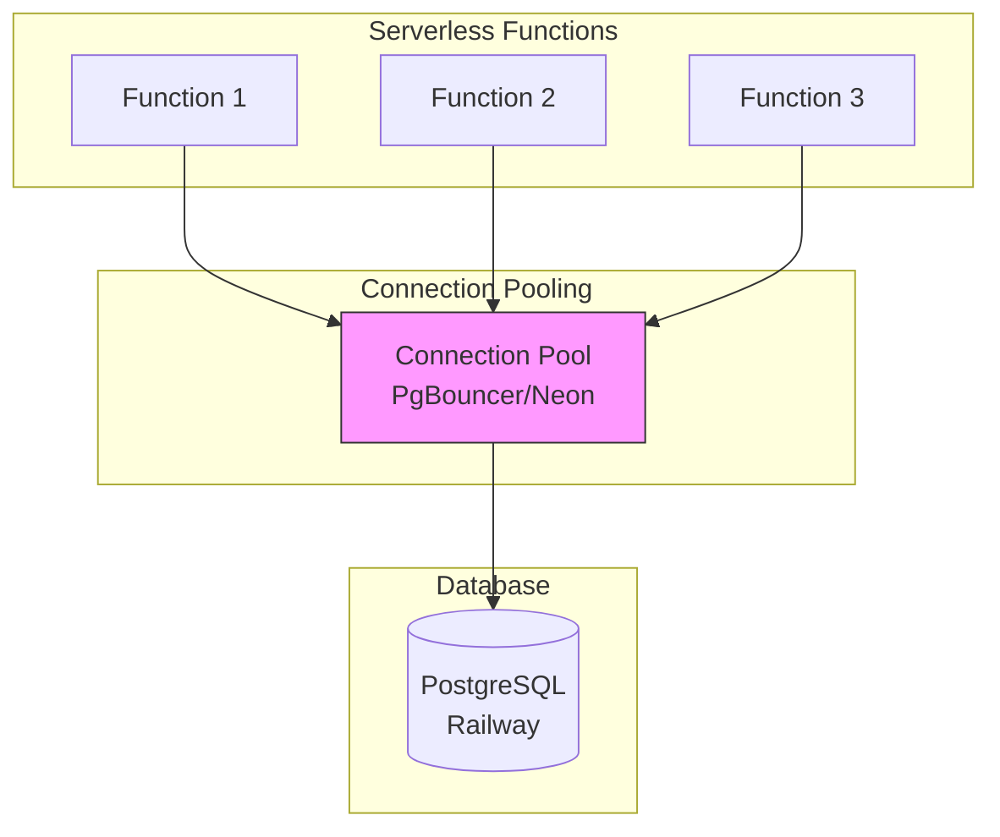
```mermaid
flowchart TD
    subgraph "Serverless Functions"
        A[Function 1]
        B[Function 2]
        C[Function 3]
    end

    subgraph "Connection Pooling"
        D[Connection Pool<br/>PgBouncer/Neon]
    end

    subgraph "Database"
        E[(PostgreSQL<br/>Railway)]
    end

    A --> D
    B --> D
    C --> D
    D --> E

    style D fill:#f9f,stroke:#333
```

### Database Configuration

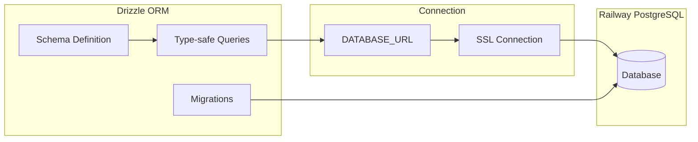
```mermaid
graph LR
    subgraph "Drizzle ORM"
        A[Schema Definition]
        B[Type-safe Queries]
        C[Migrations]
    end

    subgraph "Connection"
        D[DATABASE_URL]
        E[SSL Connection]
    end

    subgraph "Railway PostgreSQL"
        F[(Database)]
    end

    A --> B --> D --> E --> F
    C --> F
```

**Configuration (`drizzle.config.ts`):**

```ts
export default defineConfig({
  dialect: "postgresql",
  schema: "./lib/server/db/schema.ts",
  out: "./drizzle",
  dbCredentials: {
    url: process.env.DATABASE_URL!,
  },
})
```

### Connection Best Practices

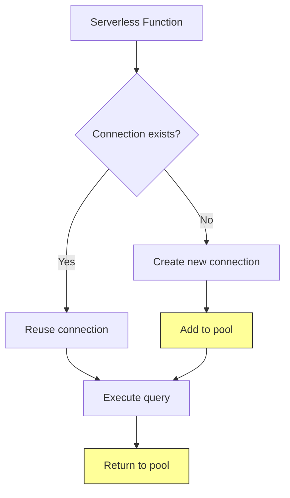
```mermaid
flowchart TD
    A[Serverless Function] --> B{Connection exists?}
    B -->|Yes| C[Reuse connection]
    B -->|No| D[Create new connection]
    D --> E[Add to pool]
    C --> F[Execute query]
    E --> F
    F --> G[Return to pool]

    style E fill:#ff9,stroke:#333
    style G fill:#ff9,stroke:#333
```

---

## CI/CD Pipeline

### GitHub Actions Workflow

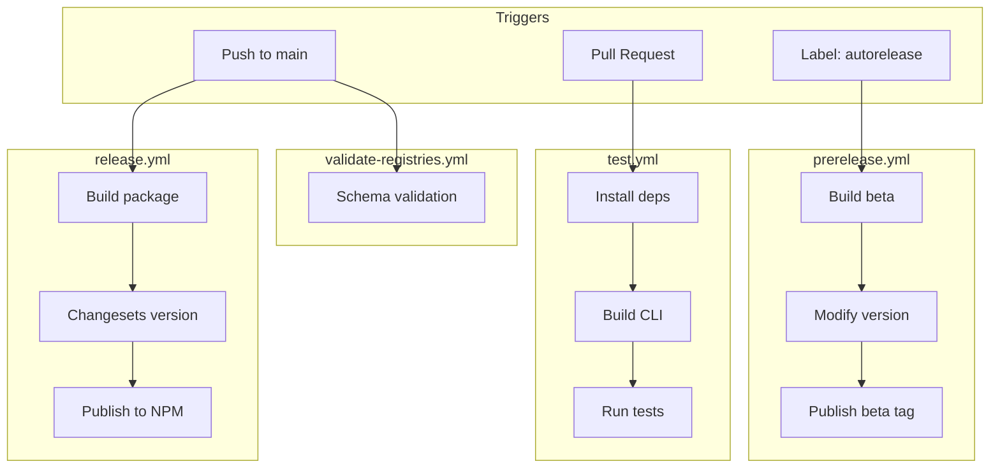
```mermaid
flowchart TD
    subgraph "Triggers"
        A[Push to main]
        B[Pull Request]
        C[Label: autorelease]
    end

    subgraph "test.yml"
        D[Install deps]
        E[Build CLI]
        F[Run tests]
    end

    subgraph "release.yml"
        G[Build package]
        H[Changesets version]
        I[Publish to NPM]
    end

    subgraph "prerelease.yml"
        J[Build beta]
        K[Modify version]
        L[Publish beta tag]
    end

    subgraph "validate-registries.yml"
        M[Schema validation]
    end

    B --> D --> E --> F
    A --> G --> H --> I
    C --> J --> K --> L
    A --> M
```

### Release Process

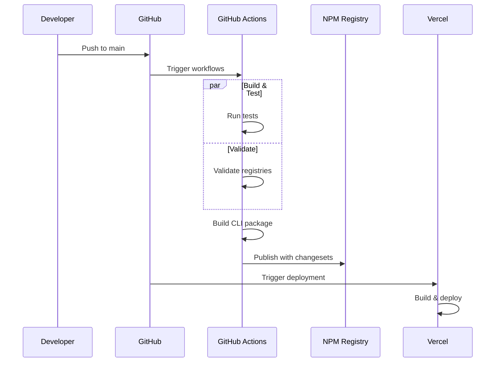
```mermaid
sequenceDiagram
    participant Dev as Developer
    participant GH as GitHub
    participant Actions as GitHub Actions
    participant NPM as NPM Registry
    participant Vercel

    Dev->>GH: Push to main
    GH->>Actions: Trigger workflows

    par Build & Test
        Actions->>Actions: Run tests
    and Validate
        Actions->>Actions: Validate registries
    end

    Actions->>Actions: Build CLI package
    Actions->>NPM: Publish with changesets
    GH->>Vercel: Trigger deployment
    Vercel->>Vercel: Build & deploy
```

### Workflow Configuration

**Test Workflow (`test.yml`):**
```yaml
on:
  pull_request:
    branches: [main]

jobs:
  test:
    runs-on: ubuntu-latest
    steps:
      - uses: oven-sh/setup-bun@v2
      - run: bun install
      - run: bun run build --filter=pitsi
      - run: bun run test
```

**Release Workflow (`release.yml`):**
```yaml
on:
  push:
    branches: [main]

jobs:
  release:
    if: github.repository_owner == 'pitsi-ui'
    steps:
      - run: bun run pitsi:build
      - uses: changesets/action@v1
        with:
          publish: bunx changeset publish
```

---

## Environment Configuration

### Environment Variables Flow

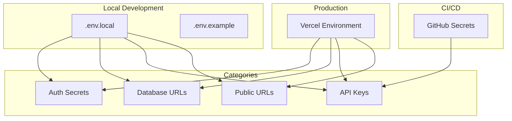
```mermaid
flowchart TD
    subgraph "Local Development"
        A[.env.local]
        B[.env.example]
    end

    subgraph "CI/CD"
        C[GitHub Secrets]
    end

    subgraph "Production"
        D[Vercel Environment]
    end

    subgraph "Categories"
        E[Auth Secrets]
        F[Database URLs]
        G[API Keys]
        H[Public URLs]
    end

    A --> E
    A --> F
    A --> G
    A --> H
    C --> G
    D --> E
    D --> F
    D --> G
    D --> H
```

### Environment Variables

| Category | Variable | Usage |
|----------|----------|-------|
| **App** | `NEXT_PUBLIC_APP_URL` | Public base URL |
| **Database** | `DATABASE_URL` | PostgreSQL connection |
| **Auth** | `BETTER_AUTH_SECRET` | Session encryption |
| **Auth** | `BETTER_AUTH_URL` | Auth callback URL |
| **OAuth** | `GITHUB_CLIENT_ID/SECRET` | GitHub login |
| **OAuth** | `GOOGLE_CLIENT_ID/SECRET` | Google login |
| **Payments** | `STRIPE_SECRET_KEY` | Stripe API |
| **Payments** | `STRIPE_WEBHOOK_SECRET` | Webhook validation |
| **Dev** | `TURBOPACK` | Enable Turbopack |

### Turbo Environment Configuration

```js
// turbo.json
{
  "globalEnv": [
    "NODE_ENV",
    "NEXT_PUBLIC_APP_URL",
    "DATABASE_URL",
    "HIDE_ALPHA_ITEMS"
  ],
  "tasks": {
    "build": {
      "env": [
        "BETTER_AUTH_SECRET",
        "STRIPE_SECRET_KEY",
        // ... 29 total variables
      ]
    }
  }
}
```

---

## Caching Strategy

### Cache Layers

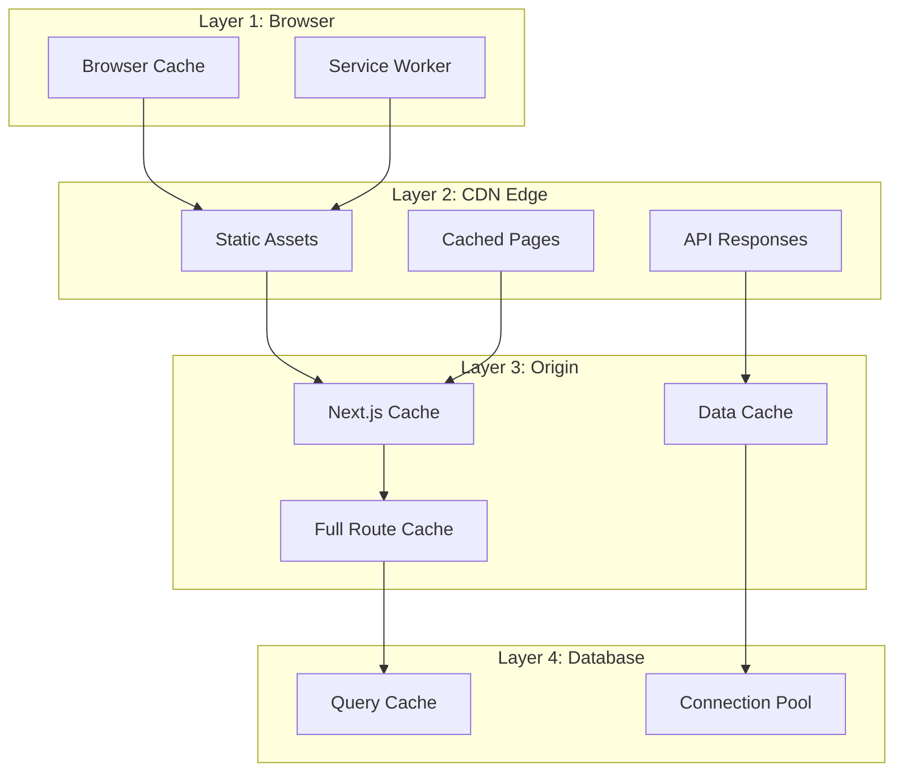
```mermaid
flowchart TD
    subgraph "Layer 1: Browser"
        A[Browser Cache]
        B[Service Worker]
    end

    subgraph "Layer 2: CDN Edge"
        C[Static Assets]
        D[Cached Pages]
        E[API Responses]
    end

    subgraph "Layer 3: Origin"
        F[Next.js Cache]
        G[Data Cache]
        H[Full Route Cache]
    end

    subgraph "Layer 4: Database"
        I[Query Cache]
        J[Connection Pool]
    end

    A --> C
    B --> C
    C --> F
    D --> F
    E --> G
    F --> H
    H --> I
    G --> J
```

### Cache Headers Strategy

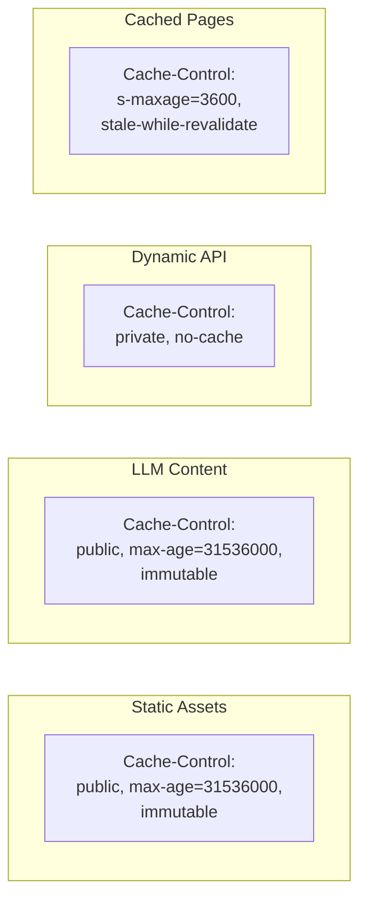
```mermaid
graph LR
    subgraph "Static Assets"
        A["Cache-Control:<br/>public, max-age=31536000,<br/>immutable"]
    end

    subgraph "LLM Content"
        B["Cache-Control:<br/>public, max-age=31536000,<br/>immutable"]
    end

    subgraph "Dynamic API"
        C["Cache-Control:<br/>private, no-cache"]
    end

    subgraph "Cached Pages"
        D["Cache-Control:<br/>s-maxage=3600,<br/>stale-while-revalidate"]
    end
```

**LLM Route Caching (`/api/llm/[[...slug]]`):**

```ts
return new Response(content, {
  headers: {
    "Content-Type": "text/markdown; charset=utf-8",
    "Cache-Control": "public, max-age=31536000, immutable",
  },
})
```

### Revalidation Patterns

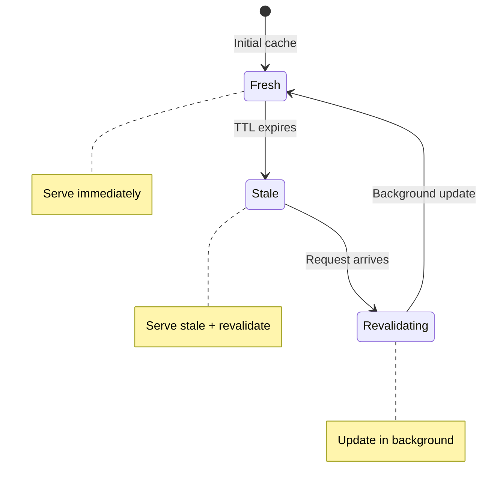
```mermaid
stateDiagram-v2
    [*] --> Fresh: Initial cache
    Fresh --> Stale: TTL expires
    Stale --> Revalidating: Request arrives
    Revalidating --> Fresh: Background update

    note right of Fresh: Serve immediately
    note right of Stale: Serve stale + revalidate
    note right of Revalidating: Update in background
```

---

## Static Asset Delivery

### Asset Pipeline

```mermaid
flowchart LR
    subgraph "Build Time"
        A[Source Files]
        B[Bundler]
        C[Optimization]
        D[Hashing]
    end

    subgraph "Deploy"
        E[Upload to CDN]
        F[Purge old cache]
    end

    subgraph "Runtime"
        G[Edge Server]
        H[User Browser]
    end

    A --> B --> C --> D --> E --> F
    G --> H
    E --> G
```

### Image Optimization

```mermaid
flowchart TD
    A[Image Request] --> B{Local or Remote?}

    B -->|Local| C[/_next/image]
    B -->|Remote| D{Whitelisted?}

    D -->|Yes| C
    D -->|No| E[Block]

    C --> F{Cached?}
    F -->|Yes| G[Return cached]
    F -->|No| H[Optimize on-demand]

    H --> I[Resize]
    I --> J[Convert to WebP/AVIF]
    J --> K[Cache at edge]
    K --> G
```

**Whitelisted Image Domains:**

```js
// next.config.mjs
images: {
  remotePatterns: [
    { hostname: "avatars.githubusercontent.com" },
    { hostname: "images.unsplash.com" },
    { hostname: "images.pexels.com" },
    { hostname: "avatar.vercel.sh" },
    { hostname: "framerusercontent.com" },
    // ... 13 total domains
  ],
}
```

### Font Delivery

```mermaid
sequenceDiagram
    participant Browser
    participant Vercel as Vercel Edge
    participant Google as Google Fonts

    Note over Browser,Google: next/font optimization
    Browser->>Vercel: Request page
    Vercel->>Vercel: Inline font CSS
    Vercel->>Browser: HTML with preload hints
    Browser->>Vercel: Request font files
    Note over Vercel: Self-hosted, no Google request
    Vercel->>Browser: Optimized font subset
```

---

## Summary

### Architecture Overview

```mermaid
graph TB
    subgraph "Global Edge Network"
        A[CDN PoPs Worldwide]
    end

    subgraph "Serverless Compute"
        B[Next.js Server Functions]
        C[API Route Handlers]
    end

    subgraph "Managed Services"
        D[(PostgreSQL)]
        E[Stripe]
        F[OAuth Providers]
    end

    subgraph "CI/CD"
        G[GitHub Actions]
        H[Vercel Deploy]
    end

    A --> B
    A --> C
    B --> D
    C --> D
    C --> E
    C --> F
    G --> H --> A
```

### Key Benefits

| Aspect | Benefit |
|--------|---------|
| **Scaling** | Automatic, pay-per-request |
| **Performance** | Global edge distribution |
| **Reliability** | No server management |
| **Cost** | Zero idle costs |
| **Development** | Focus on code, not infra |

### Deployment Checklist

```mermaid
flowchart TD
    A[Environment Variables] --> B[Database Migration]
    B --> C[Build Validation]
    C --> D[Registry Build]
    D --> E[Deploy to Vercel]
    E --> F[Health Checks]
    F --> G[Cache Warmup]
```
