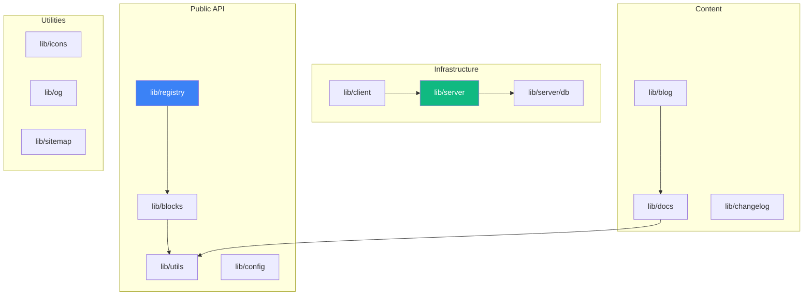
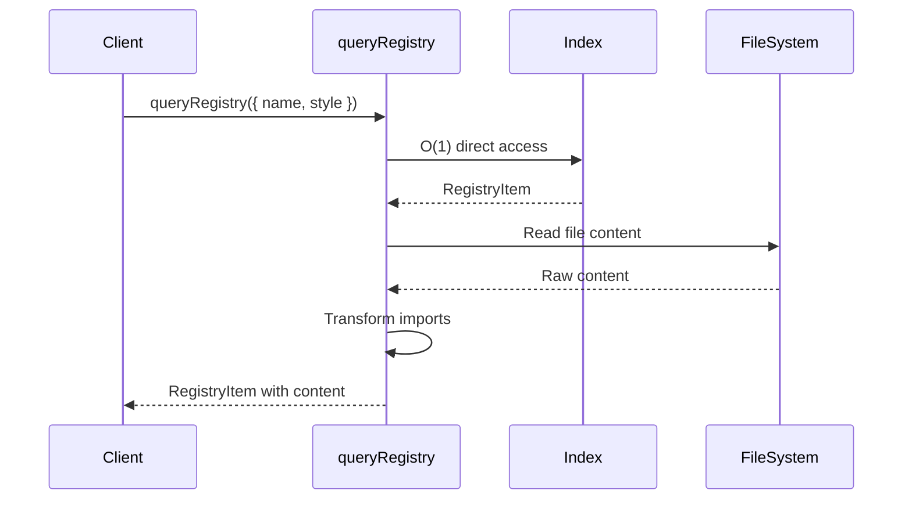
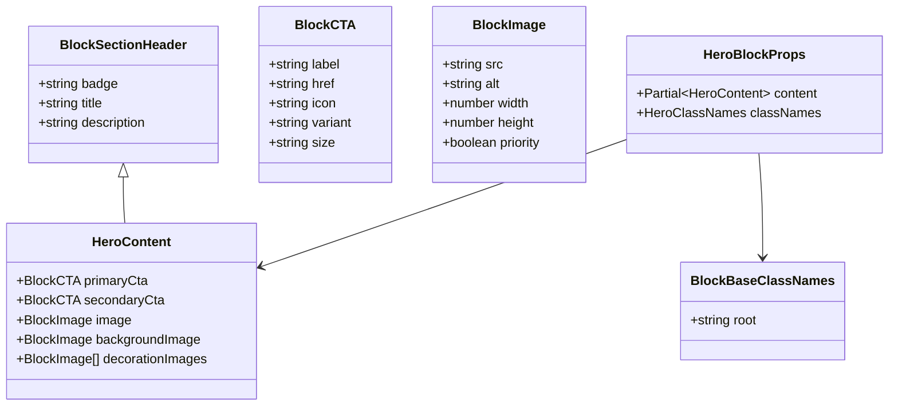
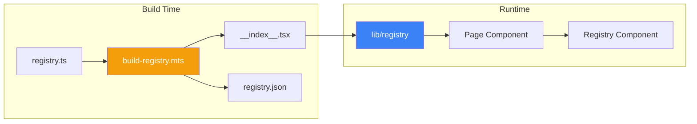

# Lib Utilities Architecture

> Complete architecture documentation for apps/v4/lib

## Directory Structure

```
apps/v4/lib/
├── blocks/                    # Block type definitions
│   ├── index.ts               # Barrel exports
│   ├── types.ts               # Common block types
│   ├── hero.types.ts          # Hero block types
│   ├── features.types.ts      # Features block types
│   ├── pricing.types.ts       # Pricing block types
│   ├── testimonials.types.ts  # Testimonials types
│   ├── team.types.ts          # Team block types
│   ├── faq.types.ts           # FAQ block types
│   ├── cta.types.ts           # CTA block types
│   ├── footer.types.ts        # Footer block types
│   ├── header.types.ts        # Header block types
│   ├── contact.types.ts       # Contact block types
│   ├── newsletter.types.ts    # Newsletter types
│   ├── logos.types.ts         # Logos block types
│   ├── gallery.types.ts       # Gallery block types
│   ├── stats.types.ts         # Stats block types
│   ├── products.types.ts      # Products block types
│   ├── blog.types.ts          # Blog block types
│   ├── blog-post.types.ts     # Blog post types
│   ├── search.types.ts        # Search block types
│   └── application.types.ts   # Application block types
│
├── client/                    # Client-side utilities
│   └── auth.ts                # Auth client (better-auth)
│
├── server/                    # Server-side utilities
│   ├── auth.ts                # Auth server config
│   ├── api-keys.ts            # API key management
│   ├── stripe.ts              # Stripe integration
│   ├── team.ts                # Team management
│   ├── user.ts                # User utilities
│   └── db/                    # Database
│       ├── index.ts           # Drizzle client
│       └── schema.ts          # Database schema
│
├── config/                    # Configuration
│   ├── index.ts               # App configuration
│   ├── themes.ts              # Theme definitions
│   └── fonts.ts               # Font configuration
│
├── docs/                      # Documentation utilities
│   ├── index.ts               # Barrel exports
│   ├── source.ts              # fumadocs source
│   ├── highlight.ts           # Code highlighting
│   ├── llm.ts                 # LLM docs generation
│   └── rehype.ts              # Rehype plugins
│
├── icons/                     # Icon utilities
│   ├── index.ts               # Barrel exports
│   ├── logo.ts                # Logo fetching
│   └── icon-mapping.ts        # Icon name mapping
│
├── pages/                     # Page utilities
│   ├── blocks.ts              # Blocks page helpers
│   ├── docs.ts                # Docs page helpers
│   └── view.ts                # View page helpers
│
├── registry/                  # Registry utilities
│   ├── index.ts               # Core registry API
│   └── index.test.ts          # Registry tests
│
├── blog/                      # Blog utilities
│   ├── source.ts              # Blog source config
│   └── source.test.ts         # Blog tests
│
├── changelog/                 # Changelog utilities
│   ├── parser.ts              # Changelog parsing
│   └── parser.test.ts         # Parser tests
│
├── roadmap/                   # Roadmap utilities
│   ├── parser.ts              # Roadmap parsing
│   └── parser.test.ts         # Parser tests
│
├── sitemap/                   # Sitemap utilities
│   ├── config.ts              # Sitemap configuration
│   └── config.test.ts         # Config tests
│
├── og/                        # Open Graph utilities
│   └── fonts.ts               # OG font loading
│
├── tests/                     # Test utilities
│   └── setup.ts               # Test setup
│
├── utils/                     # General utilities
│   ├── index.ts               # cn() + absoluteUrl()
│   ├── user.ts                # User utilities
│   ├── safe-async.ts          # Safe async operations
│   ├── index.test.ts          # Utils tests
│   └── user.test.ts           # User utils tests
│
├── blocks.ts                  # Block helpers
├── blocks-storage.ts          # Block storage (Upstash)
├── colors.ts                  # Color utilities
├── events.ts                  # Event tracking
├── figma-export.ts            # Figma export utilities
├── format.ts                  # Formatting utilities
├── highlight-code.ts          # Code highlighting
├── llm.ts                     # LLM utilities
├── local-storage.ts           # Local storage hooks
├── registry.ts                # Registry re-export
├── registry-utils.ts          # Registry utilities
├── source.ts                  # fumadocs source
├── tailwind-colors.ts         # Tailwind color utilities
└── utils.ts                   # Root utils re-export
```

---

## Module Architecture



---

## Core Modules

### Registry Module (`lib/registry`)

The registry module provides O(1) lookups for component metadata using lazy-initialized singleton indexes.

```typescript
// Lazy-initialized singleton indexes
let _allItemsArray: RegistryItem[] | null = null
let _itemsByName: Map<string, RegistryItem> | null = null
let _itemsByType: Map<RegistryItemType, RegistryItem[]> | null = null
let _blockCategories: Map<string, { main: string | null; sub: string | null }> | null = null
```

#### Key Functions

| Function | Purpose | Complexity |
|----------|---------|------------|
| `getAllRegistryItems()` | Get all items with filtering | O(n) or O(1) with type filter |
| `getItemByName()` | Get item by name | O(1) Map lookup |
| `itemExists()` | Check if item exists | O(1) lookup |
| `getBlockMainCategory()` | Get block category | O(1) cached |
| `queryRegistry()` | Unified query interface | Variable |
| `getRegistryItem()` | Get item with file content | O(1) + file I/O |

#### Query Flow



### Utils Module (`lib/utils`)

```typescript
import { clsx, type ClassValue } from "clsx"
import { twMerge } from "tailwind-merge"

export function cn(...inputs: ClassValue[]) {
  return twMerge(clsx(inputs))
}

export function absoluteUrl(path: string) {
  return `${process.env.NEXT_PUBLIC_APP_URL}${path}`
}
```

**`cn()` Function:**
- Combines `clsx` for conditional classes
- Uses `tailwind-merge` to resolve Tailwind conflicts
- Last conflicting class wins (e.g., `cn('px-2', 'px-4')` → `'px-4'`)

---

## Block Types System

### Type Hierarchy



### Common Types (`lib/blocks/types.ts`)

```typescript
// Image with Next.js Image attributes
interface BlockImage {
  src: string
  alt: string
  width?: number
  height?: number
  priority?: boolean
}

// Link structure
interface BlockLink {
  label: string
  href: string
  external?: boolean
}

// CTA with button styling
interface BlockCTA extends BlockLink {
  icon?: string
  variant?: "default" | "outline" | "secondary" | "ghost" | "link"
  size?: "default" | "sm" | "lg" | "icon"
}

// Section header pattern
interface BlockSectionHeader {
  badge?: string
  title: string
  description?: string
}

// ClassNames structures
interface BlockBaseClassNames { root?: string }
interface BlockHeaderClassNames { root?: string; badge?: string; title?: string; description?: string }
interface BlockCtaClassNames { root?: string; primary?: string; secondary?: string }
interface BlockImageClassNames { root?: string; wrapper?: string; img?: string }
```

### Block-Specific Types

Each block category has dedicated types:

```typescript
// lib/blocks/hero.types.ts
interface HeroBlockProps {
  content?: Partial<HeroContent>
  classNames?: HeroClassNames
}

// With defaults
const heroDefaults: HeroContent = {
  badge: "Plant Care Specialists",
  title: "Transform Your Space\nInto a Living Sanctuary",
  description: "Handpicked plants...",
  primaryCta: { label: "Explore Collection", href: "#" },
  secondaryCta: { label: "Plant Quiz", href: "#", variant: "outline" },
  image: { src: "/placeholders/...", alt: "..." },
  backgroundImage: { src: "/placeholders/...", alt: "" },
}
```

---

## Server Modules

### Authentication (`lib/server/auth.ts`)

Uses **better-auth** with:
- GitHub OAuth
- Google OAuth
- Session management
- Drizzle adapter

### Database (`lib/server/db`)

Uses **Drizzle ORM** with:
- PostgreSQL (Neon)
- Type-safe schema
- Relations support

```typescript
// lib/server/db/schema.ts
export const users = pgTable("users", { ... })
export const sessions = pgTable("sessions", { ... })
export const teams = pgTable("teams", { ... })
export const teamMembers = pgTable("team_members", { ... })
```

### Stripe (`lib/server/stripe.ts`)

Handles:
- Checkout sessions
- Subscription management
- Webhook processing
- Pro tier access

---

## Client Modules

### Auth Client (`lib/client/auth.ts`)

```typescript
import { createAuthClient } from "better-auth/react"

export const authClient = createAuthClient({
  baseURL: process.env.NEXT_PUBLIC_APP_URL
})
```

### Local Storage (`lib/local-storage.ts`)

Type-safe localStorage hooks with SSR support.

---

## Content Modules

### Documentation (`lib/docs`)

Uses **fumadocs** for:
- MDX processing
- Search indexing
- LLM documentation generation
- Code highlighting with Shiki

```typescript
// lib/docs/source.ts - fumadocs source configuration
import { docs } from "@/content/docs.source"
import { openapi } from "@/content/openapi.source"
```

### Blog (`lib/blog`)

MDX-based blog system with:
- Author support
- Category filtering
- RSS generation

---

## Data Flow

### Component Rendering Flow



### Import Transformation

The registry module transforms imports when reading file content:

```typescript
export function fixImport(content: string) {
  return content.replace(
    /@\/(.+?)\/((?:.*?\/)?(?:components|ui|hooks|lib))\/([\w-]+)/g,
    (match, _path, type, component) => {
      if (type.endsWith("components")) return `@/components/${component}`
      if (type.endsWith("ui")) return `@/components/ui/${component}`
      if (type.endsWith("hooks")) return `@/hooks/${component}`
      if (type.endsWith("lib")) return `@/lib/${component}`
      return match
    }
  )
}
```

**Example:**
```
// Input (registry path)
import { Button } from "@/registry/new-york-v4/ui/button"

// Output (user project path)
import { Button } from "@/components/ui/button"
```

---

## Caching Strategy

### Registry Caching

```typescript
// Lazy singleton pattern
let _itemsByName: Map<string, RegistryItem> | null = null

function buildItemsByNameMap(): Map<string, RegistryItem> {
  if (_itemsByName) return _itemsByName  // Return cached

  const map = new Map<string, RegistryItem>()
  for (const item of buildAllItemsArray()) {
    map.set(item.name, item)
  }
  _itemsByName = map  // Cache for next access
  return map
}
```

### ts-morph Project Caching

```typescript
let _cachedProject: Project | null = null

function getProject(): Project {
  if (!_cachedProject) {
    _cachedProject = new Project({ compilerOptions: {} })
  }
  return _cachedProject
}
```

---

## Testing

### Test Structure

```bash
apps/v4/lib/
├── tests/setup.ts              # Global test setup
├── registry/index.test.ts      # Registry tests
├── utils/index.test.ts         # Utils tests
├── blog/source.test.ts         # Blog tests
├── changelog/parser.test.ts    # Changelog tests
├── events.test.ts              # Events tests
└── format.test.ts              # Format tests
```

### Running Tests

```bash
cd apps/v4
bun test                          # All tests
bun test lib/registry             # Registry tests only
bun test lib/utils                # Utils tests only
```
