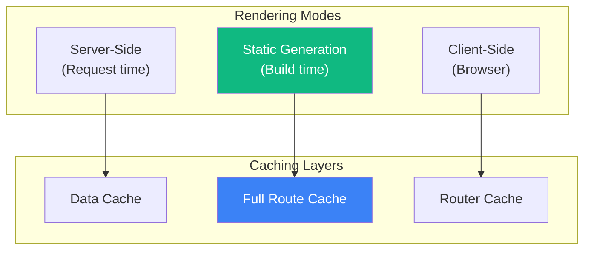
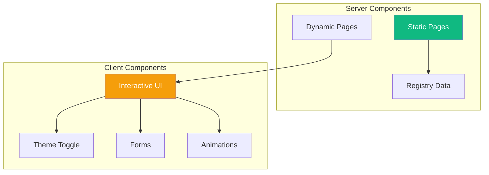
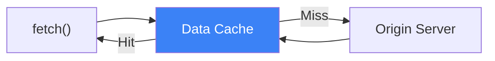
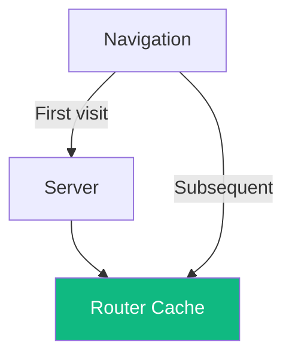
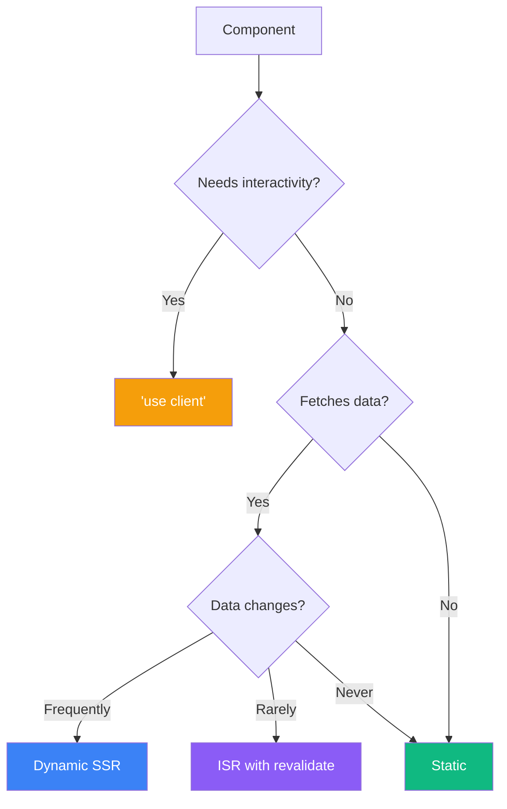

# Next.js Rendering & Caching Strategy

> How apps/v4 handles rendering, caching, and performance

## Overview

The v4 app uses **Next.js 16** with:
- Server Components (default)
- Client Components (explicit `"use client"`)
- Cache Components (`cacheComponents: true`)
- Static Generation + ISR
- Aggressive build-time optimizations



---

## Configuration (`next.config.mjs`)

### Core Settings

```javascript
const nextConfig = {
  // Enable cache components for Next.js 16
  cacheComponents: true,

  // Logging for debugging
  logging: {
    fetches: { fullUrl: true }
  },

  // Disable dev indicators
  devIndicators: false,

  // Include registry files in output tracing
  outputFileTracingIncludes: {
    "/*": ["./registry/**/*", "./content/**/*"]
  }
}
```

### Experimental Features

```javascript
experimental: {
  // Cache HMR for server components
  serverComponentsHmrCache: true,

  // Turbopack filesystem cache
  turbopackFileSystemCacheForDev: true,

  // Package import optimization
  optimizePackageImports: [
    // Icon libraries
    "@radix-ui/react-icons",
    "@tabler/icons-react",
    "lucide-react",
    "@remixicon/react",

    // Radix UI components
    "@radix-ui/react-accordion",
    "@radix-ui/react-dialog",
    "@radix-ui/react-dropdown-menu",
    "@radix-ui/react-popover",
    "@radix-ui/react-select",
    "@radix-ui/react-tabs",
    "@radix-ui/react-tooltip",
    // ... all radix packages

    // Heavy utilities
    "recharts",
    "date-fns",
    "lodash",
    "jotai",
    "react-hook-form",

    // DnD Kit
    "@dnd-kit/core",
    "@dnd-kit/sortable",
    "@dnd-kit/modifiers",
    "@dnd-kit/utilities"
  ],

  // Optimize React server-side
  optimizeServerReact: true
}
```

### Development Webpack Optimizations

```javascript
webpack: (config, { dev, isServer }) => {
  if (dev && !isServer) {
    config.optimization = {
      ...config.optimization,
      removeAvailableModules: false,
      removeEmptyChunks: false,
      splitChunks: false
    }
  }
  return config
}
```

These disable expensive optimizations during development for faster HMR.

---

## Rendering Strategy

### Component Types



### Server Components (Default)

Most components are Server Components:

```typescript
// app/docs/[slug]/page.tsx - Server Component
export default async function DocsPage({ params }) {
  const doc = await getDocBySlug(params.slug)
  return <DocRenderer content={doc} />
}
```

**Benefits:**
- Zero JS shipped to client
- Direct database access
- Async/await at component level
- Automatic data fetching

### Client Components

Interactive components use `"use client"`:

```typescript
"use client"

// registry/new-york-v4/ui/button.tsx
import { forwardRef } from "react"

export const Button = forwardRef<HTMLButtonElement, ButtonProps>(
  ({ variant, size, ...props }, ref) => {
    return <button ref={ref} {...props} />
  }
)
```

**Used for:**
- Event handlers (onClick, onChange)
- Browser APIs (localStorage, window)
- React hooks (useState, useEffect)
- Animations (Motion)

### Block Components (Hybrid)

Blocks are often `"use client"` for animations:

```typescript
"use client"

import { motion, useScroll, useTransform } from "motion/react"

export function Hero1({ content, classNames }: HeroBlockProps) {
  const { scrollYProgress } = useScroll({...})
  const heroImageX = useTransform(scrollYProgress, [0, 1], [0, -100])

  return (
    <motion.section style={{ x: heroImageX }}>
      {/* Content */}
    </motion.section>
  )
}
```

---

## Caching Layers

### 1. Data Cache



**Configuration:**

```typescript
// Cache for 1 hour
const data = await fetch(url, {
  next: { revalidate: 3600 }
})

// No caching
const data = await fetch(url, {
  cache: 'no-store'
})

// Cache forever (default)
const data = await fetch(url)
```

### 2. Full Route Cache

Static pages are cached at build time:

```typescript
// app/docs/[slug]/page.tsx
export async function generateStaticParams() {
  const docs = await getAllDocs()
  return docs.map(doc => ({ slug: doc.slug }))
}

// Generates static HTML at build time
export default async function DocsPage({ params }) {
  const doc = await getDocBySlug(params.slug)
  return <DocRenderer content={doc} />
}
```

### 3. Router Cache (Client-Side)

Browser caches visited routes:



---

## Registry Caching

### Singleton Pattern

The registry uses lazy-initialized singletons for O(1) lookups:

```typescript
// lib/registry/index.ts
let _itemsByName: Map<string, RegistryItem> | null = null

function buildItemsByNameMap(): Map<string, RegistryItem> {
  if (_itemsByName) return _itemsByName  // Return cached

  const map = new Map<string, RegistryItem>()
  for (const item of buildAllItemsArray()) {
    map.set(item.name, item)
  }
  _itemsByName = map  // Cache for next access
  return map
}
```

### ts-morph Project Cache

Code transformation uses cached Project instance:

```typescript
let _cachedProject: Project | null = null

function getProject(): Project {
  if (!_cachedProject) {
    _cachedProject = new Project({ compilerOptions: {} })
  }
  return _cachedProject
}
```

---

## Static Generation

### Documentation Pages

All docs pages are statically generated:

```typescript
// app/docs/[...slug]/page.tsx
export async function generateStaticParams() {
  const pages = source.getPages()
  return pages.map(page => ({
    slug: page.slugs
  }))
}
```

### Registry Pages

Component pages use `generateStaticParams`:

```typescript
// app/r/[style]/[name]/page.tsx
export async function generateStaticParams() {
  const items = getAllRegistryItems({ types: ["registry:ui"] })
  return items.map(item => ({
    style: "new-york-v4",
    name: item.name
  }))
}
```

---

## Image Optimization

### Remote Patterns

```javascript
images: {
  remotePatterns: [
    { protocol: "https", hostname: "avatars.githubusercontent.com" },
    { protocol: "https", hostname: "lh3.googleusercontent.com" },
    { protocol: "https", hostname: "images.unsplash.com" },
    { protocol: "https", hostname: "images.pexels.com" },
    { protocol: "https", hostname: "avatar.vercel.sh" },
    { protocol: "https", hostname: "framerusercontent.com" },
    // ...
  ]
}
```

### Usage

```typescript
import Image from "next/image"

<Image
  src="/placeholders/hero.webp"
  alt="Hero"
  width={1200}
  height={800}
  priority  // LCP image
/>
```

---

## Route Configuration

### Redirects

```javascript
redirects() {
  return [
    {
      source: "/components",
      destination: "/docs/components",
      permanent: true
    },
    {
      source: "/docs/primitives/:path*",
      destination: "/docs/components/:path*",
      permanent: true
    },
    {
      source: "/view/styles/:style/:name",
      destination: "/view/:name",
      permanent: true
    }
  ]
}
```

### Rewrites

```javascript
rewrites() {
  return [
    {
      source: "/docs/:path*.md",
      destination: "/llm/:path*"
    }
  ]
}
```

LLM-friendly markdown endpoints.

---

## Performance Optimizations

### 1. Package Import Optimization

Dramatically reduces bundle size by tree-shaking:

```javascript
optimizePackageImports: [
  "lucide-react",      // 1000+ icons → only imported ones
  "@radix-ui/*",       // Tree-shake primitives
  "recharts",          // Large charting library
  "date-fns",          // 200+ functions → only used ones
]
```

### 2. Server Component HMR Cache

```javascript
experimental: {
  serverComponentsHmrCache: true
}
```

Caches server component renders during development.

### 3. Turbopack Filesystem Cache

```javascript
experimental: {
  turbopackFileSystemCacheForDev: true
}
```

Persistent cache for faster dev server restarts.

### 4. Server React Optimization

```javascript
experimental: {
  optimizeServerReact: true
}
```

Optimizes React server-side rendering.

---

## Rendering Decision Tree



---

## Caching Best Practices

### 1. Prefer Static Generation

```typescript
// Good - generates at build time
export async function generateStaticParams() { ... }

// Avoid - re-renders on every request
export const dynamic = 'force-dynamic'
```

### 2. Use Proper Revalidation

```typescript
// Good - ISR with 1 hour revalidation
export const revalidate = 3600

// Good - on-demand revalidation
await revalidatePath('/docs')
await revalidateTag('docs')
```

### 3. Minimize Client Components

```typescript
// Good - Only interactive parts are client
<ServerLayout>
  <ClientButton />  // Small client island
</ServerLayout>

// Avoid - Entire tree becomes client
"use client"
<Layout>
  <StaticContent />  // Now sent to client
</Layout>
```

### 4. Use Loading States

```typescript
// app/docs/loading.tsx
export default function Loading() {
  return <DocSkeleton />
}
```

Provides instant feedback while server renders.
