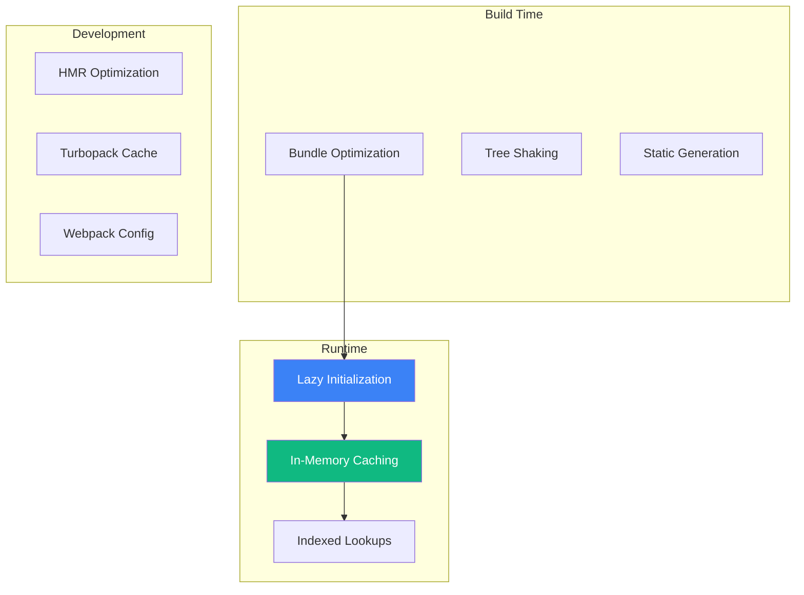

# Codebase Optimizations

> Performance optimizations implemented across pitsi/ui

## Overview

The codebase implements optimizations at multiple levels:



---

## Registry Optimizations

### 1. Lazy-Initialized Singleton Indexes

Instead of building indexes on module load, indexes are built on first access:

```typescript
// Before: Eager initialization (slow startup)
const itemsByName = new Map(allItems.map(i => [i.name, i]))

// After: Lazy initialization (fast startup)
let _itemsByName: Map<string, RegistryItem> | null = null

function buildItemsByNameMap(): Map<string, RegistryItem> {
  if (_itemsByName) return _itemsByName  // O(1) return if cached

  const map = new Map<string, RegistryItem>()
  for (const item of buildAllItemsArray()) {
    map.set(item.name, item)
  }
  _itemsByName = map
  return map
}
```

**Benefits:**
- Zero startup cost if not accessed
- Built once, reused forever
- O(1) subsequent lookups

### 2. Multi-Index Strategy

Multiple indexes for different query patterns:

```typescript
let _allItemsArray: RegistryItem[] | null = null          // List queries
let _itemsByName: Map<string, RegistryItem> | null = null // Name lookups
let _itemsByType: Map<Type, RegistryItem[]> | null = null // Type filtering
let _blockCategories: Map<string, {...}> | null = null    // Category lookups
```

### 3. Direct Index Access

For style-specific lookups, bypass Map and use direct object access:

```typescript
// O(1) direct access via Index object
export function itemExists(name: string, style?: Style["name"]): boolean {
  if (style) {
    return !!Index[style]?.[name]  // Direct property access
  }
  return buildItemsByNameMap().has(name)
}
```

### 4. Cached ts-morph Project

Expensive Project instantiation is cached:

```typescript
let _cachedProject: Project | null = null

function getProject(): Project {
  if (!_cachedProject) {
    _cachedProject = new Project({ compilerOptions: {} })
  }
  return _cachedProject
}
```

---

## Bundle Optimizations

### 1. Package Import Optimization

Aggressive tree-shaking for icon and UI libraries:

```javascript
// next.config.mjs
experimental: {
  optimizePackageImports: [
    // Icons: 1000+ icons → only imported ones
    "lucide-react",
    "@radix-ui/react-icons",
    "@tabler/icons-react",
    "@remixicon/react",

    // Radix UI: Tree-shake to only used primitives
    "@radix-ui/react-accordion",
    "@radix-ui/react-dialog",
    "@radix-ui/react-dropdown-menu",
    // ... 20+ packages

    // Utilities: 200+ functions → only used ones
    "date-fns",
    "lodash",

    // Heavy libraries
    "recharts",
    "react-hook-form",

    // State management
    "jotai",

    // DnD Kit
    "@dnd-kit/core",
    "@dnd-kit/sortable",
    "@dnd-kit/modifiers",
    "@dnd-kit/utilities"
  ]
}
```

**Impact:**
- `lucide-react`: ~2MB → ~20KB (99% reduction)
- `date-fns`: ~500KB → ~10KB (98% reduction)
- Radix UI: Only used components bundled

### 2. Server React Optimization

```javascript
experimental: {
  optimizeServerReact: true
}
```

Enables React-specific server optimizations.

---

## Development Optimizations

### 1. Webpack Dev Overrides

Disable expensive optimizations in development:

```javascript
webpack: (config, { dev, isServer }) => {
  if (dev && !isServer) {
    config.optimization = {
      ...config.optimization,
      removeAvailableModules: false,  // Skip expensive analysis
      removeEmptyChunks: false,       // Skip chunk cleanup
      splitChunks: false              // Skip code splitting
    }
  }
  return config
}
```

**Impact:**
- Faster HMR cycles
- Reduced memory usage in dev
- Quicker initial builds

### 2. Server Component HMR Cache

```javascript
experimental: {
  serverComponentsHmrCache: true
}
```

Caches server component renders during HMR.

### 3. Turbopack Filesystem Cache

```javascript
experimental: {
  turbopackFileSystemCacheForDev: true
}
```

Persists compilation cache to disk for faster restarts.

---

## Static Path Resolution

Avoid dynamic `process.cwd()` calls:

```typescript
// Before: Dynamic resolution (slower)
const configPath = path.join(process.cwd(), 'config.json')

// After: Static resolution (build-time resolved)
import { fileURLToPath } from "url"

const __filename = fileURLToPath(import.meta.url)
const __dirname = path.dirname(__filename)
const APP_ROOT = path.resolve(__dirname, "../..")
```

**Benefits:**
- Resolved at build time
- Better tree-shaking
- Faster runtime execution

---

## Turbo Task Caching

### Build Task Optimization

```json
{
  "build": {
    "dependsOn": ["^build"],
    "outputs": ["dist/**", ".next/**", "!.next/cache/**"]
  }
}
```

- `^build` ensures dependencies build first
- `outputs` enables caching of build artifacts
- `!.next/cache/**` excludes internal Next.js cache

### Registry Build Caching

```json
{
  "registry:build": {
    "cache": true,
    "outputs": ["registry/**/*.json", "registry/**/__index__.tsx"]
  }
}
```

Registry builds are cached when source files don't change.

---

## Image Optimization

### WebP Format

All placeholder images use WebP:

```
public/placeholders/blocks/
├── service-plants/
│   ├── subject/
│   │   ├── 1.webp    # ~50KB vs ~200KB JPEG
│   │   ├── 2.webp
│   │   └── ...
│   └── assets/
│       ├── decoration-1.svg
│       └── decoration-2.svg
```

### Next.js Image Component

```typescript
<Image
  src="/placeholders/hero.webp"
  alt="Hero"
  width={1200}
  height={800}
  priority              // LCP optimization
  placeholder="blur"    // Low-quality placeholder
  blurDataURL="..."     // Base64 blur
/>
```

**Optimizations:**
- Automatic format selection (WebP/AVIF)
- Responsive srcset generation
- Lazy loading by default
- Priority flag for LCP images

---

## Code Splitting

### Lazy Component Loading

Registry uses lazy loading for component previews:

```typescript
// __index__.tsx (generated)
export const Index: Record<Style["name"], RegistryIndex> = {
  "new-york-v4": {
    "button": {
      name: "button",
      type: "registry:ui",
      component: React.lazy(() => import("@/registry/new-york-v4/ui/button")),
      // ...
    }
  }
}
```

### Route-Based Splitting

Next.js automatically code-splits by route:

```
app/
├── docs/         # Separate chunk
├── blocks/       # Separate chunk
├── components/   # Separate chunk
└── view/         # Separate chunk
```

---

## Memory Optimization

### Registry File Content

File content is read on-demand, not cached:

```typescript
async function getFileContent(file: { path: string }): Promise<string | null> {
  try {
    const raw = await fs.readFile(file.path, "utf-8")
    // Transform and return, don't cache
    return fixImport(code)
  } catch {
    return null
  }
}
```

Large file contents aren't stored in memory indexes.

### Temp File Cleanup

ts-morph temp files are created in system temp directory:

```typescript
async function createTempSourceFile(filename: string) {
  const dir = await fs.mkdtemp(path.join(tmpdir(), "pitsi-"))
  return path.join(dir, filename)
}
```

OS handles cleanup of temp directory.

---

## Query Optimization

### Fast Paths

`queryRegistry` has fast paths for common operations:

```typescript
export async function queryRegistry(options) {
  // Fast path: single item with content
  if (name && style) {
    return await getRegistryItemWithContent(name, style)
  }

  // Fast path: single item by name (O(1) lookup)
  if (name && !style) {
    return getItemByName(name)
  }

  // Standard path: filtered list
  let items = getAllRegistryItems({ types, mainCategory, subcategory })
  // ...
}
```

### Type-First Filtering

Filter by type first using pre-built index:

```typescript
export function getAllRegistryItems(options) {
  // Fast path: filter by types using pre-built index
  if (options?.types && options.types.length > 0) {
    const typeMap = buildItemsByTypeMap()
    items = options.types.flatMap((t) => typeMap.get(t) || [])
  } else {
    items = buildAllItemsArray()
  }
  // Then apply additional filters...
}
```

---

## Summary Table

| Optimization | Area | Impact |
|--------------|------|--------|
| Lazy singleton indexes | Registry | O(1) lookups, zero startup cost |
| Direct Index access | Registry | Skip Map overhead |
| ts-morph caching | Code transform | Single instantiation |
| Package imports | Bundle | 90-99% size reduction |
| Webpack dev overrides | Development | Faster HMR |
| Static path resolution | Build | Build-time resolution |
| Turbo task caching | Build | Skip unchanged rebuilds |
| WebP images | Assets | 50-80% size reduction |
| Lazy components | Runtime | On-demand loading |
| Fast query paths | Registry | Skip unnecessary work |
