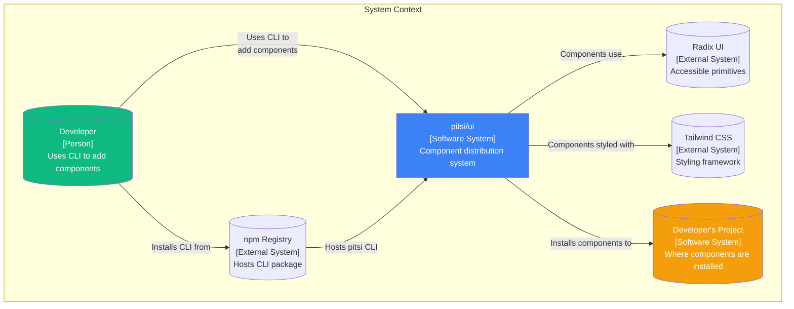
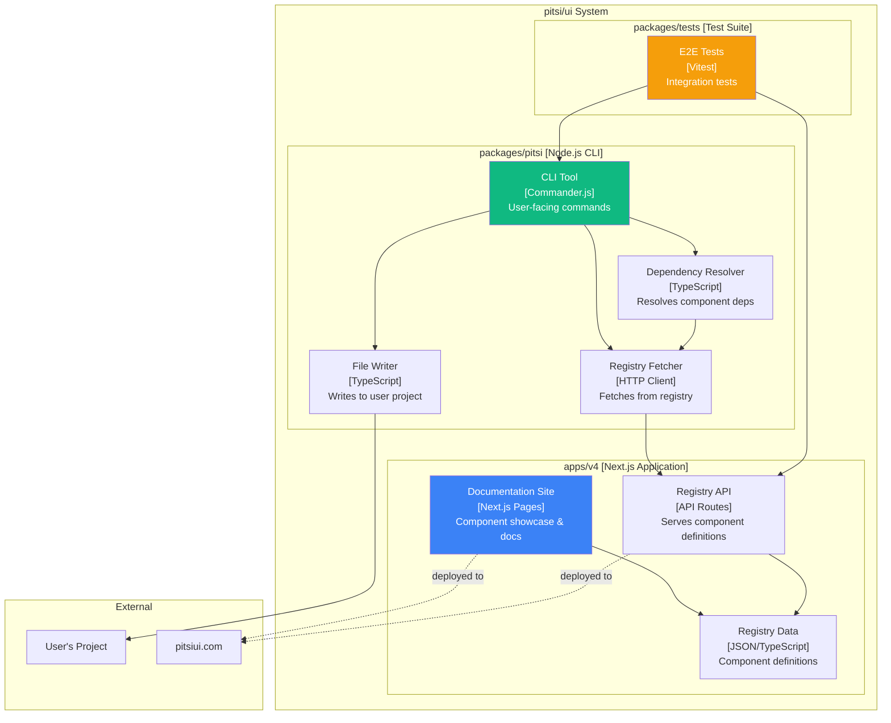
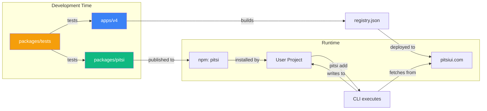
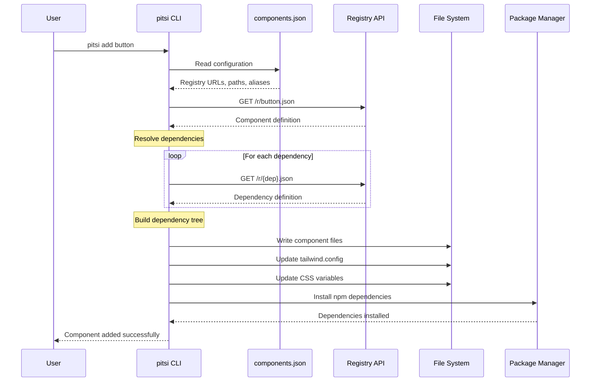
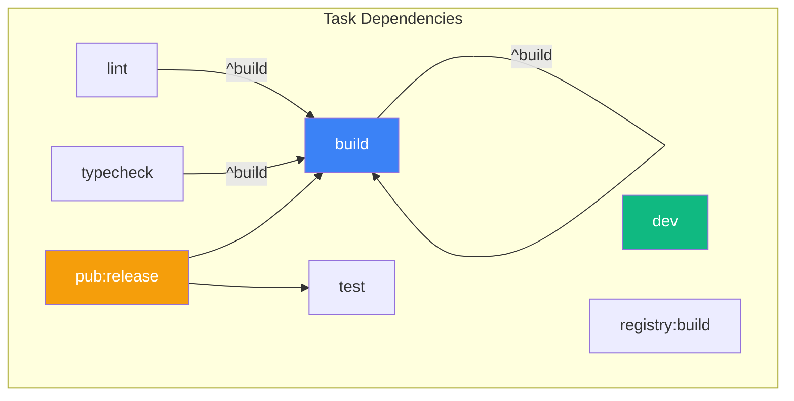

# System Architecture Overview

> High-level architecture of pitsi/ui - a component distribution system

## Philosophy

pitsi/ui takes a fundamentally different approach from traditional npm component libraries:

| Traditional npm | pitsi/ui |
|-----------------|----------|
| Install as dependency | Copy to your codebase |
| Version locked | Full ownership |
| Update via npm | Update when you want |
| Black box | Fully customizable |
| Shared across projects | Per-project customization |

This "copy-paste" approach gives developers complete control over their components while still providing the convenience of a curated, well-tested component library.

---

## C4 Model: System Context



---

## C4 Model: Container Diagram



---

## Monorepo Structure

```
pitsi-ui/
├── apps/
│   └── v4/                    # Next.js documentation site
│       ├── app/               # Next.js app router
│       ├── components/        # Site-specific components
│       ├── lib/               # Shared utilities
│       ├── registry/          # Component registry
│       │   └── new-york-v4/   # Main registry
│       └── scripts/           # Build & automation scripts
│
├── packages/
│   ├── pitsi/                 # CLI tool (published to npm)
│   │   ├── src/
│   │   │   ├── commands/      # CLI commands
│   │   │   ├── registry/      # Registry API client
│   │   │   ├── utils/         # Utility functions
│   │   │   └── mcp/           # MCP server
│   │   └── dist/              # Built output
│   │
│   └── tests/                 # E2E test suite
│       ├── src/tests/         # Test files
│       └── fixtures/          # Test project templates
│
├── scripts/                   # Root-level scripts
├── ._docs/                    # Internal documentation (this folder)
├── package.json               # Workspace configuration
├── turbo.json                 # Turborepo configuration
└── CLAUDE.md                  # Development guidelines
```

---

## Package Relationships



---

## Data Flow: Component Installation



---

## Technology Stack

### Core Runtime

| Technology | Version | Purpose |
|------------|---------|---------|
| Bun | 1.1.38 | Package manager, runtime |
| Turborepo | 2.6.3 | Monorepo orchestration |
| TypeScript | 5.9.3 | Type safety |
| Node.js | 18+ | CLI runtime |

### apps/v4 (Documentation Site)

| Technology | Version | Purpose |
|------------|---------|---------|
| Next.js | 16.0.x | React framework |
| React | 19.x | UI library |
| fumadocs | 16.x | Documentation framework |
| Tailwind CSS | 4.1.x | Styling |
| Radix UI | various | Accessible primitives |

### packages/pitsi (CLI)

| Technology | Version | Purpose |
|------------|---------|---------|
| Commander.js | 13.x | CLI framework |
| Zod | 3.x | Schema validation |
| ts-morph | 25.x | AST manipulation |
| @antfu/ni | 0.29.x | Package manager detection |

---

## Build Pipeline

```mermaid
flowchart TB
    subgraph "Development"
        DEV_V4["bun run v4:dev<br/>Port 4000"]
        DEV_CLI["bun run pitsi:dev<br/>Watch mode"]
    end

    subgraph "Registry Build"
        REG_BUILD["bun run registry:build"]
        REG_BUILD --> LOAD["Load _registry.ts files"]
        LOAD --> VALIDATE["Validate against schema"]
        VALIDATE --> GEN_JSON["Generate registry.json"]
        VALIDATE --> GEN_INDEX["Generate __index__.tsx"]
        GEN_JSON --> LINT["Lint & format"]
        GEN_INDEX --> LINT
    end

    subgraph "Production Build"
        BUILD["bun run build"]
        BUILD --> BUILD_CLI["Build CLI (tsup)"]
        BUILD --> BUILD_V4["Build Next.js"]
        BUILD_CLI --> DIST["dist/index.js"]
        BUILD_V4 --> NEXT[".next/"]
    end

    subgraph "Testing"
        TEST["bun run test"]
        TEST --> START_V4["Start v4 dev server"]
        START_V4 --> RUN_TESTS["Run E2E tests"]
    end

    subgraph "Publishing"
        PUB["bun run pub:release"]
        PUB --> PUB_BUILD["Build CLI"]
        PUB_BUILD --> PUB_TEST["Run tests"]
        PUB_TEST --> PUB_NPM["Publish to npm"]
    end

    style DEV_V4 fill:#3b82f6,color:#fff
    style DEV_CLI fill:#10b981,color:#fff
    style REG_BUILD fill:#8b5cf6,color:#fff
```



---

## Turborepo Task Graph



### Task Configuration

| Task | Cache | Outputs | Dependencies |
|------|-------|---------|--------------|
| `build` | Yes | `dist/**`, `.next/**` | `^build` |
| `dev` | No | - | - |
| `lint` | Yes | - | `^build` |
| `typecheck` | Yes | - | `^build` |
| `test` | Yes | - | - |
| `registry:build` | Yes | `registry/**/*.json`, `registry/**/__index__.tsx` | - |
| `pub:release` | No | - | `build`, `test` |

---

## Environment Variables

### Global (All Packages)

| Variable | Purpose |
|----------|---------|
| `NODE_ENV` | Environment mode |
| `NEXT_PUBLIC_APP_URL` | Public app URL |
| `DATABASE_URL` | Database connection |

### Build-Time

| Variable | Purpose |
|----------|---------|
| `REGISTRY_URL` | Registry API URL |
| `COMPONENTS_REGISTRY_URL` | Component registry URL |
| `HIDE_ALPHA_ITEMS` | Hide alpha components |

### Authentication

| Variable | Purpose |
|----------|---------|
| `BETTER_AUTH_SECRET` | Auth secret |
| `GITHUB_CLIENT_ID/SECRET` | GitHub OAuth |
| `GOOGLE_CLIENT_ID/SECRET` | Google OAuth |

### External Services

| Variable | Purpose |
|----------|---------|
| `STRIPE_*` | Stripe payment integration |
| `UPSTASH_*` | Redis caching |

---

## Key Design Decisions

### 1. Copy vs Install

**Decision**: Components are copied into user's codebase, not installed as dependencies.

**Rationale**:
- Full customization without forking
- No version conflicts
- Works with any build system
- Users own their code

### 2. Schema-Driven Registry

**Decision**: All components defined via Zod schemas with strict validation.

**Rationale**:
- Single source of truth
- Type safety throughout
- Consistent validation
- Easy to extend

### 3. Multi-Registry Support

**Decision**: CLI supports multiple registries via `components.json`.

**Rationale**:
- Enterprise customization
- Community registries
- Local development registries
- Gradual migration

### 4. CSS Variables Over CSS-in-JS

**Decision**: Theming via CSS variables, not runtime CSS-in-JS.

**Rationale**:
- Zero runtime overhead
- Works with SSR
- Easy to customize
- Dark mode support

---

## Next Steps

- **[Registry System Deep Dive](./registry-system.md)** - Understand the core architecture
- **[CLI Architecture](./cli-architecture.md)** - Learn how the CLI works
- **[Documentation Site](./docs-site.md)** - Explore apps/v4 structure
