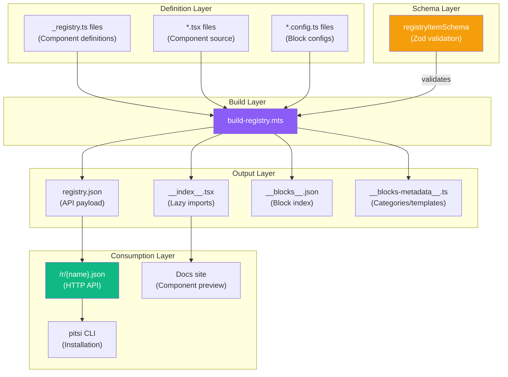
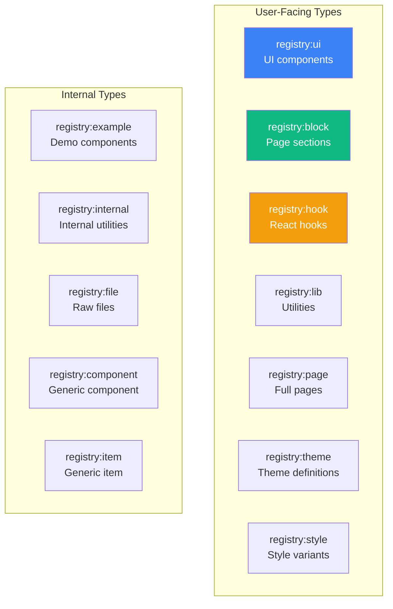
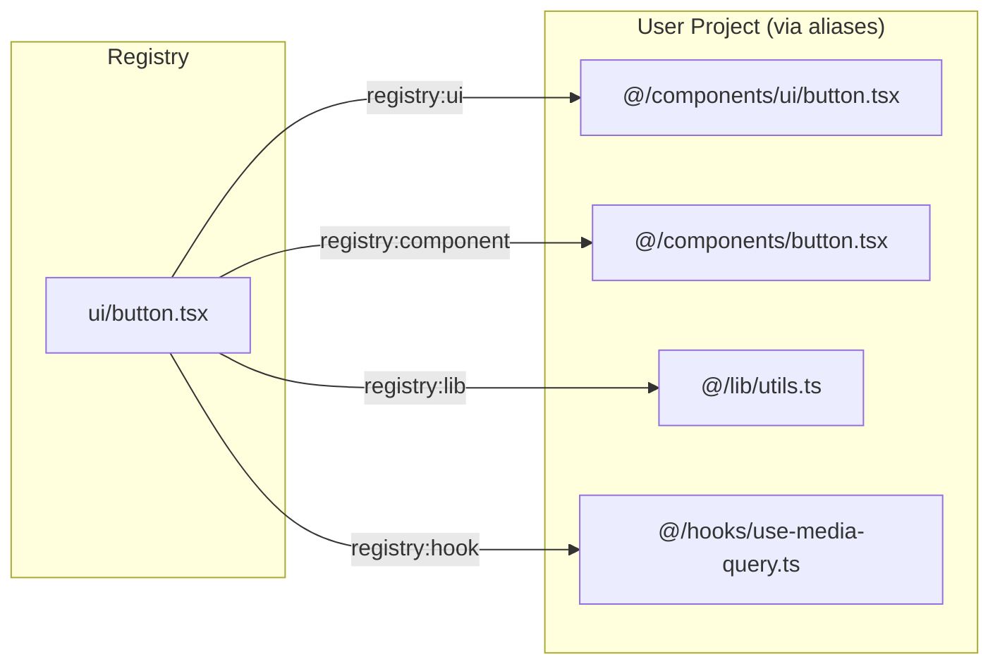
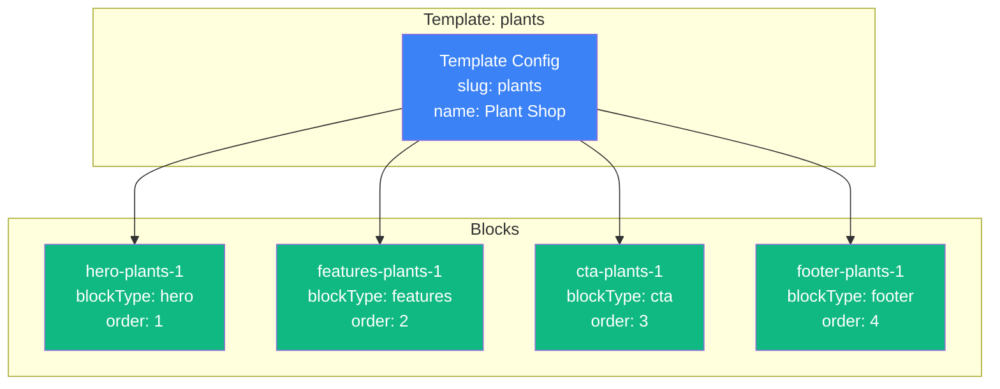
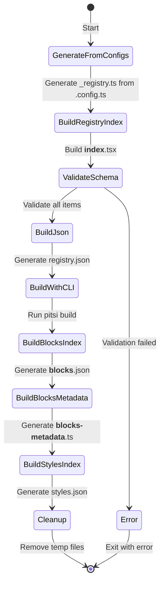
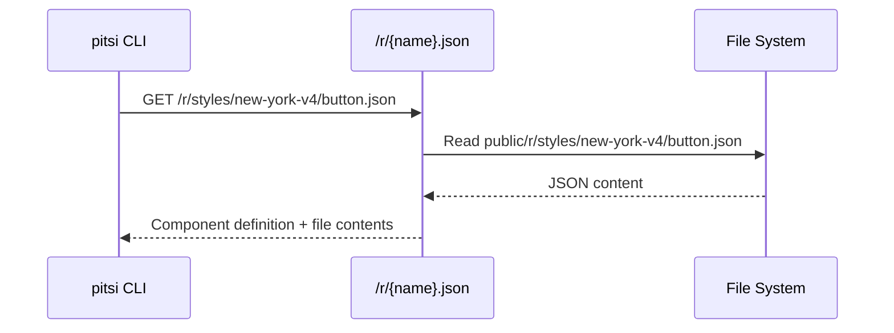
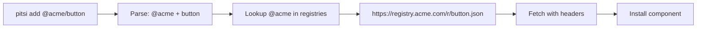
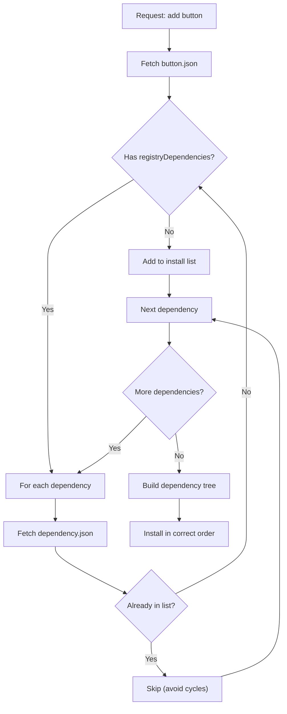
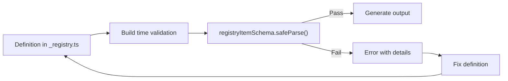

# Registry System Deep Dive

> The registry is the core architecture that powers component distribution

## Overview

The registry system is the heart of pitsi/ui. It's a **schema-driven, declarative system** that:

1. **Defines** components with metadata, dependencies, and configuration
2. **Validates** all definitions against Zod schemas
3. **Builds** into distributable JSON and TypeScript files
4. **Serves** components via HTTP endpoints
5. **Resolves** dependencies for CLI installation



---

## Registry Item Schema

Every component is defined by the `registryItemSchema`. This is the **single source of truth**.

### Schema Definition

```typescript
// packages/pitsi/src/registry/schema.ts

export const registryItemSchema = z.object({
  // Identity
  $schema: z.string().optional(),
  extends: z.string().optional(),
  name: z.string(),                              // Unique identifier
  type: registryItemTypeSchema,                  // Component type
  title: z.string().optional(),                  // Display name
  author: z.string().min(2).optional(),
  description: z.string().optional(),

  // Dependencies
  dependencies: z.array(z.string()).optional(),        // npm packages
  devDependencies: z.array(z.string()).optional(),     // npm dev packages
  registryDependencies: z.array(z.string()).optional(),// Other registry items

  // Files
  files: z.array(registryItemFileSchema).optional(),

  // Configuration
  tailwind: registryItemTailwindSchema.optional(),     // Tailwind config to merge
  cssVars: registryItemCssVarsSchema.optional(),       // CSS variables
  css: registryItemCssSchema.optional(),               // Raw CSS
  envVars: registryItemEnvVarsSchema.optional(),       // Environment variables

  // Metadata
  meta: z.record(z.string(), z.any()).optional(),
  docs: z.string().optional(),                         // MDX documentation
  categories: z.array(z.string()).optional(),          // For organization
  tier: z.enum(["free", "pro"]).optional(),            // Access tier
  readiness: z.enum(["alpha", "beta", "production"]).default("alpha"),
  poweredBy: z.array(registryItemPoweredBySchema).optional(),
  blockConfig: blockConfigSchema,                      // Block-specific config
})
```

### Registry Item Types



| Type | Purpose | User Installable |
|------|---------|------------------|
| `registry:ui` | Fundamental UI components (Button, Input, Dialog) | Yes |
| `registry:block` | Larger composed sections (Hero, CTA, Features) | Yes |
| `registry:hook` | Custom React hooks | Yes |
| `registry:lib` | Utility functions (cn, formatDate) | Yes |
| `registry:page` | Full page templates | Yes |
| `registry:theme` | Theme configurations | Yes |
| `registry:style` | Style variant definitions | Yes |
| `registry:example` | Demo/example implementations | No (internal) |
| `registry:internal` | Internal utilities | No (internal) |
| `registry:file` | Raw configuration files | Yes |
| `registry:component` | Generic component | Yes |
| `registry:item` | Generic item | Yes |

---

## File Schema

Files define what gets copied to the user's project:

```typescript
export const registryItemFileSchema = z.discriminatedUnion("type", [
  // Files with required target path
  z.object({
    path: z.string(),           // Source path in registry
    content: z.string().optional(), // Optional inline content
    type: z.enum(["registry:file", "registry:page"]),
    target: z.string(),         // Where to write in user's project
  }),

  // Other file types (target is optional)
  z.object({
    path: z.string(),
    content: z.string().optional(),
    type: registryItemTypeSchema.exclude(["registry:file", "registry:page"]),
    target: z.string().optional(),
  }),
])
```

### Path Resolution



---

## Configuration Schemas

### Tailwind Configuration

Components can extend the user's Tailwind config:

```typescript
export const registryItemTailwindSchema = z.object({
  config: z.object({
    content: z.array(z.string()).optional(),
    theme: z.record(z.string(), z.any()).optional(),
    plugins: z.array(z.string()).optional(),
  }).optional(),
})
```

**Example:**
```typescript
{
  name: "animated-counter",
  tailwind: {
    config: {
      theme: {
        extend: {
          keyframes: {
            "count-up": { "0%": { opacity: "0" }, "100%": { opacity: "1" } }
          }
        }
      }
    }
  }
}
```

### CSS Variables

Components can define CSS variables for theming:

```typescript
export const registryItemCssVarsSchema = z.object({
  theme: z.record(z.string(), z.string()).optional(),
  light: z.record(z.string(), z.string()).optional(),
  dark: z.record(z.string(), z.string()).optional(),
})
```

**Example:**
```typescript
{
  name: "sidebar",
  cssVars: {
    light: {
      "--sidebar-background": "0 0% 98%",
      "--sidebar-foreground": "240 5.3% 26.1%",
    },
    dark: {
      "--sidebar-background": "240 5.9% 10%",
      "--sidebar-foreground": "240 4.8% 95.9%",
    }
  }
}
```

---

## Block Configuration

Blocks have additional configuration for the blocks-first architecture:

```typescript
export const blockConfigSchema = z.object({
  template: z.string(),                               // Which template (plants, fitness, etc.)
  blockType: z.string(),                              // Type (hero, cta, features, etc.)
  order: z.number(),                                  // Position in template
  palette: z.string(),                                // Color palette
  typography: z.string(),                             // Typography preset
  tint: z.enum(["base", "tinted", "deep"]).optional(),
  forceLight: z.boolean().optional(),
  forceDark: z.boolean().optional(),
}).optional()
```

### Block Architecture



---

## Registry Definition Structure

### Directory Layout

```
registry/new-york-v4/
├── _registry/                    # Top-level registry definitions
│   └── index.ts                  # Combines all _registry.ts files
├── ui/
│   ├── _registry.ts              # UI component definitions
│   ├── button.tsx
│   ├── input.tsx
│   └── ...
├── blocks/
│   ├── _registry.ts              # Block definitions (auto-generated)
│   ├── _template-configs.ts      # Template configurations
│   ├── hero/
│   │   ├── hero-plants-1.tsx
│   │   └── hero-plants-1.config.ts
│   └── ...
├── hooks/
│   ├── _registry.ts
│   ├── use-media-query.ts
│   └── ...
├── lib/
│   ├── _registry.ts
│   ├── utils.ts
│   └── ...
├── examples/
│   ├── _registry.ts
│   ├── button-demo.tsx
│   └── ...
└── registry.ts                   # Main registry export
```

### Registry Definition Example

```typescript
// registry/new-york-v4/ui/_registry.ts
import type { Registry } from "pitsi/schema"

export const ui: Registry["items"] = [
  {
    name: "button",
    type: "registry:ui",
    description: "A versatile button component with multiple variants and sizes",
    dependencies: ["@radix-ui/react-slot"],
    registryDependencies: ["utils"],
    files: [
      { path: "ui/button.tsx", type: "registry:ui" }
    ],
    categories: ["core-components"],
    tier: "free",
    readiness: "production",
  },
  {
    name: "dialog",
    type: "registry:ui",
    description: "A modal dialog for user interactions",
    dependencies: ["@radix-ui/react-dialog"],
    registryDependencies: ["utils", "button"],
    files: [
      { path: "ui/dialog.tsx", type: "registry:ui" }
    ],
    categories: ["overlay"],
    tier: "free",
    readiness: "production",
  },
  // ... more components
]
```

### Main Registry Export

```typescript
// registry/new-york-v4/registry.ts
import type { Registry } from "pitsi/schema"

import { animations } from "./animations/_registry"
import { blocks } from "./blocks/_registry"
import { examples } from "./examples/_registry"
import { hooks } from "./hooks/_registry"
import { internal } from "./internal/_registry"
import { lib } from "./lib/_registry"
import { ui } from "./ui/_registry"

export const registry: Registry = {
  name: "pitsi/ui",
  homepage: "https://pitsiui.com",
  items: [
    ...lib,
    ...hooks,
    ...ui,
    ...blocks,
    ...examples,
    ...animations,
    ...internal,
  ],
}
```

---

## Build Process

The build process transforms TypeScript definitions into distributable files.

### Build Pipeline



### Step-by-Step

#### 1. Generate from Configs

For blocks, config files (`.config.ts`) are converted to registry entries:

```typescript
// hero-plants-1.config.ts
export const registryConfig = {
  name: "hero-plants-1",
  type: "registry:block",
  description: "Hero section for plant shop",
  blockConfig: {
    template: "plants",
    blockType: "hero",
    order: 1,
    palette: "sage",
    typography: "elegant",
  },
  // ...
}
```

↓ Generates ↓

```typescript
// blocks/_registry.ts (auto-generated)
export const blocks: Registry["items"] = [
  {
    name: "hero-plants-1",
    type: "registry:block",
    description: "Hero section for plant shop",
    files: [{ path: "blocks/hero/hero-plants-1.tsx", type: "registry:block" }],
    blockConfig: { /* ... */ }
  },
  // ...
]
```

#### 2. Build Registry Index

Creates lazy-loaded component imports for the docs site:

```typescript
// registry/__index__.tsx
export const Index: Record<string, Record<string, any>> = {
  "new-york-v4": {
    "button": {
      name: "button",
      description: "A versatile button...",
      type: "registry:ui",
      registryDependencies: ["utils"],
      files: [{ path: "registry/new-york-v4/ui/button.tsx", type: "registry:ui", target: "" }],
      component: React.lazy(async () => {
        const mod = await import("@/registry/new-york-v4/ui/button")
        return { default: mod.default || mod["button"] }
      }),
      categories: ["core-components"],
      tier: "free",
      readiness: "production",
    },
    // ... more components
  }
}
```

#### 3. Build Registry JSON

Creates the API payload:

```json
// public/r/styles/new-york-v4/registry.json
{
  "name": "pitsi/ui",
  "homepage": "https://pitsiui.com",
  "items": [
    {
      "name": "button",
      "type": "registry:ui",
      "description": "A versatile button...",
      "dependencies": ["@radix-ui/react-slot"],
      "registryDependencies": ["utils"],
      "files": [
        { "path": "registry/new-york-v4/ui/button.tsx", "type": "registry:ui" }
      ],
      "categories": ["core-components"],
      "tier": "free",
      "readiness": "production"
    }
  ]
}
```

#### 4. Build Individual Item Files

The CLI build command creates individual JSON files:

```
public/r/styles/new-york-v4/
├── registry.json     # Full registry
├── button.json       # Individual component
├── dialog.json
├── utils.json
└── ...
```

#### 5. Build Blocks Metadata

Creates pre-computed metadata for fast navigation:

```typescript
// registry/__blocks-metadata__.ts
export const BLOCK_CATEGORIES: Record<string, string[]> = {
  "hero": ["hero-plants-1", "hero-fitness-1", ...],
  "cta": ["cta-plants-1", "cta-fitness-1", ...],
  "features": ["features-plants-1", ...],
}

export const COMPUTED_TEMPLATES: Record<string, ComputedTemplate> = {
  "plants": {
    slug: "plants",
    name: "Plant Shop",
    blocks: [
      { name: "hero-plants-1", blockType: "hero", order: 1, ... },
      { name: "features-plants-1", blockType: "features", order: 2, ... },
    ],
    blockGroups: {
      "hero": ["hero-plants-1"],
      "features": ["features-plants-1"],
    }
  }
}
```

---

## API Endpoints

The registry is served via Next.js API routes.

### Endpoint Structure

```
/r/
├── styles.json                           # Available styles
├── styles/new-york-v4/
│   ├── registry.json                     # Full registry
│   ├── button.json                       # Individual items
│   ├── dialog.json
│   └── ...
└── index.json                            # Registry index
```

### Request Flow



---

## Multi-Registry Support

The CLI supports multiple registries for enterprise and custom use cases.

### Configuration

```json
// components.json
{
  "registries": {
    "@pitsi": "https://pitsiui.com/r/{name}.json",
    "@acme": {
      "url": "https://registry.acme.com/r/{name}.json",
      "headers": {
        "Authorization": "Bearer ${ACME_REGISTRY_TOKEN}"
      }
    },
    "@v0": "https://v0.dev/registry/{name}.json"
  }
}
```

### Registry Name Resolution



### Schema

```typescript
export const registryConfigSchema = z.record(
  z.string().refine((key) => key.startsWith("@"), {
    message: "Registry names must start with @ (e.g., @v0, @acme)",
  }),
  z.union([
    // Simple string format
    z.string().refine((s) => s.includes("{name}"), {
      message: "Registry URL must include {name} placeholder",
    }),
    // Advanced object format
    z.object({
      url: z.string(),
      params: z.record(z.string(), z.string()).optional(),
      headers: z.record(z.string(), z.string()).optional(),
    }),
  ])
)
```

---

## Dependency Resolution

When installing a component, the CLI resolves all dependencies.

### Resolution Algorithm



### Example Resolution

```
button
├── utils (registryDependency)
│   └── (no dependencies)
└── @radix-ui/react-slot (npm dependency)

dialog
├── utils (registryDependency)
├── button (registryDependency)
│   └── utils (already resolved)
└── @radix-ui/react-dialog (npm dependency)
```

---

## Validation

All registry items are validated against schemas at build time.

### Validation Points



### Error Example

```
❌ Registry validation failed for new-york-v4:
{
  "_errors": [],
  "items": {
    "42": {
      "name": {
        "_errors": ["Required"]
      },
      "type": {
        "_errors": ["Invalid enum value"]
      }
    }
  }
}
```

---

## Best Practices

### 1. Always Define Dependencies

```typescript
// Good
{
  name: "data-table",
  dependencies: ["@tanstack/react-table"],
  registryDependencies: ["button", "checkbox", "dropdown-menu"],
}

// Bad - missing dependencies will cause runtime errors
{
  name: "data-table",
  // dependencies: [],  // Missing!
}
```

### 2. Use Appropriate Types

```typescript
// Good - specific type
{ type: "registry:ui" }
{ type: "registry:hook" }

// Avoid - generic types unless necessary
{ type: "registry:item" }
```

### 3. Set Readiness Correctly

```typescript
// Alpha - experimental, may change
{ readiness: "alpha" }

// Beta - feature complete, testing
{ readiness: "beta" }

// Production - stable, documented
{ readiness: "production" }
```

### 4. Categorize for Discovery

```typescript
{
  name: "data-table",
  categories: ["data-display", "tables"],  // Multiple categories OK
}
```

---

## Next Steps

- **[CLI Architecture](./cli-architecture.md)** - How the CLI uses the registry
- **[Build Registry Script](../subsystems/scripts/build-registry.md)** - Detailed build process
- **[Registry Format Reference](../subsystems/apps-v4/registry-format.md)** - Complete schema docs
