# Next.js Rendering Architecture

This document explains how Next.js rendering works in the pitsi-ui codebase, covering SSR, SSG, PPR, streaming, and the App Router architecture.

## Table of Contents

- [Rendering Overview](#rendering-overview)
- [Rendering Modes](#rendering-modes)
- [App Router Architecture](#app-router-architecture)
- [Server vs Client Components](#server-vs-client-components)
- [Caching Architecture](#caching-architecture)
- [Streaming and Suspense](#streaming-and-suspense)
- [Route Handlers](#route-handlers)
- [Parallel Routes](#parallel-routes)

---

## Rendering Overview

### Request Flow

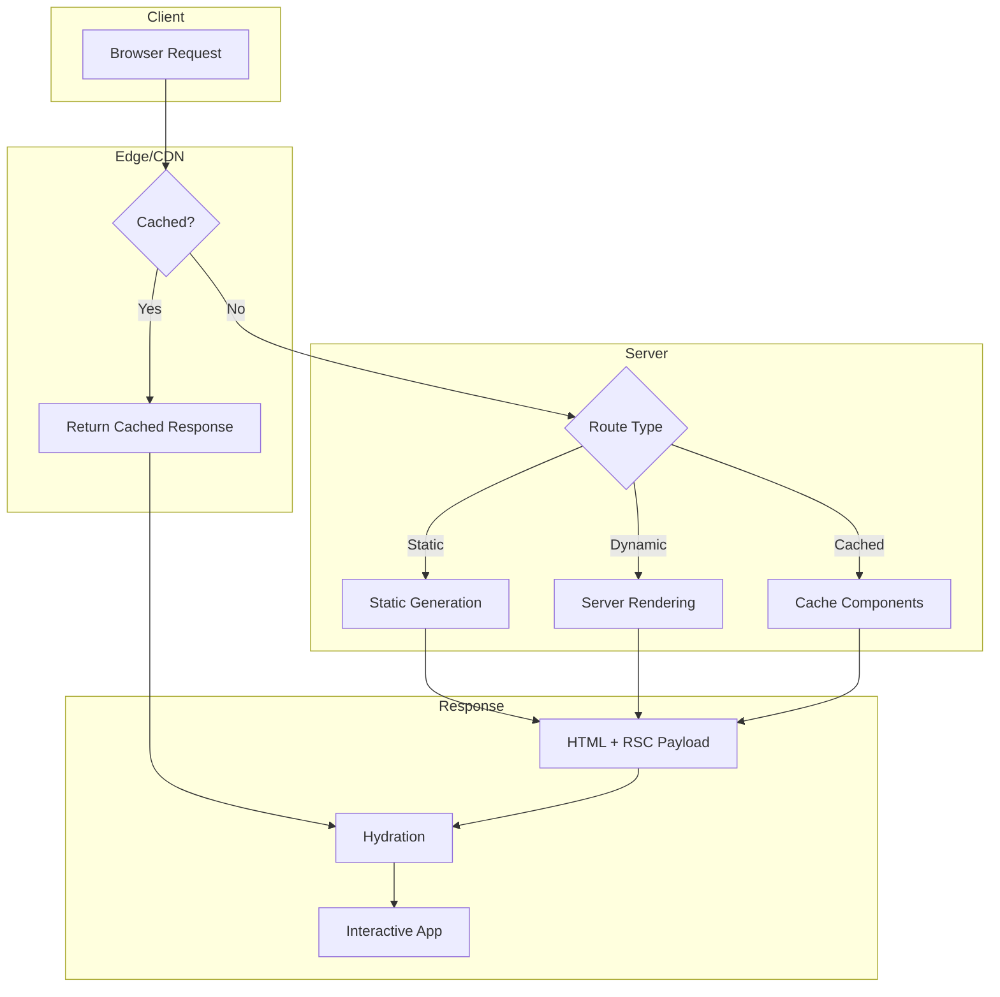
```mermaid
flowchart TD
    subgraph Client
        A[Browser Request]
    end

    subgraph Edge/CDN
        B{Cached?}
        C[Return Cached Response]
    end

    subgraph Server
        D{Route Type}
        E[Static Generation]
        F[Server Rendering]
        G[Cache Components]
    end

    subgraph Response
        H[HTML + RSC Payload]
        I[Hydration]
        J[Interactive App]
    end

    A --> B
    B -->|Yes| C --> I
    B -->|No| D
    D -->|Static| E --> H
    D -->|Dynamic| F --> H
    D -->|Cached| G --> H
    H --> I --> J
```

### Rendering Decision Tree

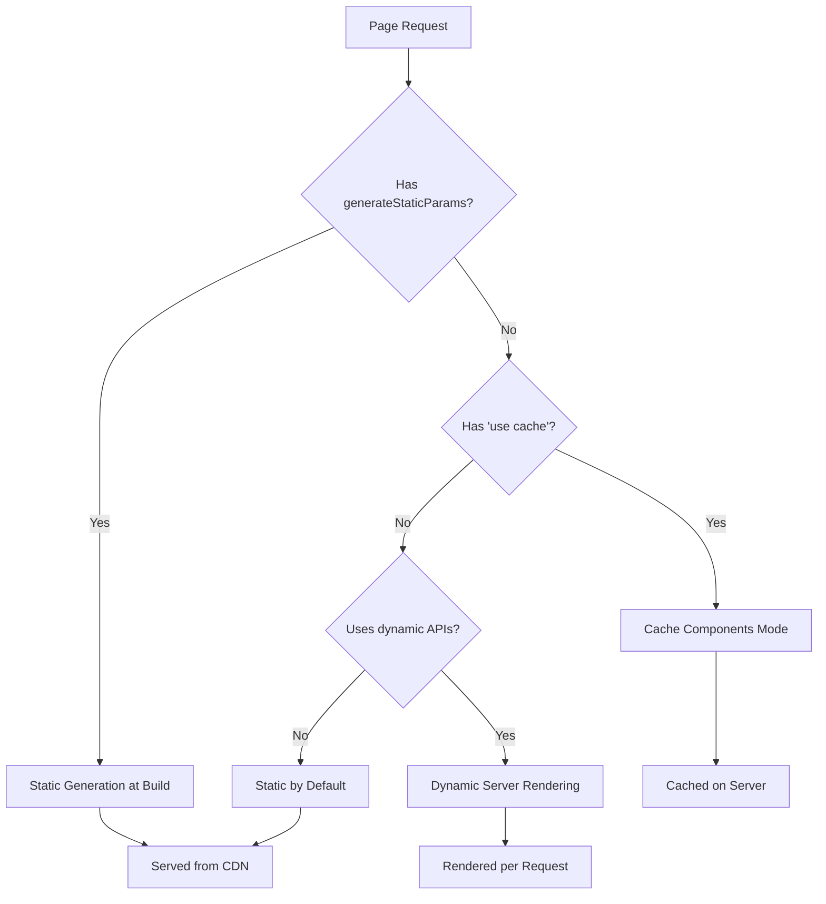
```mermaid
flowchart TD
    A[Page Request] --> B{Has generateStaticParams?}
    B -->|Yes| C[Static Generation at Build]
    B -->|No| D{Has 'use cache'?}
    D -->|Yes| E[Cache Components Mode]
    D -->|No| F{Uses dynamic APIs?}
    F -->|Yes| G[Dynamic Server Rendering]
    F -->|No| H[Static by Default]

    C --> I[Served from CDN]
    E --> J[Cached on Server]
    G --> K[Rendered per Request]
    H --> I
```

---

## Rendering Modes

### Static Site Generation (SSG)

Pages pre-rendered at build time.

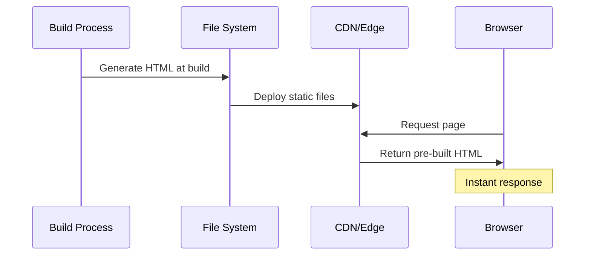
```mermaid
sequenceDiagram
    participant Build as Build Process
    participant FS as File System
    participant CDN as CDN/Edge
    participant Browser

    Build->>FS: Generate HTML at build
    FS->>CDN: Deploy static files
    Browser->>CDN: Request page
    CDN->>Browser: Return pre-built HTML
    Note over Browser: Instant response
```

**Implementation:**

```tsx
// app/(app)/(content)/docs/[[...slug]]/page.tsx

export async function generateStaticParams() {
  return docs.getPages().map((page) => ({
    slug: page.slugs,
  }))
}

export default async function Page({ params }: Props) {
  const page = docs.getPage(params.slug)
  return <DocsContent page={page} />
}
```

**Used for:**
- Documentation pages
- Blog posts
- Block showcases
- Static content pages

### Cache Components Mode (Next.js 16+)

Server-cached components with `"use cache"` directive.

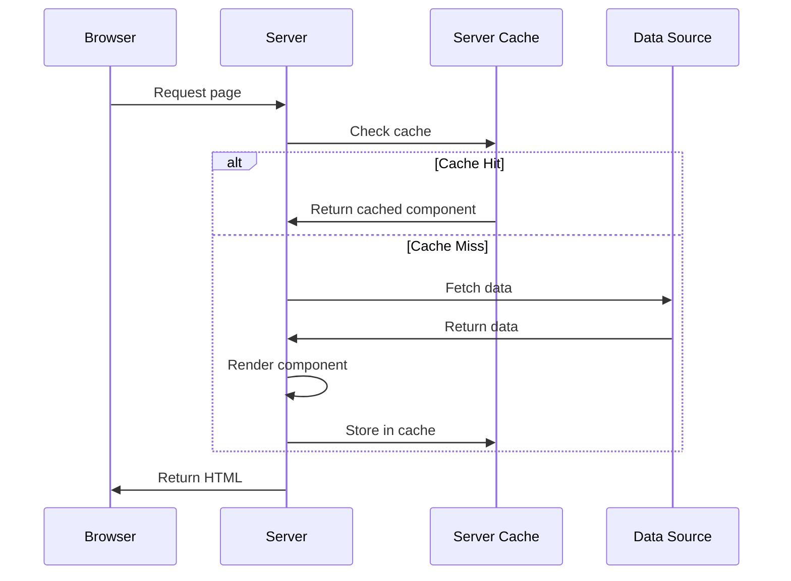
```mermaid
sequenceDiagram
    participant Browser
    participant Server
    participant Cache as Server Cache
    participant DB as Data Source

    Browser->>Server: Request page
    Server->>Cache: Check cache
    alt Cache Hit
        Cache->>Server: Return cached component
    else Cache Miss
        Server->>DB: Fetch data
        DB->>Server: Return data
        Server->>Server: Render component
        Server->>Cache: Store in cache
    end
    Server->>Browser: Return HTML
```

**Implementation:**

```tsx
// app/(app)/(content)/blog/[[...slug]]/page.tsx
"use cache"
import { cacheLife } from "next/cache"

export default async function BlogPage({ params }: Props) {
  cacheLife("max")  // Maximum cache duration

  const post = await getBlogPost(params.slug)
  return <BlogContent post={post} />
}
```

**Cache Lifecycle:**

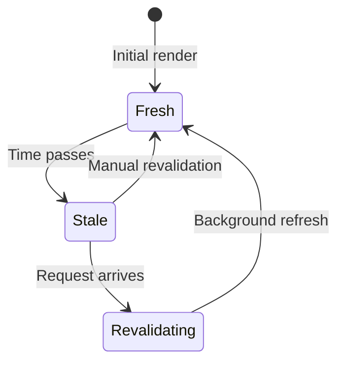
```mermaid
stateDiagram-v2
    [*] --> Fresh: Initial render
    Fresh --> Stale: Time passes
    Stale --> Revalidating: Request arrives
    Revalidating --> Fresh: Background refresh
    Stale --> Fresh: Manual revalidation
```

### Dynamic Server Rendering

Rendered on every request.

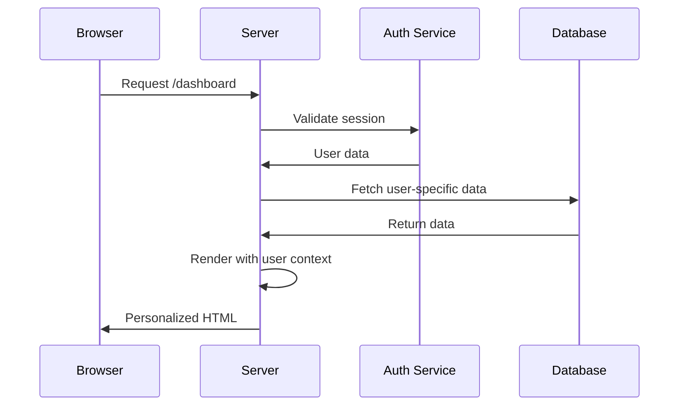
```mermaid
sequenceDiagram
    participant Browser
    participant Server
    participant Auth as Auth Service
    participant DB as Database

    Browser->>Server: Request /dashboard
    Server->>Auth: Validate session
    Auth->>Server: User data
    Server->>DB: Fetch user-specific data
    DB->>Server: Return data
    Server->>Server: Render with user context
    Server->>Browser: Personalized HTML
```

**Triggers for dynamic rendering:**
- `cookies()`, `headers()` usage
- `searchParams` access
- Uncached data fetching
- Dynamic route segments

**Example:**

```tsx
// app/(app)/dashboard/page.tsx
import { getCurrentUser } from "@/lib/server/user"

export default async function DashboardPage() {
  const user = await getCurrentUser()  // Uses headers()
  // This page will be dynamically rendered
  return <Dashboard user={user} />
}
```

---

## App Router Architecture

### Route Structure

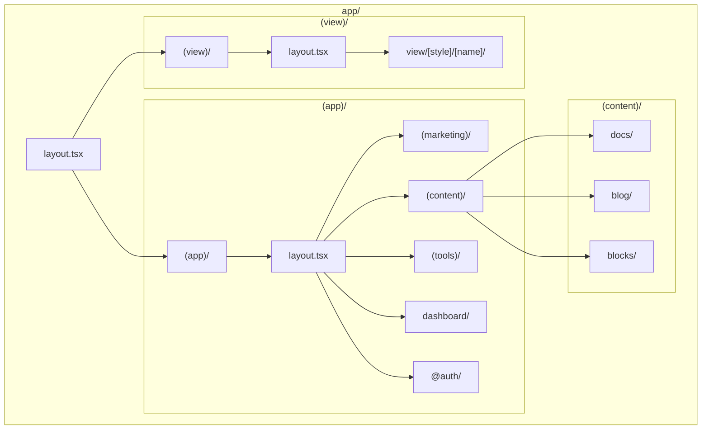
```mermaid
graph TD
    subgraph "app/"
        A[layout.tsx] --> B["(app)/"]
        A --> C["(view)/"]

        subgraph "(app)/"
            B --> D[layout.tsx]
            D --> E["(marketing)/"]
            D --> F["(content)/"]
            D --> G["(tools)/"]
            D --> H["dashboard/"]
            D --> I["@auth/"]
        end

        subgraph "(content)/"
            F --> J["docs/"]
            F --> K["blog/"]
            F --> L["blocks/"]
        end

        subgraph "(view)/"
            C --> M[layout.tsx]
            M --> N["view/[style]/[name]/"]
        end
    end
```

### Route Groups Explained

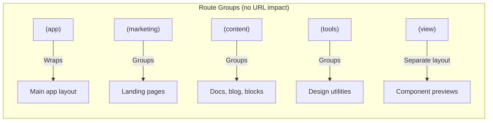
```mermaid
flowchart LR
    subgraph "Route Groups (no URL impact)"
        A["(app)"] --> |"Wraps"| B[Main app layout]
        C["(marketing)"] --> |"Groups"| D[Landing pages]
        E["(content)"] --> |"Groups"| F[Docs, blog, blocks]
        G["(tools)"] --> |"Groups"| H[Design utilities]
        I["(view)"] --> |"Separate layout"| J[Component previews]
    end
```

### Layout Hierarchy

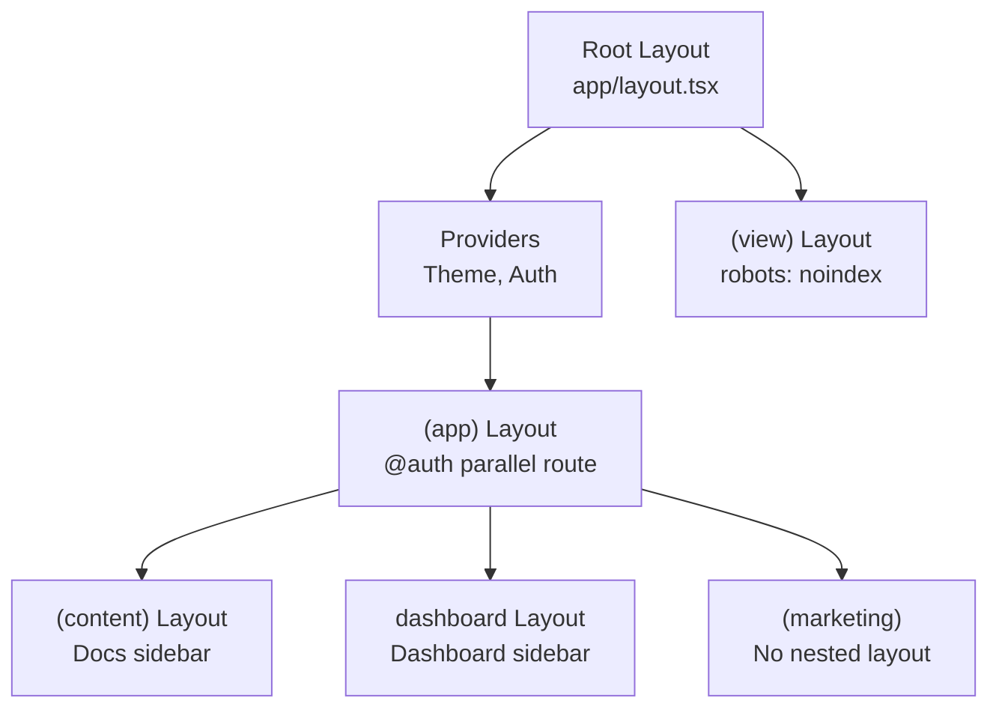
```mermaid
flowchart TD
    A[Root Layout<br/>app/layout.tsx] --> B[Providers<br/>Theme, Auth]
    B --> C["(app) Layout<br/>@auth parallel route"]
    C --> D["(content) Layout<br/>Docs sidebar"]
    C --> E["dashboard Layout<br/>Dashboard sidebar"]
    C --> F["(marketing)<br/>No nested layout"]

    A --> G["(view) Layout<br/>robots: noindex"]
```

---

## Server vs Client Components

### Component Decision Flow

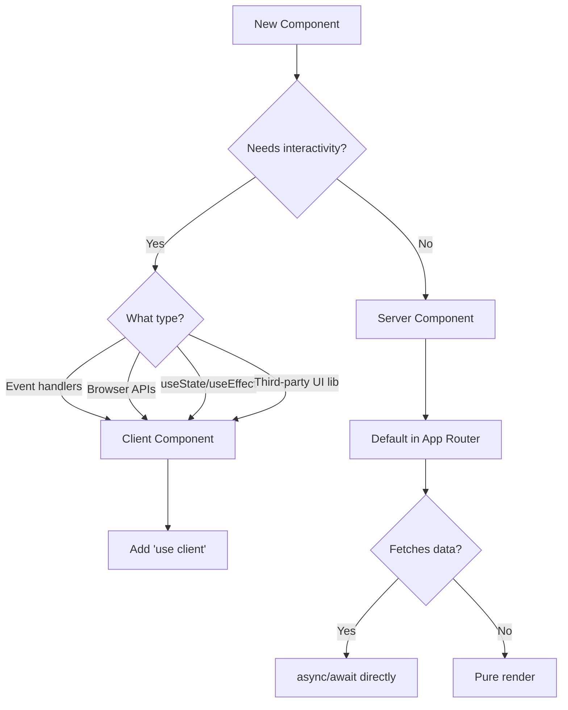
```mermaid
flowchart TD
    A[New Component] --> B{Needs interactivity?}
    B -->|No| C[Server Component]
    B -->|Yes| D{What type?}

    D -->|Event handlers| E[Client Component]
    D -->|Browser APIs| E
    D -->|useState/useEffect| E
    D -->|Third-party UI lib| E

    C --> F[Default in App Router]
    E --> G["Add 'use client'"]

    F --> H{Fetches data?}
    H -->|Yes| I[async/await directly]
    H -->|No| J[Pure render]
```

### Component Boundaries

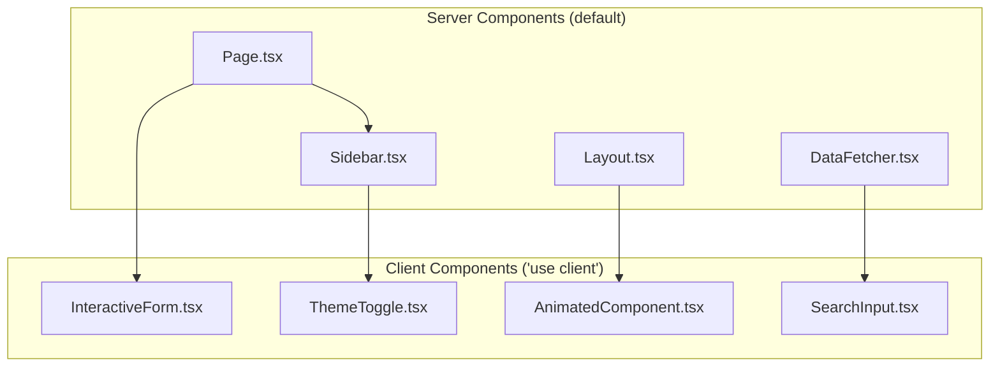
```mermaid
graph TD
    subgraph "Server Components (default)"
        A[Page.tsx]
        B[Layout.tsx]
        C[Sidebar.tsx]
        D[DataFetcher.tsx]
    end

    subgraph "Client Components ('use client')"
        E[InteractiveForm.tsx]
        F[ThemeToggle.tsx]
        G[AnimatedComponent.tsx]
        H[SearchInput.tsx]
    end

    A --> E
    A --> C
    C --> F
    B --> G
    D --> H
```

### Data Flow Pattern

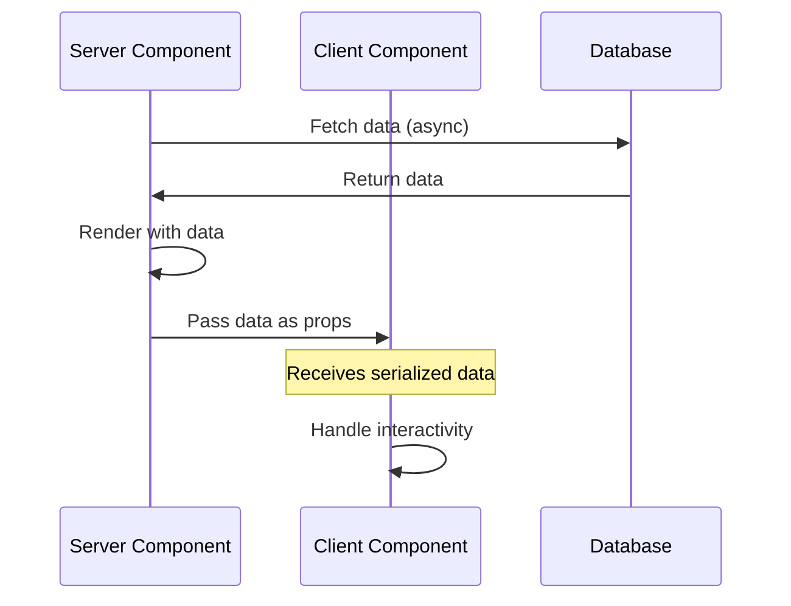
```mermaid
sequenceDiagram
    participant SC as Server Component
    participant CC as Client Component
    participant DB as Database

    SC->>DB: Fetch data (async)
    DB->>SC: Return data
    SC->>SC: Render with data
    SC->>CC: Pass data as props
    Note over CC: Receives serialized data
    CC->>CC: Handle interactivity
```

**Implementation:**

```tsx
// Server Component - fetches data
async function BlockPage({ params }) {
  const block = await getBlock(params.name)  // Server-side fetch
  return <BlockClient block={block} />       // Pass to client
}

// Client Component - handles interaction
"use client"
function BlockClient({ block }) {
  const [copied, setCopied] = useState(false)
  return (
    <div onClick={() => setCopied(true)}>
      {block.code}
    </div>
  )
}
```

---

## Caching Architecture

### Cache Layers

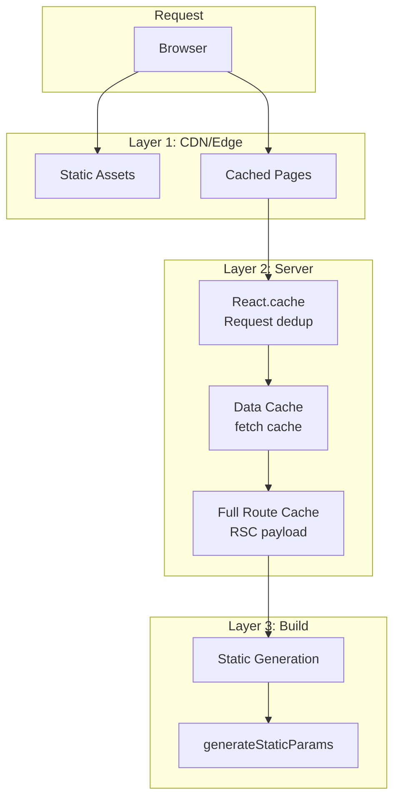
```mermaid
flowchart TD
    subgraph "Request"
        A[Browser]
    end

    subgraph "Layer 1: CDN/Edge"
        B[Static Assets]
        C[Cached Pages]
    end

    subgraph "Layer 2: Server"
        D[React.cache<br/>Request dedup]
        E[Data Cache<br/>fetch cache]
        F[Full Route Cache<br/>RSC payload]
    end

    subgraph "Layer 3: Build"
        G[Static Generation]
        H[generateStaticParams]
    end

    A --> B
    A --> C
    C --> D
    D --> E
    E --> F
    F --> G
    G --> H
```

### Cache Types Comparison

```mermaid
graph LR
    subgraph "React.cache()"
        A[Single Request<br/>Deduplication]
    end

    subgraph "Data Cache"
        B[Cross-Request<br/>fetch() caching]
    end

    subgraph "Full Route Cache"
        C[RSC Payload<br/>HTML caching]
    end

    subgraph "Cache Components"
        D["'use cache'<br/>Component-level"]
    end

    A -->|Same render| B
    B -->|Revalidation| C
    C -->|Next.js 16+| D
```

### Caching in pitsi-ui

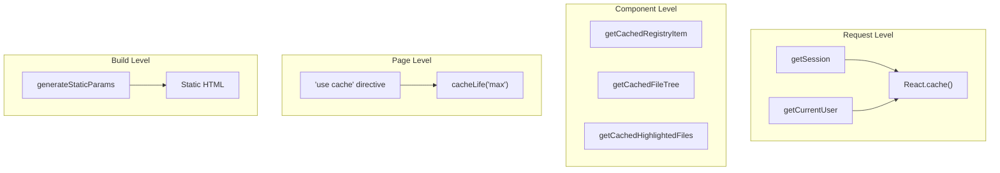
```mermaid
flowchart TD
    subgraph "Request Level"
        A[getSession]
        B[getCurrentUser]
        C["React.cache()"]
        A --> C
        B --> C
    end

    subgraph "Component Level"
        D[getCachedRegistryItem]
        E[getCachedFileTree]
        F[getCachedHighlightedFiles]
    end

    subgraph "Page Level"
        G["'use cache' directive"]
        H["cacheLife('max')"]
        G --> H
    end

    subgraph "Build Level"
        I[generateStaticParams]
        J[Static HTML]
        I --> J
    end
```

---

## Streaming and Suspense

### Streaming Architecture

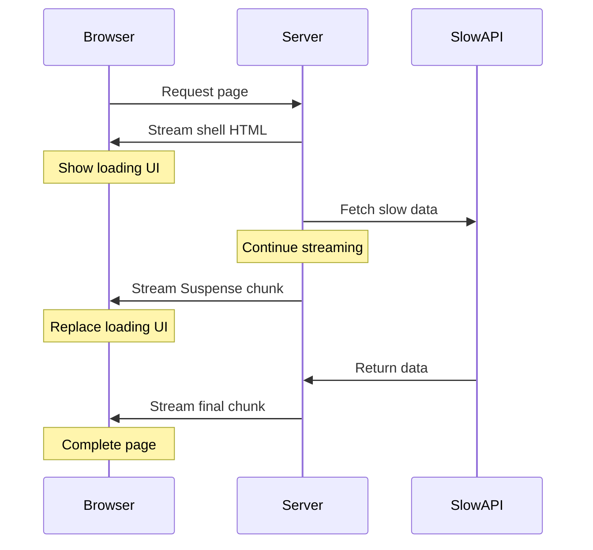
```mermaid
sequenceDiagram
    participant Browser
    participant Server
    participant SlowAPI

    Browser->>Server: Request page
    Server->>Browser: Stream shell HTML
    Note over Browser: Show loading UI

    Server->>SlowAPI: Fetch slow data
    Note over Server: Continue streaming
    Server->>Browser: Stream Suspense chunk
    Note over Browser: Replace loading UI

    SlowAPI->>Server: Return data
    Server->>Browser: Stream final chunk
    Note over Browser: Complete page
```

### Suspense Boundaries

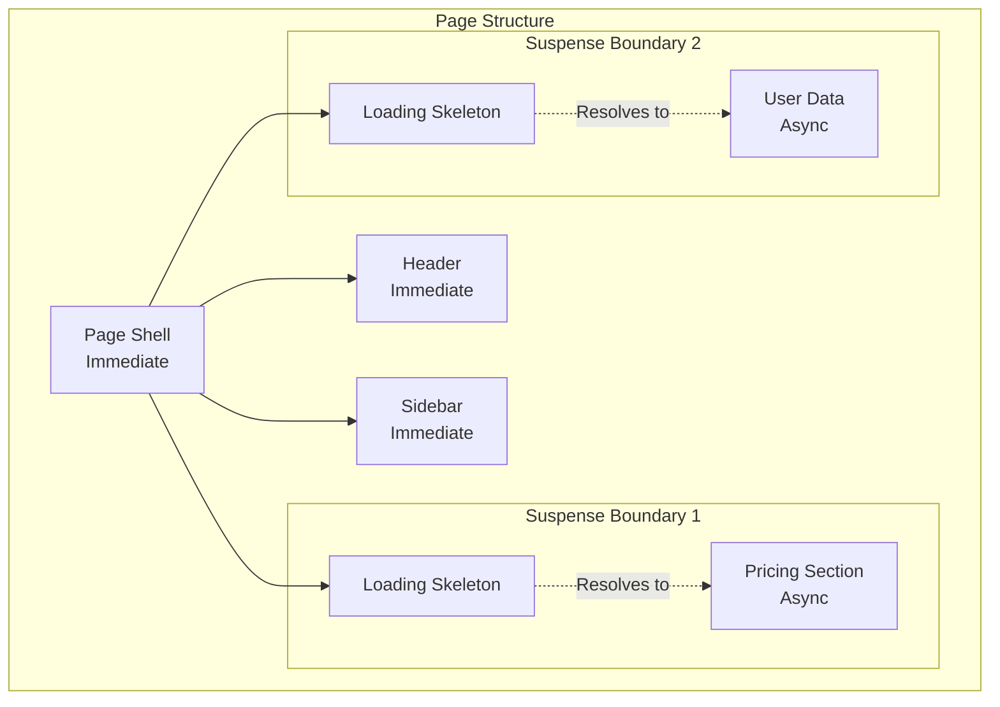
```mermaid
graph TD
    subgraph "Page Structure"
        A[Page Shell<br/>Immediate]
        B[Header<br/>Immediate]
        C[Sidebar<br/>Immediate]

        subgraph "Suspense Boundary 1"
            D[Loading Skeleton]
            E[Pricing Section<br/>Async]
        end

        subgraph "Suspense Boundary 2"
            F[Loading Skeleton]
            G[User Data<br/>Async]
        end
    end

    A --> B
    A --> C
    A --> D
    D -.->|Resolves to| E
    A --> F
    F -.->|Resolves to| G
```

**Implementation:**

```tsx
// app/(app)/(marketing)/page.tsx
import { Suspense } from "react"

export default function HomePage() {
  return (
    <main>
      {/* Immediate render */}
      <HeroSection />
      <FeaturesSection />

      {/* Streamed in */}
      <Suspense fallback={<PricingCardsSkeleton />}>
        <DynamicPricingSection />
      </Suspense>

      {/* More immediate content */}
      <TestimonialsSection />
    </main>
  )
}
```

### Loading States

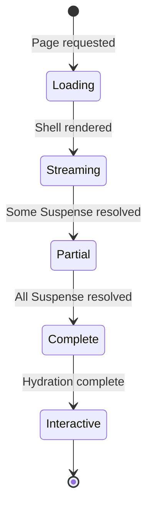
```mermaid
stateDiagram-v2
    [*] --> Loading: Page requested
    Loading --> Streaming: Shell rendered
    Streaming --> Partial: Some Suspense resolved
    Partial --> Complete: All Suspense resolved
    Complete --> Interactive: Hydration complete
    Interactive --> [*]
```

---

## Route Handlers

### API Route Architecture

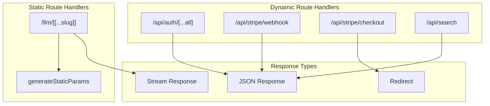
```mermaid
flowchart TD
    subgraph "Static Route Handlers"
        A["/llm/[[...slug]]"]
        B[generateStaticParams]
        A --> B
    end

    subgraph "Dynamic Route Handlers"
        C["/api/auth/[...all]"]
        D["/api/stripe/webhook"]
        E["/api/stripe/checkout"]
        F["/api/search"]
    end

    subgraph "Response Types"
        G[JSON Response]
        H[Stream Response]
        I[Redirect]
    end

    C --> G
    D --> G
    E --> I
    F --> G
    A --> H
```

### Route Handler Flow

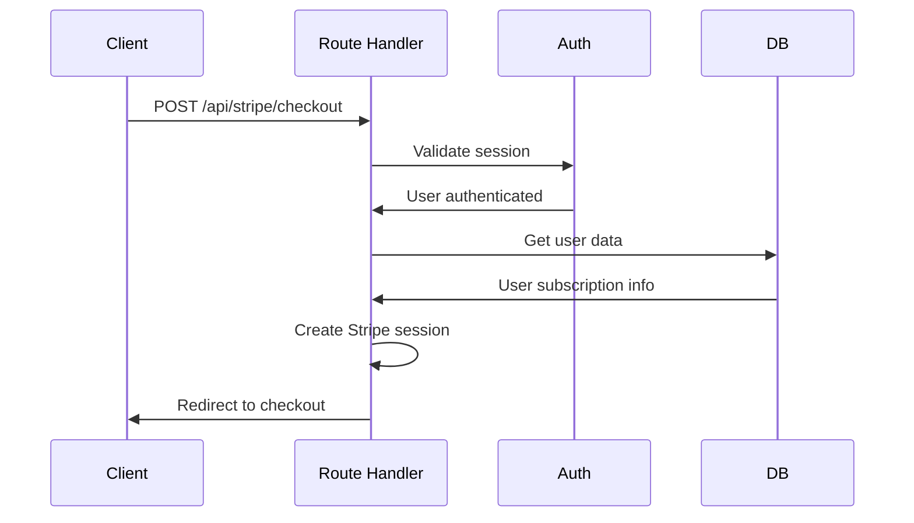
```mermaid
sequenceDiagram
    participant Client
    participant Handler as Route Handler
    participant Auth
    participant DB

    Client->>Handler: POST /api/stripe/checkout
    Handler->>Auth: Validate session
    Auth->>Handler: User authenticated
    Handler->>DB: Get user data
    DB->>Handler: User subscription info
    Handler->>Handler: Create Stripe session
    Handler->>Client: Redirect to checkout
```

---

## Parallel Routes

### Parallel Route Structure

```mermaid
graph TD
    subgraph "layout.tsx"
        A[Layout Component]
    end

    subgraph "Slots"
        B["@auth"]
        C["@content"]
        D["@paywall"]
    end

    subgraph "Conditional Rendering"
        E{User subscription?}
        F[Show content]
        G[Show paywall]
    end

    A --> B
    A --> C
    A --> D
    C --> E
    D --> E
    E -->|Pro| F
    E -->|Free| G
```

### Auth Modal Pattern

```mermaid
flowchart TD
    subgraph "Route Structure"
        A["(app)/layout.tsx"]
        B["@auth/(.)signin/page.tsx"]
        C["@auth/(.)signup/page.tsx"]
        D["@auth/default.tsx"]
    end

    subgraph "Behavior"
        E[Normal navigation]
        F[Intercepted route]
        G[Modal overlay]
    end

    A --> B
    A --> C
    A --> D

    B --> F
    C --> F
    F --> G
    D --> E
```

**Implementation:**

```tsx
// app/(app)/layout.tsx
export default function AppLayout({
  children,
  auth,  // Parallel route slot
}: {
  children: React.ReactNode
  auth: React.ReactNode
}) {
  return (
    <>
      {children}
      {auth}  {/* Modal renders here */}
    </>
  )
}
```

### Paywall Pattern

```mermaid
flowchart TD
    A["/block/[category]/[blockName]"] --> B[layout.tsx]
    B --> C{Check subscription}
    C -->|Free tier| D["@paywall/page.tsx"]
    C -->|Pro user| E["@content/page.tsx"]

    D --> F[Upgrade prompt]
    E --> G[Full block content]
```

**Implementation:**

```tsx
// app/(app)/(content)/(blocks)/block/[category]/[blockName]/layout.tsx
import { getCurrentUser } from "@/lib/server/user"

export default async function BlockLayout({
  children,
  content,
  paywall,
}: {
  children: React.ReactNode
  content: React.ReactNode
  paywall: React.ReactNode
}) {
  const user = await getCurrentUser()
  const isPro = user?.isPro ?? false

  return (
    <div>
      {children}
      {isPro ? content : paywall}
    </div>
  )
}
```

---

## Summary

### Rendering Strategy Overview

```mermaid
pie title "Rendering Distribution in pitsi-ui"
    "Static (SSG)" : 45
    "Cache Components" : 35
    "Dynamic" : 20
```

### Key Patterns

| Pattern | Use Case | Files |
|---------|----------|-------|
| SSG + generateStaticParams | Docs, blog, blocks | 10 routes |
| Cache Components | Long-lived pages | 19+ pages |
| Dynamic rendering | Dashboard, auth | User-specific |
| Streaming + Suspense | Home page, previews | Select pages |
| Parallel routes | Auth modals, paywalls | 2 patterns |

### Performance Impact

```mermaid
graph LR
    subgraph "Build Time"
        A[Static Generation]
        B[Faster TTFB]
    end

    subgraph "Runtime"
        C[Cache Components]
        D[Reduced Server Load]
    end

    subgraph "User Experience"
        E[Streaming]
        F[Progressive Loading]
    end

    A --> B
    C --> D
    E --> F
```
