# Template Apps

This document explains the template applications in the pitsi-ui monorepo. These apps serve as showcases, testing grounds, and demonstrations for different features of the component library.

## Table of Contents

- [Overview](#overview)
- [App Architecture](#app-architecture)
- [Portfolio App](#portfolio-app)
- [Quiz Web App](#quiz-web-app)
- [Quiz Mobile App](#quiz-mobile-app)
- [AI App](#ai-app)
- [Shared Packages](#shared-packages)
- [Test Fixtures](#test-fixtures)
- [Running Template Apps](#running-template-apps)

---

## Overview

### Purpose of Template Apps

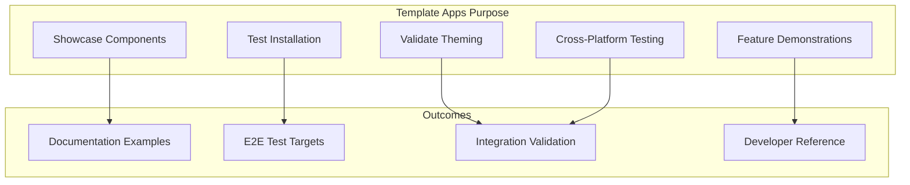

### Monorepo Structure

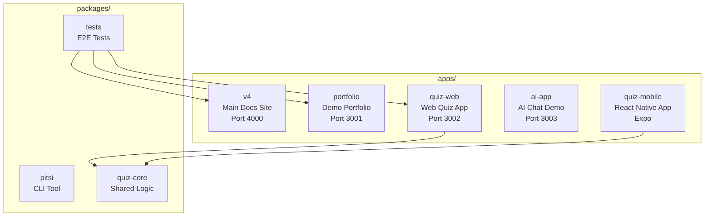

---

## App Architecture

### Technology Stack Comparison

| App | Framework | Port | Styling | State | Purpose |
|-----|-----------|------|---------|-------|---------|
| **v4** | Next.js 16 | 4000 | Tailwind 4 | - | Main docs + registry |
| **portfolio** | Next.js 16 | 3001 | Tailwind 4 | - | Component showcase |
| **quiz-web** | Next.js 16 | 3002 | Tailwind 4 | Jotai | Feature testing |
| **ai-app** | Next.js 16 | 3003 | Tailwind 4 | - | AI SDK demo |
| **quiz-mobile** | Expo/RN | Expo | NativeWind | - | Cross-platform |

### Shared Dependencies Flow

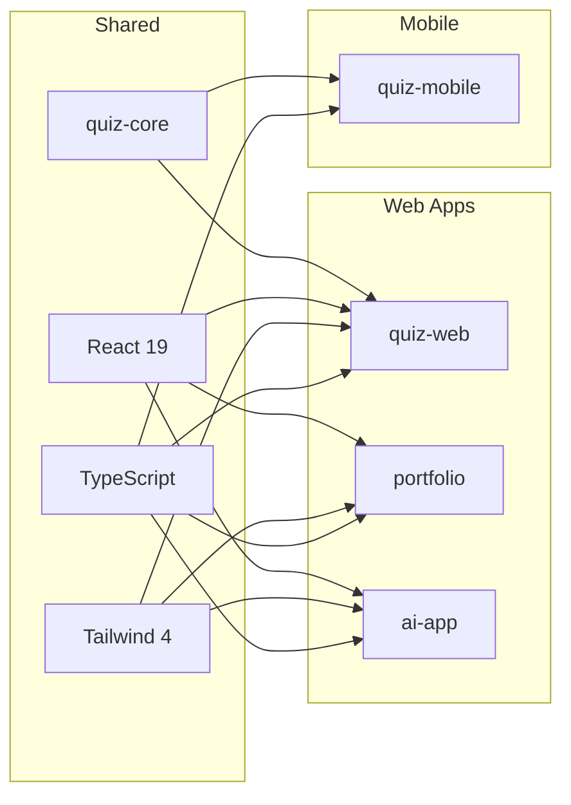

---

## Portfolio App

### Overview

The portfolio app demonstrates how to build a complete portfolio website using pitsi-ui components.

**Location:** `apps/portfolio`
**Port:** 3001

### Architecture

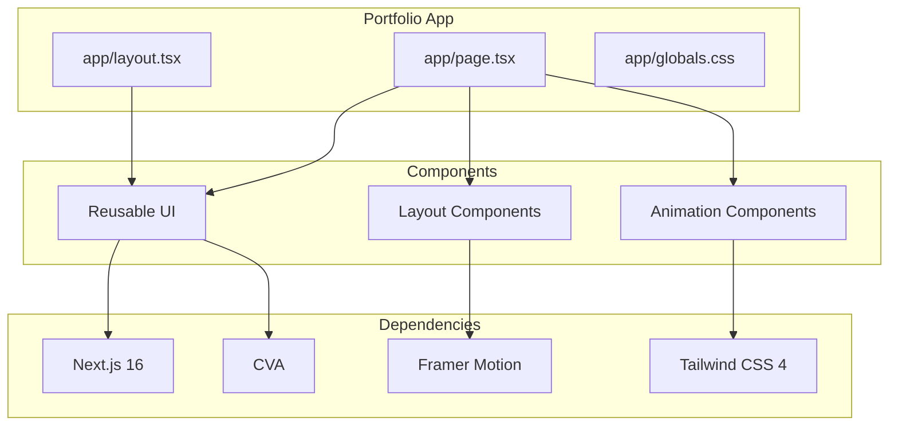

### Tech Stack

```json
{
  "dependencies": {
    "next": "16.0.7",
    "react": "19.2.0",
    "react-dom": "19.2.0",
    "framer-motion": "12.23.26",
    "class-variance-authority": "0.7.1",
    "clsx": "2.1.1",
    "tailwind-merge": "3.3.0"
  }
}
```

### Use Cases

- **Component Showcase**: Demonstrates button, card, and layout components
- **Animation Patterns**: Shows Framer Motion integration
- **Theme Testing**: Validates dark/light mode switching
- **Responsive Design**: Tests mobile-first layouts

### Scripts

```bash
# Start development server
bun run portfolio:dev

# Build for production
bun run portfolio:build

# Type checking
bun run portfolio:typecheck
```

---

## Quiz Web App

### Overview

A full-featured quiz application that shares core logic with the mobile app via the `@pitsi/quiz-core` package.

**Location:** `apps/quiz-web`
**Port:** 3002

### Architecture

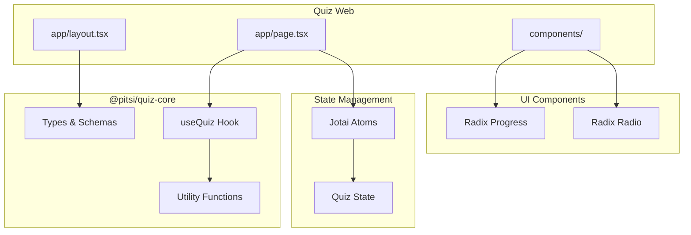

### Shared Code Pattern

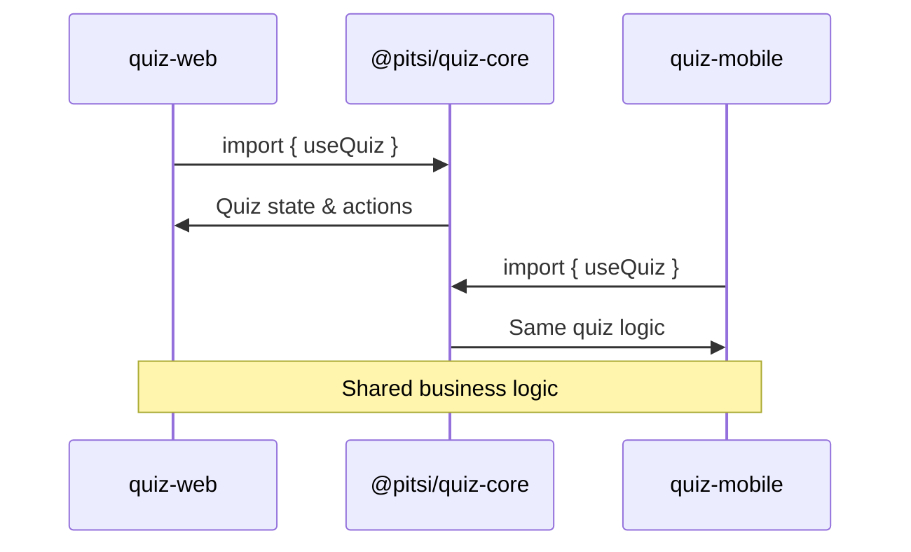

### Tech Stack

```json
{
  "dependencies": {
    "next": "16.0.7",
    "react": "19.2.0",
    "@pitsi/quiz-core": "workspace:*",
    "jotai": "2.15.2",
    "@radix-ui/react-progress": "1.1.7",
    "@radix-ui/react-radio-group": "1.3.7"
  }
}
```

### Features Tested

- **State Sharing**: Validates workspace dependency linking
- **Component Integration**: Tests Radix UI with Tailwind
- **Hook Patterns**: Validates custom hook consumption
- **Type Safety**: Ensures TypeScript types flow correctly

### Scripts

```bash
# Start development server
bun run quiz-web:dev

# Build for production
bun run quiz-web:build
```

---

## Quiz Mobile App

### Overview

A React Native/Expo application demonstrating cross-platform component sharing with the same quiz logic as the web app.

**Location:** `apps/quiz-mobile`

### Architecture

```mermaid
flowchart TD
    subgraph "Quiz Mobile (Expo)"
        A[app/_layout.tsx]
        B[app/index.tsx]
        C[components/]
    end

    subgraph "Navigation"
        D[Expo Router]
        E[Tab Navigation]
    end

    subgraph "Styling"
        F[NativeWind]
        G[Tailwind Classes]
    end

    subgraph "Shared"
        H[@pitsi/quiz-core]
        I[Types]
        J[Hooks]
    end

    A --> D
    B --> E
    C --> F
    F --> G
    B --> H
    H --> I
    H --> J
```

### Cross-Platform Strategy

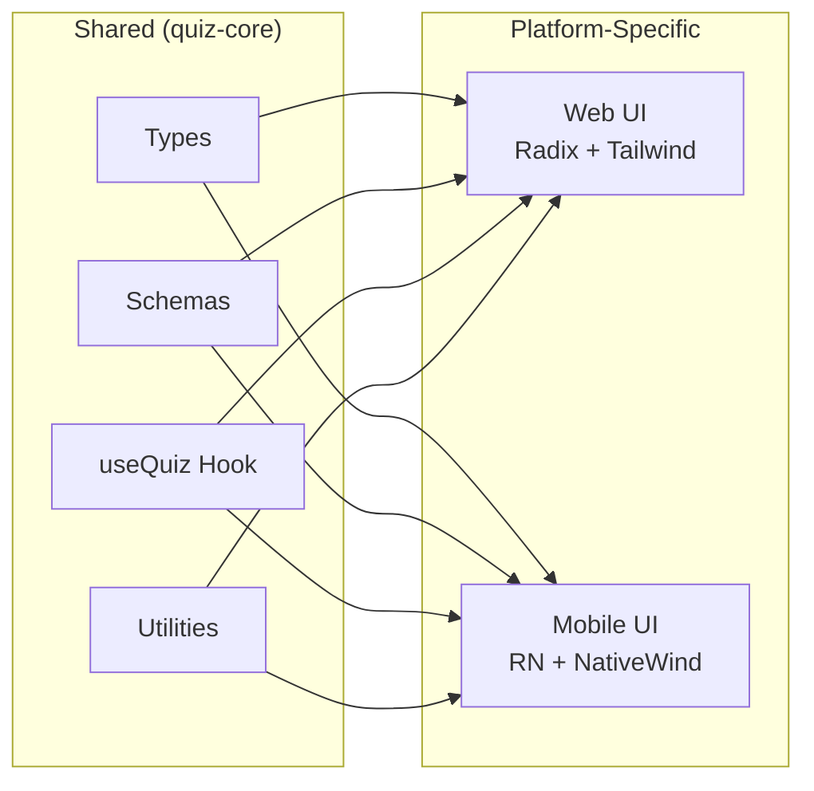

### Tech Stack

```json
{
  "dependencies": {
    "expo": "52.0.0",
    "react-native": "0.76.0",
    "react": "18.3.1",
    "@pitsi/quiz-core": "workspace:*",
    "expo-router": "4.0.0",
    "nativewind": "4.1.23",
    "lucide-react-native": "0.483.0"
  }
}
```

### Features Tested

- **Workspace Linking**: Same package works in RN
- **NativeWind**: Tailwind-style classes in React Native
- **Expo Router**: File-based routing like Next.js
- **Cross-Platform Hooks**: Same hooks, different renderers

### Scripts

```bash
# Start Expo development
bun run quiz-mobile:start

# Run on iOS
bun run quiz-mobile:ios

# Run on Android
bun run quiz-mobile:android

# Run on Web
bun run quiz-mobile:web
```

---

## AI App

### Overview

Demonstrates integration of Vercel's AI SDK for building chat interfaces.

**Location:** `apps/ai-app`
**Port:** 3003

### Architecture

```mermaid
flowchart TD
    subgraph "AI App"
        A[app/page.tsx<br/>Chat Interface]
        B[app/api/chat/route.ts<br/>AI Endpoint]
        C[components/<br/>Chat UI]
    end

    subgraph "AI SDK"
        D[@ai-sdk/openai]
        E[ai library]
        F[Streaming Response]
    end

    subgraph "UI"
        G[Textarea Autosize]
        H[Framer Motion]
    end

    A --> C
    A --> B
    B --> D
    B --> E
    E --> F
    C --> G
    C --> H
```

### Tech Stack

```json
{
  "dependencies": {
    "next": "16.0.7",
    "react": "19.2.0",
    "@ai-sdk/openai": "1.0.0",
    "ai": "4.0.0",
    "framer-motion": "12.23.26",
    "react-textarea-autosize": "8.5.9"
  }
}
```

### Features Tested

- **AI SDK Integration**: Streaming responses
- **API Routes**: Next.js route handlers
- **Real-time UI**: Message streaming
- **Input Components**: Auto-resizing textarea

### Scripts

```bash
# Start development server
bun run ai-app:dev

# Build for production
bun run ai-app:build
```

---

## Shared Packages

### @pitsi/quiz-core

A shared library containing quiz logic, types, and hooks used by both web and mobile apps.

**Location:** `packages/quiz-core`

### Package Structure

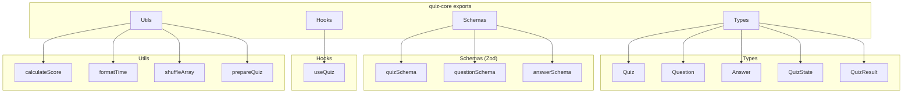

### Type Definitions

```typescript
// Question types supported
type QuestionType =
  | "multiple_choice"
  | "single_choice"
  | "true_false"
  | "text_input"

// Quiz configuration
interface Quiz {
  id: string
  title: string
  description?: string
  questions: Question[]
  timeLimit?: number
  shuffleQuestions?: boolean
  shuffleAnswers?: boolean
  showResults?: boolean
  passingScore?: number
}

// Quiz state management
interface QuizState {
  currentIndex: number
  answers: UserAnswer[]
  startTime: number
  endTime?: number
  isComplete: boolean
}
```

### Build Configuration

```bash
# Watch mode for development
bun run quiz-core:dev

# Production build with tsup
bun run quiz-core:build
```

---

## Test Fixtures

### E2E Test Templates

Test fixtures are minimal project templates used for automated testing of the CLI.

**Location:** `packages/tests/fixtures/`

### Fixture Types

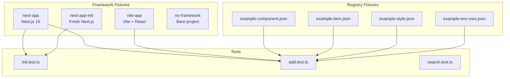

### Fixture Structure

```
packages/tests/fixtures/
├── next-app/           # Next.js test project
│   ├── app/
│   ├── package.json
│   └── tsconfig.json
├── next-app-init/      # Fresh Next.js for init tests
├── vite-app/           # Vite + React test project
│   ├── src/
│   ├── package.json
│   └── vite.config.ts
├── no-framework/       # Edge case testing
│   └── .gitkeep
└── registry/           # Mock registry items
    ├── example-component.json
    ├── example-item.json
    ├── example-style.json
    └── example-env-vars.json
```

### How Fixtures Work

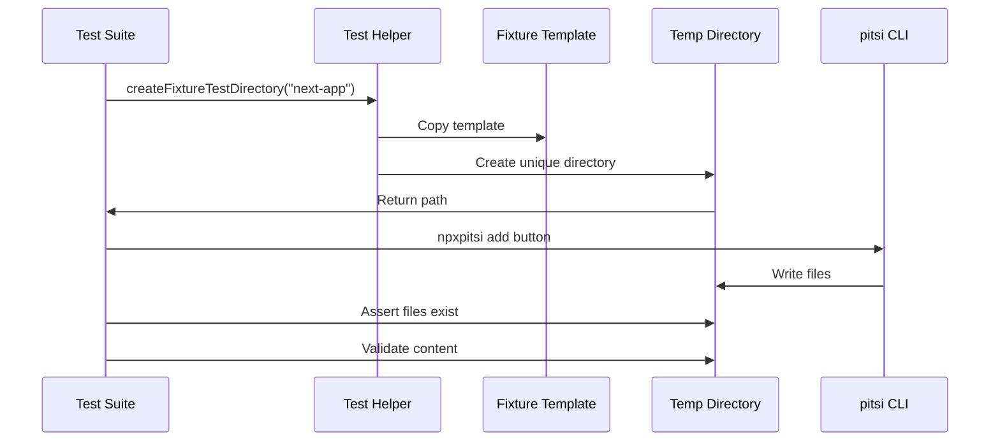

---

## Running Template Apps

### Development Commands

```bash
# Start all apps in parallel
bun run dev

# Start specific apps
bun run v4:dev          # Port 4000
bun run portfolio:dev   # Port 3001
bun run quiz-web:dev    # Port 3002
bun run ai-app:dev      # Port 3003
bun run quiz-mobile:start  # Expo

# Build all apps
bun run build

# Build specific apps
bun run portfolio:build
bun run quiz-web:build
bun run ai-app:build
```

### Port Allocation

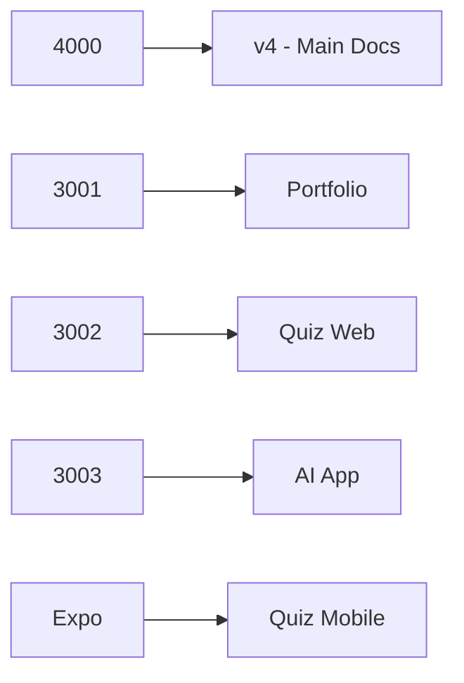

### Environment Setup

Each app may require specific environment variables:

```bash
# AI App requires OpenAI key
OPENAI_API_KEY=sk-...

# Quiz apps use shared core (no config needed)
# Portfolio uses default settings
```

---

## Summary

### App Purposes

| App | Primary Purpose | Secondary Purpose |
|-----|-----------------|-------------------|
| **v4** | Documentation & Registry | Component source |
| **portfolio** | Showcase demo | Theme testing |
| **quiz-web** | Feature testing | Shared code demo |
| **quiz-mobile** | Cross-platform testing | RN integration |
| **ai-app** | AI SDK demo | API route testing |

### Testing Coverage

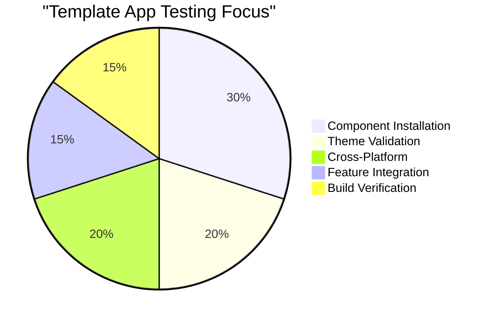
