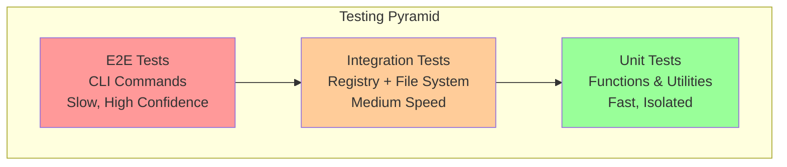
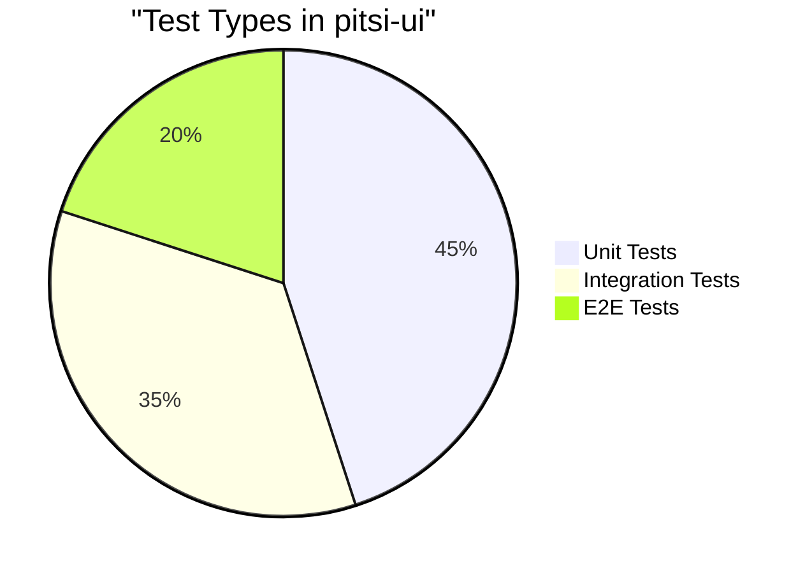
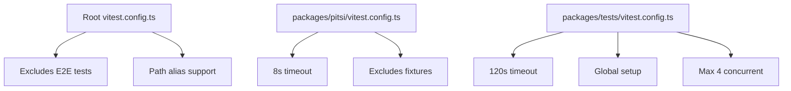
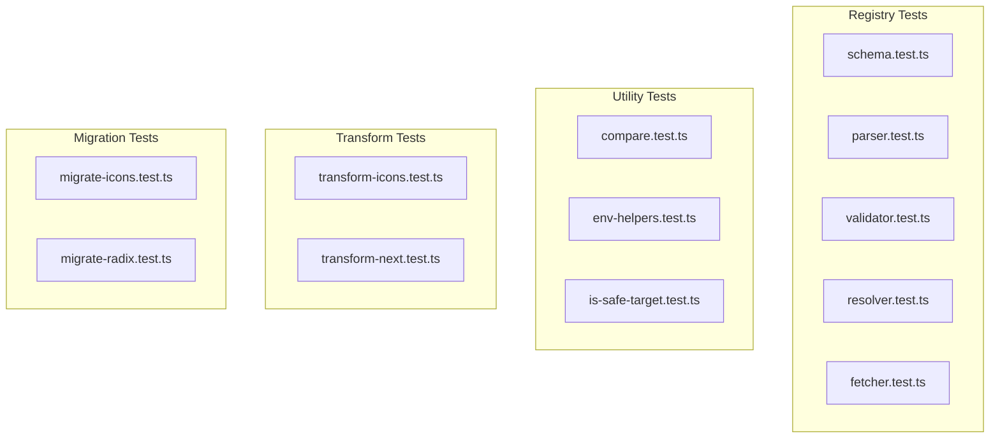
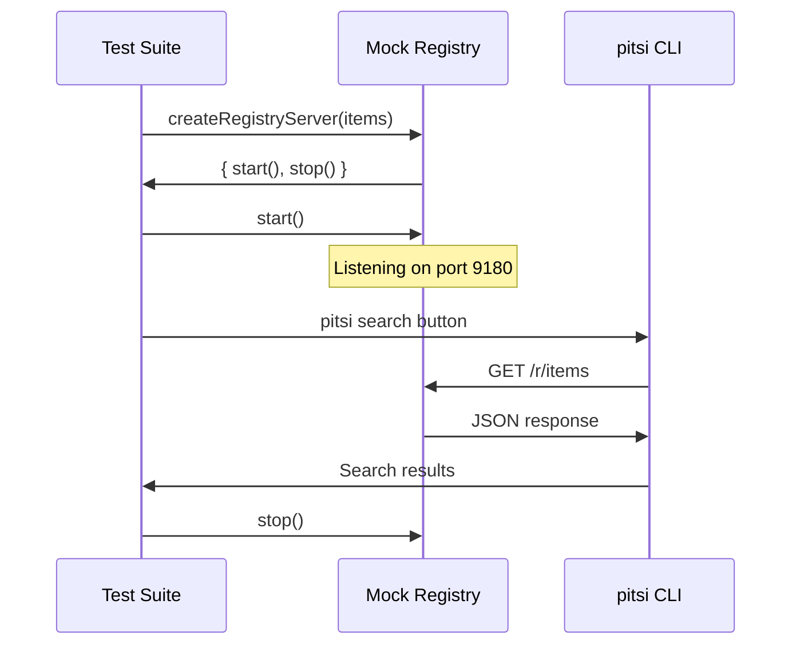
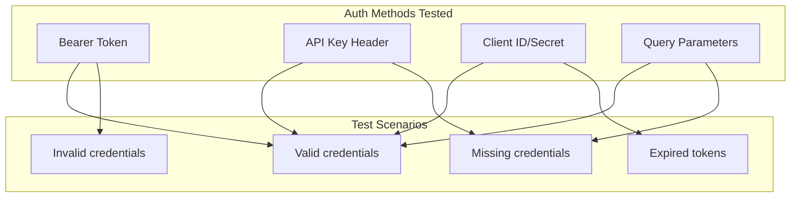
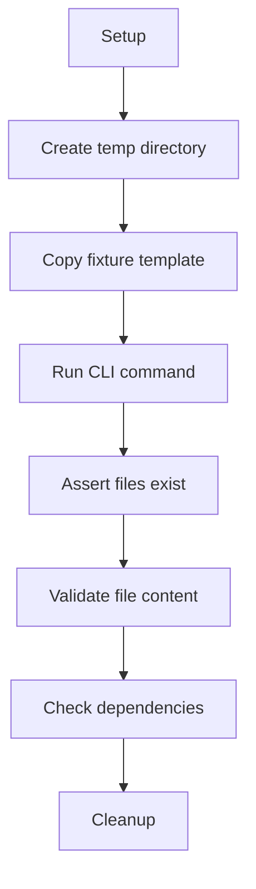
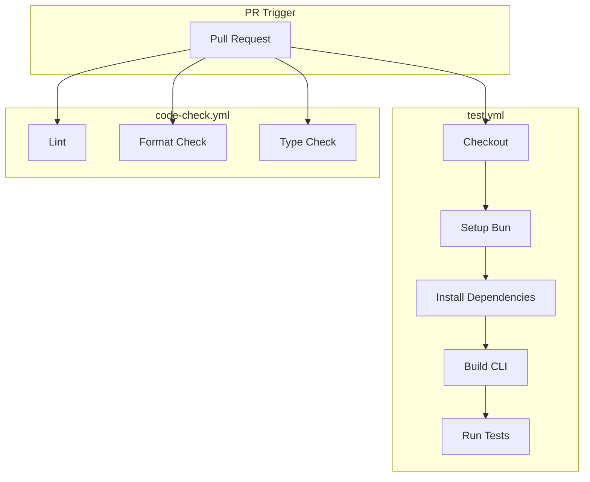
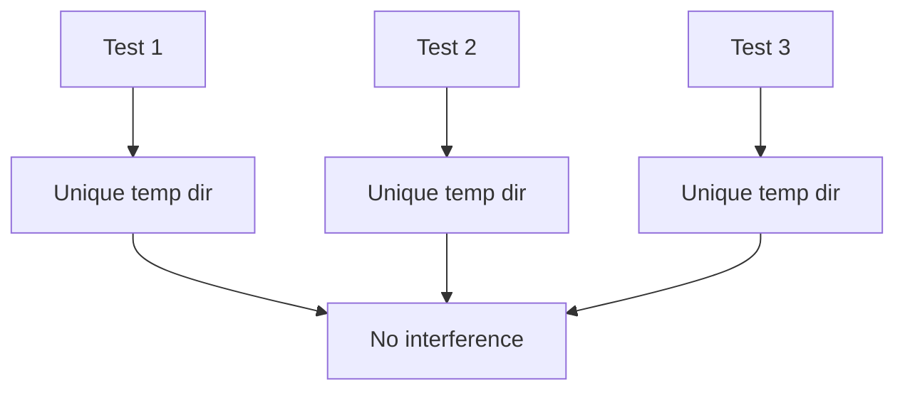

# Test-Driven Development

This document explains the testing architecture, TDD patterns, and quality assurance practices in the pitsi-ui codebase.

## Table of Contents

- [Testing Overview](#testing-overview)
- [Test Architecture](#test-architecture)
- [Unit Testing](#unit-testing)
- [Integration Testing](#integration-testing)
- [E2E Testing](#e2e-testing)
- [Test Utilities](#test-utilities)
- [CI/CD Integration](#cicd-integration)
- [Writing Tests](#writing-tests)
- [Best Practices](#best-practices)

---

## Testing Overview

### Testing Pyramid



### Test Distribution



### Testing Stack

| Tool | Purpose | Config File |
|------|---------|-------------|
| **Vitest** | Test runner | `vitest.config.ts` |
| **Execa** | CLI execution | - |
| **fs-extra** | File assertions | - |
| **Mock servers** | Registry simulation | `registry.ts` |

---

## Test Architecture

### Directory Structure

```
pitsi-ui/
├── packages/
│   ├── pitsi/                    # CLI Package
│   │   ├── src/
│   │   │   ├── registry/
│   │   │   │   ├── schema.test.ts
│   │   │   │   ├── parser.test.ts
│   │   │   │   ├── validator.test.ts
│   │   │   │   └── ...
│   │   │   ├── utils/
│   │   │   │   ├── compare.test.ts
│   │   │   │   └── env-helpers.test.ts
│   │   │   └── transforms/
│   │   │       └── transform-icons.test.ts
│   │   ├── test/
│   │   │   └── fixtures/         # CLI test fixtures
│   │   └── vitest.config.ts
│   │
│   └── tests/                    # E2E Tests Package
│       ├── src/
│       │   ├── tests/
│       │   │   ├── init.test.ts
│       │   │   ├── add.test.ts
│       │   │   ├── search.test.ts
│       │   │   └── view.test.ts
│       │   └── utils/
│       │       ├── setup.ts
│       │       ├── helpers.ts
│       │       └── registry.ts
│       ├── fixtures/             # E2E fixtures
│       │   ├── next-app/
│       │   ├── vite-app/
│       │   └── registry/
│       └── vitest.config.ts
│
└── vitest.config.ts              # Root config
```

### Configuration Hierarchy



---

## Unit Testing

### Overview

Unit tests validate individual functions and utilities in isolation.

**Location:** `packages/pitsi/src/**/*.test.ts`

### Test Categories



### Parser Tests Example

```typescript
// packages/pitsi/src/registry/parser.test.ts

describe("parseRegistryAndItemFromString", () => {
  it.each([
    ["@v0/button", { registry: "@v0", item: "button" }],
    ["@acme/data-table", { registry: "@acme", item: "data-table" }],
    ["@my-org/complex-item", { registry: "@my-org", item: "complex-item" }],
  ])("should parse registry item: %s", (input, expected) => {
    expect(parseRegistryAndItemFromString(input)).toEqual(expected)
  })

  it.each([
    "button",           // No @ prefix
    "v0/button",        // Missing @
    "@/button",         // Empty registry name
    "@v0/",             // Empty item name
  ])("should return null for invalid: %s", (input) => {
    expect(parseRegistryAndItemFromString(input)).toBeNull()
  })
})
```

### Validator Tests Example

```typescript
// packages/pitsi/src/registry/validator.test.ts

describe("extractEnvVarsFromRegistryConfig", () => {
  it("should extract env vars from Bearer token", () => {
    const config = {
      name: "@test",
      url: "https://api.example.com",
      headers: {
        Authorization: "Bearer $GITHUB_TOKEN"
      }
    }

    const envVars = extractEnvVarsFromRegistryConfig(config)
    expect(envVars).toContain("GITHUB_TOKEN")
  })

  it("should extract multiple env vars", () => {
    const config = {
      name: "@test",
      url: "https://api.example.com",
      headers: {
        "X-Api-Key": "$API_KEY",
        "X-Client-Secret": "$CLIENT_SECRET"
      }
    }

    const envVars = extractEnvVarsFromRegistryConfig(config)
    expect(envVars).toEqual(["API_KEY", "CLIENT_SECRET"])
  })
})
```

### Running Unit Tests

```bash
# Run all CLI unit tests
bun run pitsi:test

# Watch mode
bun run pitsi:test:watch

# Run specific test file
cd packages/pitsi && bun test src/registry/parser.test.ts
```

---

## Integration Testing

### Overview

Integration tests verify that multiple components work together correctly.

### Mock Registry Server



### Registry Server Implementation

```typescript
// packages/tests/src/utils/registry.ts

export function createRegistryServer(
  items: RegistryItem[],
  options: { port: number; path?: string }
) {
  const server = http.createServer((req, res) => {
    const url = new URL(req.url!, `http://localhost:${options.port}`)

    // Handle different endpoints
    if (url.pathname === "/r/items") {
      res.writeHead(200, { "Content-Type": "application/json" })
      res.end(JSON.stringify(items))
    }

    if (url.pathname.startsWith("/r/items/")) {
      const name = url.pathname.split("/").pop()
      const item = items.find(i => i.name === name)
      res.writeHead(item ? 200 : 404)
      res.end(item ? JSON.stringify(item) : "Not found")
    }

    // Handle authentication
    const authHeader = req.headers.authorization
    if (authHeader && !validateAuth(authHeader)) {
      res.writeHead(401)
      res.end("Unauthorized")
    }
  })

  return {
    start: () => server.listen(options.port),
    stop: () => server.close()
  }
}
```

### Authentication Testing



---

## E2E Testing

### Overview

End-to-end tests validate complete CLI workflows with real file system operations.

**Location:** `packages/tests/src/tests/`

### Test Flow



### Init Command Tests

```typescript
// packages/tests/src/tests/init.test.ts

describe("pitsi init", () => {
  let testDir: string

  beforeEach(async () => {
    testDir = await createFixtureTestDirectory("next-app-init")
  })

  it("should create components.json with default config", async () => {
    await npxpitsi(testDir, ["init", "--defaults"])

    const configPath = path.join(testDir, "components.json")
    expect(await fs.pathExists(configPath)).toBe(true)

    const config = await fs.readJson(configPath)
    expect(config.$schema).toBeDefined()
    expect(config.style).toBe("new-york")
    expect(config.tailwind.config).toBeDefined()
  })

  it("should handle custom base color selection", async () => {
    await npxpitsi(testDir, ["init", "--defaults", "--base-color", "slate"])

    const config = await fs.readJson(path.join(testDir, "components.json"))
    expect(config.tailwind.baseColor).toBe("slate")
  })

  it("should configure CSS variables", async () => {
    await npxpitsi(testDir, ["init", "--defaults", "--css-variables"])

    const config = await fs.readJson(path.join(testDir, "components.json"))
    expect(config.tailwind.cssVariables).toBe(true)
  })
})
```

### Add Command Tests

```typescript
// packages/tests/src/tests/add.test.ts

describe("pitsi add", () => {
  let testDir: string

  beforeEach(async () => {
    testDir = await createFixtureTestDirectory("next-app")
  })

  it("should add a single component", async () => {
    await npxpitsi(testDir, ["add", "button", "--yes"])

    const buttonPath = path.join(testDir, "components/ui/button.tsx")
    expect(await fs.pathExists(buttonPath)).toBe(true)

    const content = await fs.readFile(buttonPath, "utf-8")
    expect(content).toContain("export function Button")
  })

  it("should add multiple components", async () => {
    await npxpitsi(testDir, ["add", "button", "card", "dialog", "--yes"])

    expect(await fs.pathExists(path.join(testDir, "components/ui/button.tsx"))).toBe(true)
    expect(await fs.pathExists(path.join(testDir, "components/ui/card.tsx"))).toBe(true)
    expect(await fs.pathExists(path.join(testDir, "components/ui/dialog.tsx"))).toBe(true)
  })

  it("should resolve registry dependencies", async () => {
    // Dialog depends on button
    await npxpitsi(testDir, ["add", "dialog", "--yes"])

    // Both should be installed
    expect(await fs.pathExists(path.join(testDir, "components/ui/dialog.tsx"))).toBe(true)
    expect(await fs.pathExists(path.join(testDir, "components/ui/button.tsx"))).toBe(true)
  })

  it("should add npm dependencies to package.json", async () => {
    await npxpitsi(testDir, ["add", "dialog", "--yes"])

    const pkg = await fs.readJson(path.join(testDir, "package.json"))
    expect(pkg.dependencies["@radix-ui/react-dialog"]).toBeDefined()
  })
})
```

### Search Command Tests

```typescript
// packages/tests/src/tests/search.test.ts

describe("pitsi search", () => {
  let server: ReturnType<typeof createRegistryServer>

  beforeAll(async () => {
    server = createRegistryServer([
      { name: "button", description: "A button component" },
      { name: "card", description: "A card component" },
      { name: "alert-dialog", description: "Alert dialog" },
    ], { port: 9180 })
    await server.start()
  })

  afterAll(async () => {
    await server.stop()
  })

  it("should find exact matches", async () => {
    const result = await npxpitsi(testDir, ["search", "button"])
    expect(result.stdout).toContain("button")
  })

  it("should support fuzzy matching", async () => {
    const result = await npxpitsi(testDir, ["search", "buton"]) // typo
    expect(result.stdout).toContain("button")
  })

  it("should handle pagination", async () => {
    const result = await npxpitsi(testDir, ["search", "--limit", "2"])
    const lines = result.stdout.split("\n").filter(Boolean)
    expect(lines.length).toBeLessThanOrEqual(2)
  })
})
```

### Running E2E Tests

```bash
# Requires v4:dev running on port 4000
bun run v4:dev

# In another terminal
bun run test

# Or run tests package directly
bun run tests:test

# Watch mode
bun run tests:test:watch
```

---

## Test Utilities

### Helper Functions

```typescript
// packages/tests/src/utils/helpers.ts

/**
 * Get registry URL from environment or default
 */
export function getRegistryUrl(): string {
  return process.env.REGISTRY_URL || "http://localhost:4000/r"
}

/**
 * Create isolated test directory from fixture
 */
export async function createFixtureTestDirectory(
  fixtureName: string
): Promise<string> {
  const fixtureSource = path.join(__dirname, "../../fixtures", fixtureName)
  const uniqueId = `${process.pid}-${randomUUID()}`
  const testDir = path.join(TEMP_DIR, `${fixtureName}-${uniqueId}`)

  await fs.copy(fixtureSource, testDir)
  return testDir
}

/**
 * Execute pitsi CLI command
 */
export async function npxpitsi(
  cwd: string,
  args: string[],
  options?: { debug?: boolean }
): Promise<{ stdout: string; stderr: string; exitCode: number }> {
  const result = await execa("npx", ["pitsi", ...args], {
    cwd,
    env: {
      ...process.env,
      REGISTRY_URL: getRegistryUrl(),
      FORCE_COLOR: "0",
    },
    timeout: 30000,
  })

  return {
    stdout: result.stdout,
    stderr: result.stderr,
    exitCode: result.exitCode,
  }
}

/**
 * Assert CSS contains specific properties
 */
export function cssHasProperties(
  cssContent: string,
  checks: Array<{ selector: string; properties: string[] }>
): boolean {
  for (const { selector, properties } of checks) {
    const selectorRegex = new RegExp(`${selector}\\s*{[^}]*}`)
    const match = cssContent.match(selectorRegex)

    if (!match) return false

    for (const prop of properties) {
      if (!match[0].includes(prop)) return false
    }
  }
  return true
}
```

### Global Setup

```typescript
// packages/tests/src/utils/setup.ts

import { mkdirp, remove } from "fs-extra"
import { join } from "path"
import { tmpdir } from "os"

export const TEMP_DIR = join(tmpdir(), "pitsi-tests")

export async function setup() {
  await mkdirp(TEMP_DIR)
}

export async function teardown() {
  await remove(TEMP_DIR)
}
```

---

## CI/CD Integration

### GitHub Actions Workflow



### Test Workflow Configuration

```yaml
# .github/workflows/test.yml
name: Test

on:
  pull_request:
    branches: [main]

jobs:
  test:
    runs-on: ubuntu-latest
    steps:
      - uses: actions/checkout@v4

      - uses: oven-sh/setup-bun@v2
        with:
          bun-version: latest

      - name: Install dependencies
        run: bun install

      - name: Build CLI
        run: bun run build --filter=pitsi

      - name: Run tests
        run: bun run test
        env:
          NEXT_PUBLIC_APP_URL: http://localhost:4000
```

### Turbo Test Pipeline

```json
// turbo.json
{
  "tasks": {
    "test": {
      "cache": true,
      "dependsOn": ["^build"]
    },
    "test:dev": {
      "cache": false,
      "dependsOn": ["^build"]
    }
  }
}
```

---

## Writing Tests

### Test File Structure

```typescript
import { describe, it, expect, beforeEach, afterEach } from "vitest"

describe("Feature Name", () => {
  // Setup
  let testContext: TestContext

  beforeEach(async () => {
    testContext = await setupTest()
  })

  afterEach(async () => {
    await cleanupTest(testContext)
  })

  // Test groups
  describe("sub-feature", () => {
    it("should do expected behavior", async () => {
      // Arrange
      const input = prepareInput()

      // Act
      const result = await functionUnderTest(input)

      // Assert
      expect(result).toEqual(expectedOutput)
    })

    it("should handle edge case", async () => {
      // ...
    })
  })
})
```

### Parametrized Tests

```typescript
describe("parseInput", () => {
  it.each([
    // [input, expected]
    ["@v0/button", { registry: "@v0", item: "button" }],
    ["@acme/card", { registry: "@acme", item: "card" }],
    ["@org/data-table", { registry: "@org", item: "data-table" }],
  ])("should parse %s correctly", (input, expected) => {
    expect(parseInput(input)).toEqual(expected)
  })

  it.each([
    "invalid",
    "no-at-prefix/item",
    "@/empty-registry",
    "@registry/",
  ])("should return null for invalid input: %s", (input) => {
    expect(parseInput(input)).toBeNull()
  })
})
```

### Mocking Patterns

```typescript
import { vi } from "vitest"

// Mock modules
vi.mock("fs-extra", () => ({
  pathExists: vi.fn(),
  readJson: vi.fn(),
  writeJson: vi.fn(),
}))

// Mock functions
const mockFetch = vi.fn()
vi.stubGlobal("fetch", mockFetch)

// Use in tests
it("should fetch data", async () => {
  mockFetch.mockResolvedValueOnce({
    ok: true,
    json: () => Promise.resolve({ data: "test" }),
  })

  const result = await fetchData()

  expect(mockFetch).toHaveBeenCalledWith("https://api.example.com")
  expect(result).toEqual({ data: "test" })
})
```

---

## Best Practices

### Test Isolation



**Pattern:**
```typescript
const testDir = await createFixtureTestDirectory("next-app")
// testDir = /tmp/pitsi-tests/next-app-12345-uuid
```

### Assertion Patterns

```typescript
// File existence
expect(await fs.pathExists(filePath)).toBe(true)

// File content
const content = await fs.readFile(filePath, "utf-8")
expect(content).toContain("export function Button")

// JSON structure
const json = await fs.readJson(filePath)
expect(json).toMatchObject({
  $schema: expect.any(String),
  style: "new-york",
})

// CSS properties
expect(cssHasProperties(css, [
  { selector: ".button", properties: ["background-color", "border-radius"] }
])).toBe(true)
```

### Error Handling Tests

```typescript
it("should handle missing file gracefully", async () => {
  await expect(
    readConfig("/nonexistent/path")
  ).rejects.toThrow("File not found")
})

it("should return error for invalid input", async () => {
  const result = await npxpitsi(testDir, ["add", "nonexistent-component"])
  expect(result.exitCode).not.toBe(0)
  expect(result.stderr).toContain("not found")
})
```

### Test Naming Convention

```typescript
// Descriptive names
it("should add multiple components to project")
it("should resolve registry dependencies automatically")
it("should handle network timeouts gracefully")

// Edge cases
it("should return null for empty input")
it("should handle special characters in component names")
it("should work with very long input strings")
```

---

## Summary

### Testing Coverage

| Area | Unit Tests | Integration | E2E |
|------|------------|-------------|-----|
| **Registry** | Schema, Parser, Validator | Fetcher, Resolver | - |
| **CLI Commands** | - | - | init, add, search, view |
| **Transforms** | Icons, Next.js | - | - |
| **Migrations** | Radix, Icons | - | - |
| **Utilities** | Compare, Env, Safety | - | - |

### Quick Reference

```bash
# All tests
bun run test

# CLI unit tests
bun run pitsi:test

# E2E tests (requires v4:dev)
bun run tests:test

# Watch mode
bun run pitsi:test:watch
bun run tests:test:watch

# Specific test file
cd packages/pitsi && bun test src/registry/parser.test.ts
```

### Key Principles

1. **Isolation**: Each test uses unique temporary directories
2. **Determinism**: Mock external services with controlled responses
3. **Coverage**: Test happy paths, edge cases, and error conditions
4. **Speed**: Unit tests < 8s, E2E tests < 120s
5. **CI Integration**: All tests run on every PR
