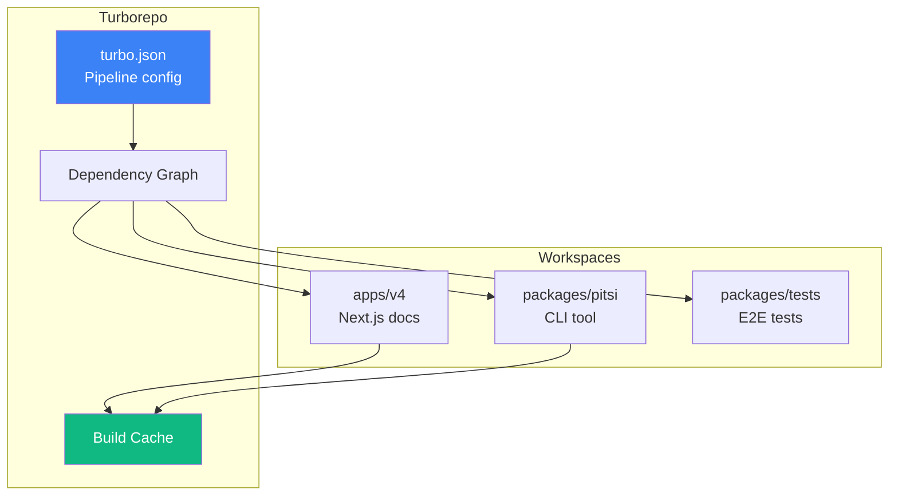
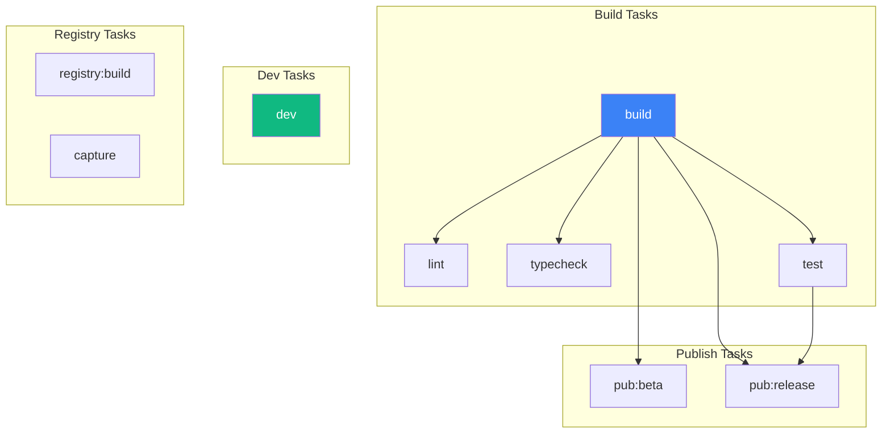
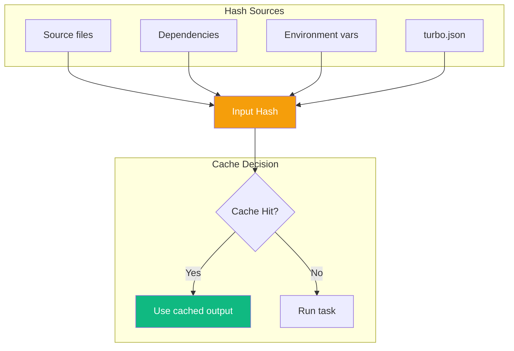
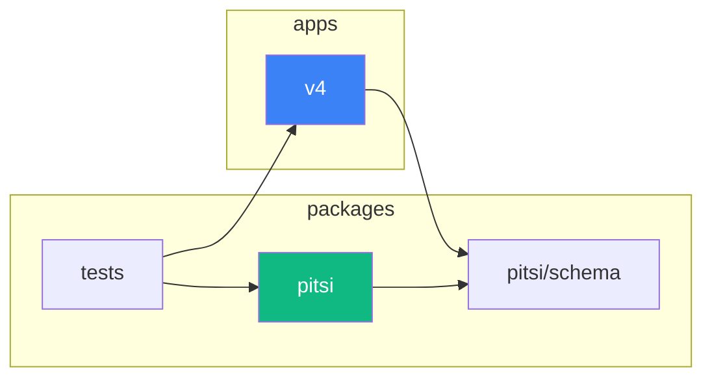
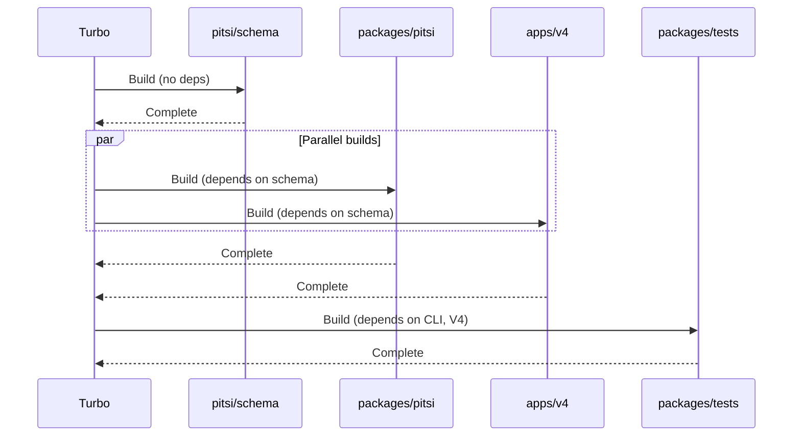

# Turborepo Build Orchestration

> How Turborepo manages the monorepo build pipeline

## Overview

pitsi/ui uses **Turborepo** to orchestrate builds across the monorepo. This provides:
- Parallel task execution
- Remote caching
- Dependency graph awareness
- Incremental builds



---

## Pipeline Configuration

### `turbo.json`

```json
{
  "$schema": "https://turbo.build/schema.json",
  "globalEnv": [
    "NODE_ENV",
    "NEXT_PUBLIC_APP_URL",
    "DATABASE_URL",
    "HIDE_ALPHA_ITEMS"
  ],
  "tasks": {
    "build": {
      "dependsOn": ["^build"],
      "outputs": ["dist/**", ".next/**", "!.next/cache/**"]
    },
    "dev": {
      "cache": false,
      "persistent": true
    },
    "lint": {
      "dependsOn": ["^build"],
      "cache": true
    },
    "typecheck": {
      "dependsOn": ["^build"]
    },
    "test": {
      "cache": true
    },
    "registry:build": {
      "cache": true,
      "outputs": ["registry/**/*.json", "registry/**/__index__.tsx"]
    }
  }
}
```

---

## Task Dependency Graph



---

## Task Definitions

### Build Task

```json
{
  "build": {
    "dependsOn": ["^build"],
    "env": [
      "NEXT_PUBLIC_APP_URL",
      "DATABASE_URL",
      "BETTER_AUTH_SECRET",
      "STRIPE_PUBLISHABLE_KEY",
      "STRIPE_PRIVATE_KEY",
      "REGISTRY_URL",
      ...
    ],
    "outputs": ["dist/**", ".next/**", "!.next/cache/**"]
  }
}
```

**Key properties:**
- `dependsOn: ["^build"]` - Builds dependencies first (topological order)
- `env` - Environment variables that affect cache invalidation
- `outputs` - Cached build artifacts
- `!.next/cache/**` - Excludes Next.js internal cache

### Dev Task

```json
{
  "dev": {
    "cache": false,
    "persistent": true,
    "env": [...]
  }
}
```

**Key properties:**
- `cache: false` - Never cache dev server
- `persistent: true` - Long-running task

### Registry Build Task

```json
{
  "registry:build": {
    "cache": true,
    "outputs": ["registry/**/*.json", "registry/**/__index__.tsx"]
  }
}
```

Generates:
- `registry.json` - Full registry index
- `__index__.tsx` - Lazy component exports

---

## Environment Variables

### Global Environment Variables

These variables invalidate ALL task caches when changed:

```json
{
  "globalEnv": [
    "NODE_ENV",
    "NEXT_PUBLIC_APP_URL",
    "DATABASE_URL",
    "HIDE_ALPHA_ITEMS"
  ]
}
```

### Task-Specific Environment Variables

Each task can declare additional env vars that affect its cache:

```json
{
  "build": {
    "env": [
      "BETTER_AUTH_SECRET",
      "GITHUB_CLIENT_ID",
      "STRIPE_PUBLISHABLE_KEY",
      "REGISTRY_URL",
      ...
    ]
  }
}
```

---

## Caching Strategy

### Cache Invalidation



### Cached vs Non-Cached Tasks

| Task | Cached | Reason |
|------|--------|--------|
| `build` | Yes | Deterministic output |
| `lint` | Yes | Deterministic result |
| `typecheck` | Yes | Deterministic result |
| `test` | Yes | Deterministic result |
| `dev` | No | Interactive/long-running |
| `capture` | No | External state (screenshots) |
| `workflow` | No | External state |

---

## Workspace Configuration

### Root `package.json`

```json
{
  "workspaces": [
    "apps/*",
    "packages/*"
  ],
  "scripts": {
    "build": "turbo build",
    "dev": "turbo dev",
    "lint": "turbo lint",
    "typecheck": "turbo typecheck",
    "test": "turbo test"
  }
}
```

### Workspace Dependencies



---

## Build Order

Turborepo automatically determines build order based on dependencies:



---

## Running Tasks

### Build All

```bash
bun run build
# Equivalent: turbo build
```

### Build Specific Workspace

```bash
turbo build --filter=apps/v4
turbo build --filter=packages/pitsi
```

### Run Dev Servers

```bash
bun run dev
# Starts all dev servers in parallel

bun run v4:dev
# Starts only v4 dev server
```

### Dry Run (Show What Would Run)

```bash
turbo build --dry-run
```

---

## Remote Caching

Turborepo supports remote caching via Vercel:

```bash
# Link to remote cache
turbo login
turbo link

# Build with remote cache
turbo build --remote-cache-read-only
```

**Benefits:**
- Share cache across CI/CD runs
- Share cache with team members
- Faster builds on fresh machines

---

## Performance Tips

### 1. Prune for Deployment

```bash
turbo prune apps/v4 --docker
```

Creates minimal deployment package.

### 2. Run Only Affected Tasks

```bash
turbo build --filter='[HEAD^1]'
```

Only builds packages changed since last commit.

### 3. Parallel Execution

Turbo automatically parallelizes independent tasks:

```
Tasks:    5 successful, 5 total
Cached:   3 cached, 5 total
Time:     2.5s
```

### 4. Watch Mode

```bash
turbo build --watch
```

Rebuilds on file changes.

---

## Common Commands

| Command | Description |
|---------|-------------|
| `bun run build` | Build all packages |
| `bun run dev` | Start all dev servers |
| `bun run lint` | Lint all packages |
| `bun run typecheck` | Type check all packages |
| `bun run test` | Run all tests |
| `bun run check` | Run lint + typecheck + format |
| `bun run registry:build` | Build registry files |
| `turbo build --dry-run` | Show what would build |
| `turbo build --graph` | Generate dependency graph |
