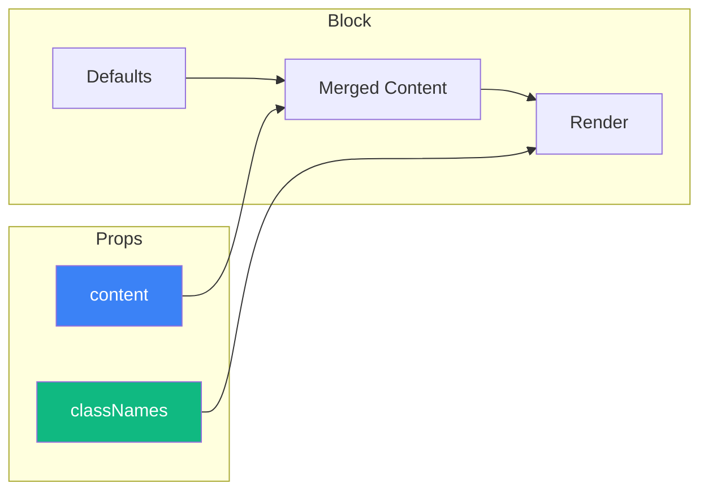
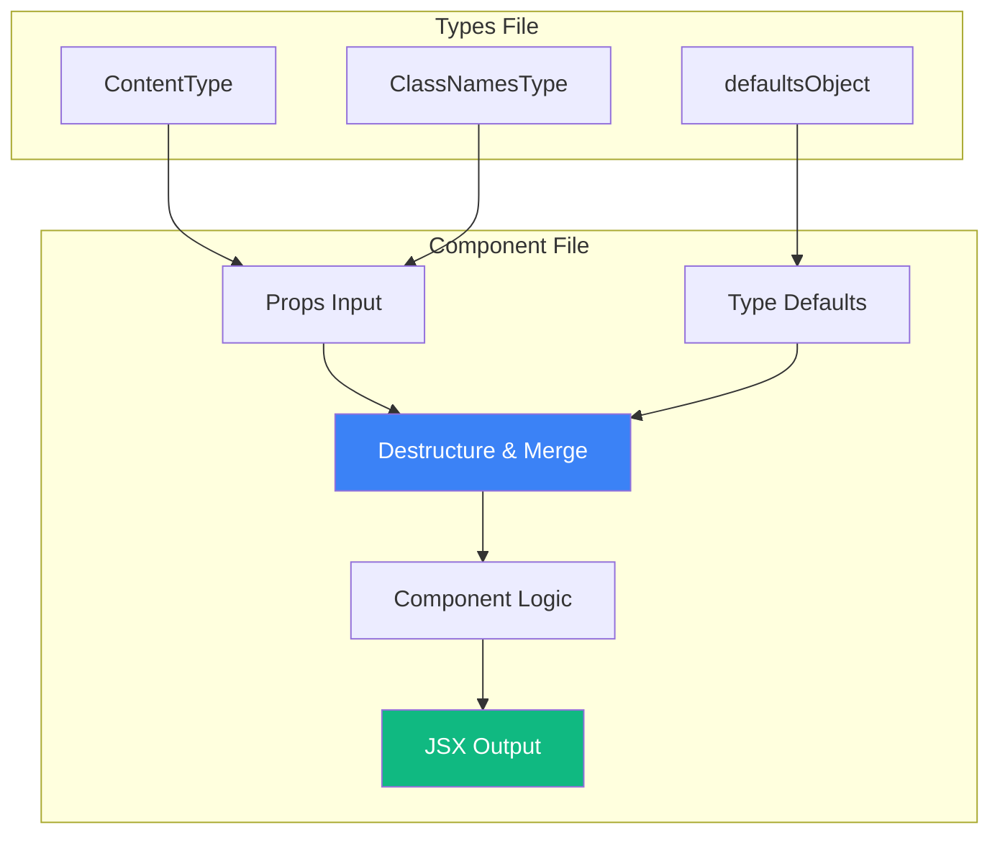

# Block Props Architecture

> How blocks receive and handle their props

## Core Pattern

Every block follows a consistent **two-prop pattern**:

```typescript
interface BlockProps {
  content?: Partial<ContentType>
  classNames?: ClassNamesType
}
```



---

## Content Props

### Definition

Content props define the **data** displayed by the block:

```typescript
// lib/blocks/hero.types.ts
export interface HeroContent extends BlockSectionHeader {
  primaryCta?: BlockCTA
  secondaryCta?: BlockCTA
  image?: BlockImage
  backgroundImage?: BlockImage
  decorationImages?: BlockImage[]
  variant?: "left" | "right"
}
```

### Common Content Types

#### BlockSectionHeader

```typescript
interface BlockSectionHeader {
  badge?: string        // Eyebrow text (e.g., "New Feature")
  title: string         // Main heading
  description?: string  // Supporting text
}
```

#### BlockCTA (Call-to-Action)

```typescript
interface BlockCTA extends BlockLink {
  icon?: string                    // Lucide icon name
  variant?: "default" | "outline" | "secondary" | "ghost" | "link"
  size?: "default" | "sm" | "lg" | "icon"
}
```

#### BlockImage

```typescript
interface BlockImage {
  src: string
  alt: string
  width?: number
  height?: number
  priority?: boolean    // LCP optimization
}
```

#### BlockLink

```typescript
interface BlockLink {
  label: string
  href: string
  external?: boolean
}
```

### Partial Content

All content props are `Partial<T>`:

```typescript
interface HeroBlockProps {
  content?: Partial<HeroContent>   // Every field optional
  // ...
}
```

This allows:
```tsx
// Minimal usage
<Hero1 />

// Override single field
<Hero1 content={{ title: "Custom Title" }} />

// Override multiple fields
<Hero1 content={{
  title: "Custom Title",
  primaryCta: { label: "Shop Now", href: "/shop" }
}} />
```

---

## ClassNames Props

### Definition

ClassNames props enable **style customization** without modifying the component:

```typescript
interface HeroClassNames extends BlockBaseClassNames {
  root?: string
  container?: string
  header?: BlockHeaderClassNames
  cta?: BlockCtaClassNames
  image?: BlockImageClassNames
  background?: string
  decoration?: string
}
```

### Common ClassNames Types

#### BlockBaseClassNames

```typescript
interface BlockBaseClassNames {
  root?: string    // Root section element
}
```

#### BlockHeaderClassNames

```typescript
interface BlockHeaderClassNames {
  root?: string
  badge?: string
  title?: string
  description?: string
}
```

#### BlockCtaClassNames

```typescript
interface BlockCtaClassNames {
  root?: string       // CTA container
  primary?: string    // Primary button/link
  secondary?: string  // Secondary button/link
}
```

#### BlockImageClassNames

```typescript
interface BlockImageClassNames {
  root?: string      // Image container
  wrapper?: string   // Image wrapper (for positioning)
  img?: string       // Image element
}
```

---

## Default Values

### Defining Defaults

Each block type has a defaults object:

```typescript
// lib/blocks/hero.types.ts
export const heroDefaults: HeroContent = {
  badge: "Plant Care Specialists",
  title: "Transform Your Space\nInto a Living Sanctuary",
  description: "Handpicked plants. Personalized care.\nFree delivery on orders over $50.",
  primaryCta: { label: "Explore Collection", href: "#" },
  secondaryCta: { label: "Plant Quiz", href: "#", variant: "outline" },
  image: {
    src: "/placeholders/blocks/service-plants/subject/4.webp",
    alt: "Woman holding houseplant"
  },
  backgroundImage: {
    src: "/placeholders/blocks/service-plants/assets/decoration-2.svg",
    alt: ""
  }
}
```

### Merging in Component

```typescript
export function Hero1({ content = {}, classNames = {} }: HeroBlockProps) {
  // Destructure with defaults
  const {
    badge = heroDefaults.badge,
    title = heroDefaults.title,
    description = heroDefaults.description,
    primaryCta = heroDefaults.primaryCta,
    secondaryCta = heroDefaults.secondaryCta,
    image = heroDefaults.image,
    backgroundImage = heroDefaults.backgroundImage,
    decorationImages = [
      { src: "/elements/subject/plants/item-3.webp", alt: "Plant decoration" }
    ]
  } = content

  // Use merged values...
}
```

---

## Using Props in JSX

### Content Usage

```tsx
// Badge
{badge && (
  <p className={cn("text-brand text-sm uppercase", classNames.header?.badge)}>
    {badge}
  </p>
)}

// Title with newlines
<h1 className={cn("text-4xl font-bold", classNames.header?.title)}>
  {title.split("\n").map((line, i) => (
    <span key={i}>
      {line}
      {i < title.split("\n").length - 1 && <br />}
    </span>
  ))}
</h1>

// CTA buttons
{primaryCta && (
  <Link href={primaryCta.href} className={classNames.cta?.primary}>
    <Button size="lg">{primaryCta.label}</Button>
  </Link>
)}

// Image
{image && (
  <Image
    src={image.src}
    alt={image.alt}
    width={image.width ?? 1200}
    height={image.height ?? 800}
    priority={image.priority}
    className={classNames.image?.img}
  />
)}
```

### ClassNames Usage

Always use `cn()` to merge classNames with base classes:

```tsx
<section
  className={cn(
    "relative py-20 px-4 md:px-6 lg:px-8",  // Base classes
    classNames.root                          // User override
  )}
>
  <div className={cn(
    "mx-auto max-w-7xl",
    classNames.container
  )}>
    <div className={cn(
      "flex flex-col items-center text-center",
      classNames.header?.root
    )}>
      {/* Content */}
    </div>
  </div>
</section>
```

---

## Type-Specific Props

### Hero Props

```typescript
interface HeroContent extends BlockSectionHeader {
  primaryCta?: BlockCTA
  secondaryCta?: BlockCTA
  image?: BlockImage
  backgroundImage?: BlockImage
  decorationImages?: BlockImage[]
  variant?: "left" | "right"
}
```

### Features Props

```typescript
interface FeaturesContent extends BlockSectionHeader {
  features: FeatureItem[]
  columns?: 2 | 3 | 4
}

interface FeatureItem {
  icon?: string
  title: string
  description: string
  link?: BlockLink
}
```

### Pricing Props

```typescript
interface PricingContent extends BlockSectionHeader {
  plans: PricingPlan[]
  billingToggle?: boolean
}

interface PricingPlan {
  name: string
  price: { monthly: number; annual: number }
  description: string
  features: string[]
  cta: BlockCTA
  highlighted?: boolean
}
```

### Testimonials Props

```typescript
interface TestimonialsContent extends BlockSectionHeader {
  testimonials: Testimonial[]
}

interface Testimonial {
  quote: string
  author: {
    name: string
    title?: string
    company?: string
    avatar?: BlockImage
  }
  rating?: number
}
```

---

## Props Flow Diagram



---

## Usage Examples

### Basic Usage

```tsx
// All defaults
<Hero1 />

// Custom title only
<Hero1 content={{ title: "Welcome to Our Store" }} />
```

### Full Customization

```tsx
<Hero1
  content={{
    badge: "Limited Time Offer",
    title: "Summer Sale\nUp to 50% Off",
    description: "Shop our biggest sale of the year.",
    primaryCta: {
      label: "Shop Sale",
      href: "/sale",
      variant: "default"
    },
    secondaryCta: {
      label: "View Lookbook",
      href: "/lookbook",
      variant: "outline"
    },
    image: {
      src: "/images/summer-hero.webp",
      alt: "Summer collection",
      priority: true
    }
  }}
  classNames={{
    root: "bg-gradient-to-br from-orange-50 to-rose-50",
    header: {
      badge: "text-orange-600",
      title: "text-gray-900",
      description: "text-gray-600"
    },
    cta: {
      primary: "bg-orange-500 hover:bg-orange-600",
      secondary: "border-orange-500 text-orange-500"
    }
  }}
/>
```

### With Animation Context

```tsx
// Blocks often receive animation context
<Hero1
  content={...}
  classNames={...}
/>

// Internally uses hooks for scroll animations
const { scrollYProgress } = useScroll({
  target: sectionRef,
  container: scrollContainer  // From context
})
```
