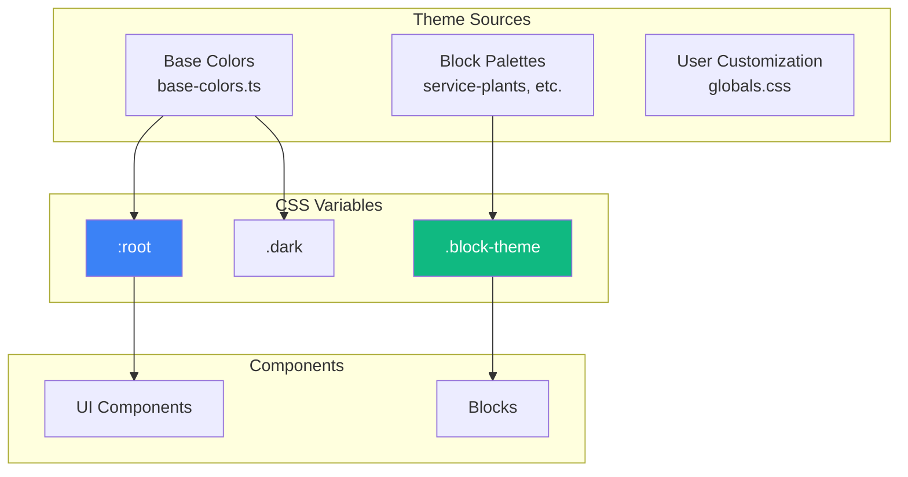
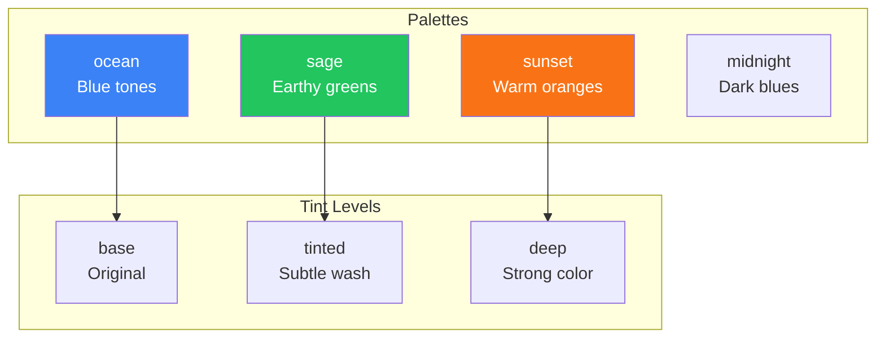

# Theming System

> How theming works in pitsi/ui components and blocks

## Overview

pitsi/ui uses a **CSS variable-based theming system** that enables:
- Dark/light mode switching
- Custom color themes
- Block-specific palettes
- No runtime JS for theme values



---

## CSS Variable Structure

### Core Variables

```css
:root {
  /* Background & Foreground */
  --background: 0 0% 100%;
  --foreground: 240 10% 3.9%;

  /* Card */
  --card: 0 0% 100%;
  --card-foreground: 240 10% 3.9%;

  /* Popover */
  --popover: 0 0% 100%;
  --popover-foreground: 240 10% 3.9%;

  /* Primary */
  --primary: 240 5.9% 10%;
  --primary-foreground: 0 0% 98%;

  /* Secondary */
  --secondary: 240 4.8% 95.9%;
  --secondary-foreground: 240 5.9% 10%;

  /* Muted */
  --muted: 240 4.8% 95.9%;
  --muted-foreground: 240 3.8% 46.1%;

  /* Accent */
  --accent: 240 4.8% 95.9%;
  --accent-foreground: 240 5.9% 10%;

  /* Destructive */
  --destructive: 0 84.2% 60.2%;
  --destructive-foreground: 0 0% 98%;

  /* Border, Input, Ring */
  --border: 240 5.9% 90%;
  --input: 240 5.9% 90%;
  --ring: 240 5.9% 10%;

  /* Radius */
  --radius: 0.5rem;

  /* Charts */
  --chart-1: 12 76% 61%;
  --chart-2: 173 58% 39%;
  --chart-3: 197 37% 24%;
  --chart-4: 43 74% 66%;
  --chart-5: 27 87% 67%;
}
```

### Dark Mode Variables

```css
.dark {
  --background: 240 10% 3.9%;
  --foreground: 0 0% 98%;

  --card: 240 10% 3.9%;
  --card-foreground: 0 0% 98%;

  --primary: 0 0% 98%;
  --primary-foreground: 240 5.9% 10%;

  --secondary: 240 3.7% 15.9%;
  --secondary-foreground: 0 0% 98%;

  --muted: 240 3.7% 15.9%;
  --muted-foreground: 240 5% 64.9%;

  --accent: 240 3.7% 15.9%;
  --accent-foreground: 0 0% 98%;

  --border: 240 3.7% 15.9%;
  --input: 240 3.7% 15.9%;
  --ring: 240 4.9% 83.9%;
}
```

---

## Base Colors

### Available Themes

Defined in `registry/base-colors.ts`:

| Name | Primary Color | Use Case |
|------|---------------|----------|
| `zinc` | Neutral gray | Default |
| `slate` | Blue-gray | Professional |
| `stone` | Warm gray | Organic |
| `gray` | True gray | Minimal |
| `neutral` | Pure gray | Clean |
| `red` | Red accent | Alert/Urgent |
| `rose` | Pink accent | Soft/Friendly |
| `orange` | Orange accent | Energy |
| `green` | Green accent | Success/Nature |
| `blue` | Blue accent | Trust/Tech |
| `yellow` | Yellow accent | Warning/Highlight |
| `violet` | Purple accent | Creative |

### Theme Structure

```typescript
// registry/base-colors.ts
export const baseColors = [
  {
    name: "zinc",
    label: "Zinc",
    activeColor: {
      light: "240 5.9% 10%",
      dark: "240 5.2% 33.9%"
    },
    cssVars: {
      light: {
        background: "0 0% 100%",
        foreground: "240 10% 3.9%",
        primary: "240 5.9% 10%",
        // ... all variables
      },
      dark: {
        background: "240 10% 3.9%",
        foreground: "0 0% 98%",
        primary: "0 0% 98%",
        // ... all variables
      }
    }
  },
  // ... more themes
]
```

---

## Block Theming

### Block Config

Blocks declare their theming in `.config.ts`:

```typescript
// blocks/hero/hero-1.config.ts
export const registryConfig: RegistryItemConfig = {
  name: "hero-1",
  type: "registry:block",
  blockConfig: {
    template: "service-plants",   // Theme template
    blockType: "hero",
    order: 2,
    palette: "sage",              // Color palette
    typography: "elegant",        // Typography style
    tint: "tinted",               // Tint level
    forceLight: true              // Force light mode
  }
}
```

### BlockConfig Interface

```typescript
interface BlockConfig {
  template: string        // e.g., "service-plants", "fitness", "saas"
  blockType: string       // e.g., "hero", "features", "pricing"
  order: number           // Display order in template
  palette: string         // Color palette name
  typography: string      // Typography preset
  tint?: "base" | "tinted" | "deep"
  forceLight?: boolean    // Force light mode
  forceDark?: boolean     // Force dark mode
}
```

### Palette System



---

## Using Theme Variables

### In Components

```typescript
// UI Component using theme variables
export const Button = forwardRef<HTMLButtonElement, ButtonProps>(
  ({ className, variant, ...props }, ref) => {
    return (
      <button
        className={cn(
          // Uses CSS variables
          "bg-primary text-primary-foreground",
          "hover:bg-primary/90",
          className
        )}
        ref={ref}
        {...props}
      />
    )
  }
)
```

### In Blocks

```typescript
// Block using brand colors
export function Hero1({ content, classNames }: HeroBlockProps) {
  return (
    <section className={cn(
      "bg-background text-foreground",
      classNames.root
    )}>
      <p className="text-brand">{content.badge}</p>
      <h1 className="text-foreground">{content.title}</h1>
      <Button className="bg-brand text-brand-foreground">
        {content.primaryCta.label}
      </Button>
    </section>
  )
}
```

### Block-Specific Variables

Blocks can define additional CSS variables:

```css
/* Block-specific brand color */
[data-block="hero-1"] {
  --brand: 142.1 76.2% 36.3%;
  --brand-foreground: 355.7 100% 97.3%;
}
```

---

## Typography Presets

### Available Presets

| Preset | Font | Style |
|--------|------|-------|
| `elegant` | Serif display | Refined, luxurious |
| `modern` | Sans-serif | Clean, contemporary |
| `bold` | Heavy weight | Strong, impactful |
| `playful` | Rounded | Friendly, approachable |

### Implementation

```css
/* Typography preset classes */
.typography-elegant {
  --heading-font: var(--font-serif);
  --heading-weight: 400;
  --heading-tracking: -0.02em;
}

.typography-modern {
  --heading-font: var(--font-sans);
  --heading-weight: 600;
  --heading-tracking: -0.025em;
}

.typography-bold {
  --heading-font: var(--font-sans);
  --heading-weight: 800;
  --heading-tracking: -0.03em;
}
```

---

## Theme Switching

### next-themes Integration

```typescript
// app/layout.tsx
import { ThemeProvider } from "next-themes"

export default function RootLayout({ children }) {
  return (
    <html suppressHydrationWarning>
      <body>
        <ThemeProvider
          attribute="class"
          defaultTheme="system"
          enableSystem
          disableTransitionOnChange
        >
          {children}
        </ThemeProvider>
      </body>
    </html>
  )
}
```

### Theme Toggle Component

```typescript
"use client"

import { useTheme } from "next-themes"

export function ThemeToggle() {
  const { setTheme, theme } = useTheme()

  return (
    <Button
      variant="outline"
      size="icon"
      onClick={() => setTheme(theme === "light" ? "dark" : "light")}
    >
      <SunIcon className="dark:hidden" />
      <MoonIcon className="hidden dark:block" />
    </Button>
  )
}
```

---

## Customization

### User Project Customization

Users can override variables in their `globals.css`:

```css
@layer base {
  :root {
    /* Override primary color */
    --primary: 262.1 83.3% 57.8%;
    --primary-foreground: 0 0% 100%;

    /* Custom brand color */
    --brand: 142.1 76.2% 36.3%;
    --brand-foreground: 355.7 100% 97.3%;

    /* Adjust radius */
    --radius: 0.75rem;
  }

  .dark {
    --primary: 263.4 70% 50.4%;
    --primary-foreground: 0 0% 100%;
  }
}
```

### Per-Component Customization

```tsx
// Override via className
<Button className="bg-blue-500 hover:bg-blue-600">
  Custom Blue
</Button>

// Override via style
<Button style={{ "--primary": "210 100% 50%" } as React.CSSProperties}>
  Inline Custom
</Button>
```

---

## Best Practices

### 1. Use Semantic Variables

```tsx
// Good - semantic meaning
<div className="bg-background text-foreground" />

// Avoid - hardcoded colors
<div className="bg-white text-black" />
```

### 2. Use Foreground Pairs

```tsx
// Good - paired colors
<div className="bg-primary text-primary-foreground" />
<div className="bg-muted text-muted-foreground" />

// Avoid - mismatched
<div className="bg-primary text-foreground" />
```

### 3. Support Both Modes

```tsx
// Good - works in both modes
<div className="border-border" />

// Avoid - hardcoded that breaks in dark mode
<div className="border-gray-200" />
```

### 4. Use Alpha for Overlays

```tsx
// Good - transparent overlay
<div className="bg-background/80 backdrop-blur" />

// Avoid - opaque overlay
<div className="bg-white" />
```
