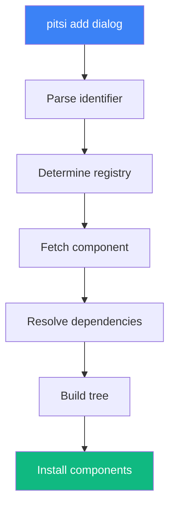
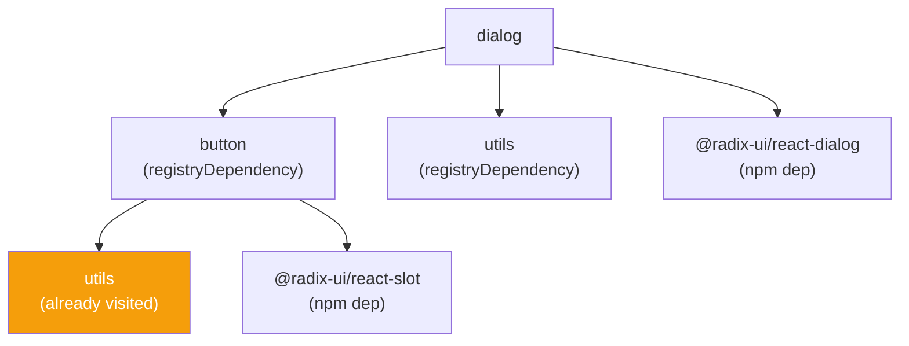
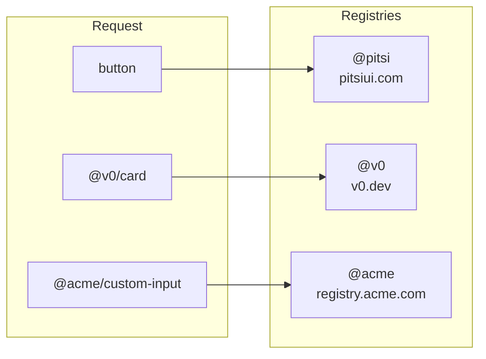

# Dependency Resolution

> How the CLI resolves component dependencies

## Overview

When you run `pitsi add`, the CLI must:

1. Parse the component identifier
2. Determine which registry to use
3. Fetch the component definition
4. Recursively resolve all dependencies
5. Build an installation tree
6. Install in correct order



---

## Component Identifiers

### Simple Name

```bash
pitsi add button
```

Resolves to: `@pitsi/button` → `https://pitsiui.com/r/button.json`

### Scoped Name

```bash
pitsi add @acme/custom-button
```

Resolves using registry from `components.json`:
```json
{
  "registries": {
    "@acme": "https://registry.acme.com/r/{name}.json"
  }
}
```

### URL

```bash
pitsi add https://example.com/r/button.json
```

Fetches directly from URL.

### Local Path

```bash
pitsi add ./local/button.json
```

Reads from local filesystem.

---

## Resolution Algorithm

```typescript
async function resolveTree(
  items: string[],
  config: Config
): Promise<ResolvedTree> {
  const visited = new Set<string>()
  const result: ResolvedTree = {
    dependencies: [],
    devDependencies: [],
    files: [],
    tailwind: {},
    cssVars: {},
    css: {},
  }

  async function resolve(name: string) {
    // Prevent cycles
    if (visited.has(name)) return
    visited.add(name)

    // Fetch item from registry
    const item = await fetchItem(name, config)

    // Resolve registry dependencies first (depth-first)
    for (const dep of item.registryDependencies ?? []) {
      await resolve(dep)
    }

    // Merge item into result
    merge(result, item)
  }

  // Resolve each requested item
  for (const item of items) {
    await resolve(item)
  }

  return result
}
```

### Key Properties

1. **Depth-first**: Dependencies are resolved before dependents
2. **Deduplication**: Each item is only resolved once
3. **Cycle detection**: Prevents infinite loops
4. **Order preservation**: Installation order is deterministic

---

## Dependency Types

### Registry Dependencies

Other pitsi components:

```typescript
{
  name: "dialog",
  registryDependencies: ["button", "utils"]
}
```

These are resolved recursively and installed.

### npm Dependencies

External packages:

```typescript
{
  name: "dialog",
  dependencies: ["@radix-ui/react-dialog"],
  devDependencies: ["@types/react"]
}
```

These are added to `package.json` and installed.

---

## Resolution Example

### Request: `pitsi add dialog`



### Resolution Order

1. `utils` (leaf dependency)
2. `button` (depends on utils)
3. `dialog` (depends on button, utils)

### Merged Result

```typescript
{
  files: [
    { path: "lib/utils.ts", ... },
    { path: "ui/button.tsx", ... },
    { path: "ui/dialog.tsx", ... }
  ],
  dependencies: [
    "@radix-ui/react-slot",
    "@radix-ui/react-dialog"
  ],
  devDependencies: [],
  cssVars: { /* merged from all */ },
  tailwind: { /* merged from all */ }
}
```

---

## Multi-Registry Resolution

When components from multiple registries are requested:

```bash
pitsi add button @v0/card @acme/custom-input
```

Each is resolved from its respective registry:



### Cross-Registry Dependencies

If `@v0/card` depends on `button`, it can reference:

```typescript
{
  name: "card",
  registryDependencies: ["@pitsi/button"]  // Cross-registry
}
```

---

## Conflict Handling

### Version Conflicts

If two items require different versions of the same npm package:

```typescript
// button requires
{ dependencies: ["react@^18.0.0"] }

// legacy-component requires
{ dependencies: ["react@^17.0.0"] }
```

The CLI will:
1. Warn about the conflict
2. Use the newer version
3. Allow user to override

### File Conflicts

If two items would write to the same path:

```typescript
// Both define:
{ files: [{ path: "lib/utils.ts" }] }
```

The CLI will:
1. Skip if content is identical
2. Warn if content differs
3. Use `--overwrite` to force

---

## Caching

### Registry Cache

Fetched items are cached in memory during a session:

```typescript
const cache = new Map<string, RegistryItem>()

async function fetchItem(name: string) {
  if (cache.has(name)) {
    return cache.get(name)
  }

  const item = await fetch(url)
  cache.set(name, item)
  return item
}
```

### HTTP Cache

HTTP responses respect cache headers:

```typescript
const response = await fetch(url, {
  headers: {
    "If-None-Match": etag,
    "If-Modified-Since": lastModified
  }
})

if (response.status === 304) {
  return cachedResponse
}
```

---

## Error Handling

### Item Not Found

```
Error: Component "nonexistent" not found in registry.

Did you mean one of these?
  - button
  - button-group
```

### Network Errors

```
Error: Failed to fetch "button" from registry.

Cause: Network request failed (ECONNREFUSED)

Possible solutions:
  1. Check your internet connection
  2. Verify the registry URL is correct
  3. Try again later
```

### Circular Dependencies

```
Error: Circular dependency detected.

Dependency chain:
  a → b → c → a

Please fix the registry definitions.
```

---

## Performance

### Parallel Fetching

Independent items are fetched in parallel:

```typescript
// These can be fetched simultaneously
const [button, card] = await Promise.all([
  fetchItem("button"),
  fetchItem("card")
])
```

### Lazy Resolution

Dependencies are only resolved when needed:

```typescript
// If button is already installed, skip its dependencies
if (await isInstalled("button")) {
  return
}
```

---

## Debugging

Enable debug output:

```bash
DEBUG=pitsi:* pitsi add dialog
```

Output:
```
pitsi:resolver Resolving: dialog
pitsi:resolver   Fetching from @pitsi
pitsi:resolver   Found dependencies: [button, utils]
pitsi:resolver Resolving: button
pitsi:resolver   Fetching from @pitsi
pitsi:resolver   Found dependencies: [utils]
pitsi:resolver Resolving: utils
pitsi:resolver   Fetching from @pitsi
pitsi:resolver   No dependencies
pitsi:resolver Resolution complete: [utils, button, dialog]
```
