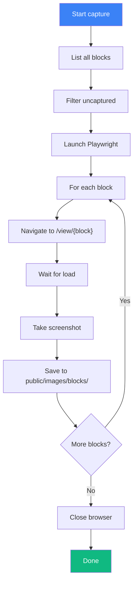

# Scripts & Automation

> Build scripts and automation in apps/v4/scripts/

## Script Overview

| Script | Purpose | Command |
|--------|---------|---------|
| `build-registry.mts` | Build registry from definitions | `bun run registry:build` |
| `capture-blocks.mts` | Capture block screenshots | `bun run registry:capture` |
| `create.mts` | Scaffold new components | `bun run create` |
| `readiness.mts` | Manage component readiness | `bun run readiness` |
| `validate-registries.mts` | Validate registry schemas | `bun run validate:registries` |
| `purge.sh` | Clean build artifacts | `bun run purge` |

---

## `build-registry.mts`

See [Build Registry](./build-registry.md) for detailed documentation.

```bash
# Standard build
bun run registry:build

# With screenshot capture
bun run registry:build -- --capture
```

---

## `capture-blocks.mts`

Captures screenshots of all blocks for thumbnails.

### Usage

```bash
# Capture new/changed blocks only
bun run registry:capture

# Force recapture all blocks
bun run registry:capture:force

# Capture specific block
bun run registry:capture -- --name hero-plants-1

# Debug mode (browser visible)
bun run registry:capture:debug
```

### Process



### Output

```
public/images/blocks/
├── hero-plants-1.png
├── hero-fitness-1.png
├── cta-plants-1.png
└── ...
```

### Configuration

```typescript
const CAPTURE_CONFIG = {
  viewport: { width: 1280, height: 720 },
  deviceScaleFactor: 2,  // Retina
  timeout: 30000,
  baseUrl: "http://localhost:4000"
}
```

---

## `create.mts`

Scaffolds new components with boilerplate.

### Usage

```bash
# Interactive mode
bun run create

# Create specific type
bun run create ui my-component
bun run create block hero-custom-1
bun run create hook use-my-hook
```

### Templates

**UI Component:**
```typescript
import * as React from "react"

import { cn } from "@/lib/utils"

export interface MyComponentProps extends React.HTMLAttributes<HTMLDivElement> {
  // Add props
}

const MyComponent = React.forwardRef<HTMLDivElement, MyComponentProps>(
  ({ className, ...props }, ref) => {
    return (
      <div
        ref={ref}
        className={cn("", className)}
        {...props}
      />
    )
  }
)
MyComponent.displayName = "MyComponent"

export { MyComponent }
```

**Block Component:**
```typescript
export function HeroCustom1() {
  return (
    <section className="py-20">
      {/* Block content */}
    </section>
  )
}
```

**Hook:**
```typescript
import * as React from "react"

export function useMyHook() {
  const [state, setState] = React.useState()

  return { state, setState }
}
```

### Auto-Generated Files

| Type | Generated |
|------|-----------|
| `ui` | `ui/{name}.tsx`, `examples/{name}-demo.tsx` |
| `block` | `blocks/{type}/{name}.tsx`, `blocks/{type}/{name}.config.ts` |
| `hook` | `hooks/{name}.ts` |

---

## `readiness.mts`

Manage component readiness levels.

### Usage

```bash
# List all components by readiness
bun run readiness:list

# Update single component
bun run readiness:update button production

# Bulk update by type
bun run readiness:bulk --type registry:ui --to beta
```

### Commands

**List:**
```
Readiness Summary:
  production: 45 components
  beta: 12 components
  alpha: 23 components

Production:
  - button
  - card
  - dialog
  ...

Beta:
  - data-table
  - chart
  ...

Alpha:
  - experimental-component
  ...
```

**Update:**
```bash
# Promote to beta
bun run readiness:update my-component beta

# Promote to production
bun run readiness:update my-component production
```

---

## `validate-registries.mts`

Validates all registry entries against schemas.

### Usage

```bash
bun run validate:registries
```

### Output

**Success:**
```
Validating registries...

  new-york-v4:
    ui: 52 items ✓
    blocks: 87 items ✓
    hooks: 8 items ✓
    lib: 3 items ✓
    examples: 45 items ✓

All registries valid!
```

**Failure:**
```
Validating registries...

  new-york-v4:
    ui: 51 items ✓
    ui: 1 error ✗

Errors:

  my-component:
    - name: Required
    - type: Invalid enum value. Expected 'registry:ui', received 'ui'

Validation failed!
```

### Checks Performed

| Check | Description |
|-------|-------------|
| Schema validation | All fields match Zod schema |
| File existence | Referenced files exist |
| Dependency existence | registryDependencies exist |
| No duplicates | No duplicate names |
| No cycles | No circular dependencies |

---

## `purge.sh`

Clean build artifacts and caches.

### Usage

```bash
bun run purge
```

### Removes

```bash
# Build outputs
rm -rf .next
rm -rf public/r/styles/*/

# Generated files
rm -rf registry/__index__.tsx
rm -rf registry/__blocks__.json
rm -rf registry/__blocks-metadata__.ts

# Caches
rm -rf node_modules/.cache
rm -rf .turbo
```

---

## Root Scripts

Located in repository root `scripts/`:

### `run.ts`

Task runner for development commands.

```bash
bun run run <task>
```

### `publish.sh`

CLI publishing automation.

```bash
# Standard release
./scripts/publish.sh

# Beta release
./scripts/publish.sh --beta

# Interactive release
./scripts/publish.sh --interactive
```

### `fix-urls.sh`

Fix URLs in generated files.

```bash
./scripts/fix-urls.sh
```

---

## CI/CD Integration

### GitHub Actions

```yaml
# .github/workflows/build.yml
name: Build

on: [push, pull_request]

jobs:
  build:
    runs-on: ubuntu-latest
    steps:
      - uses: actions/checkout@v4
      - uses: oven-sh/setup-bun@v1

      - run: bun install
      - run: bun run check
      - run: bun run build
      - run: bun run test
```

### Vercel Build

```bash
# vercel.json
{
  "buildCommand": "bun run registry:build && bun run build"
}
```
