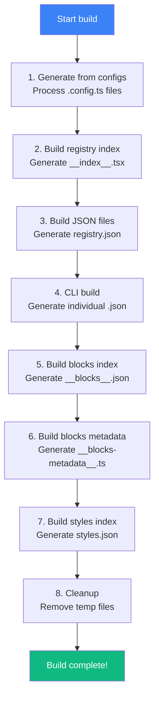

# Build Registry Script

> Deep dive into the registry build process

## Overview

The `build-registry.mts` script transforms TypeScript registry definitions into distributable JSON files.

**Location:** `apps/v4/scripts/build-registry.mts`

**Run with:** `bun run registry:build`

---

## Build Pipeline



---

## Step 1: Generate from Configs

For blocks, the script reads `.config.ts` files and generates `_registry.ts`.

### Input

```typescript
// blocks/hero/hero-plants-1.config.ts
export const registryConfig = {
  name: "hero-plants-1",
  type: "registry:block",
  description: "Hero section for plant shop",
  categories: ["hero"],
  readiness: "production",
  blockConfig: {
    template: "plants",
    blockType: "hero",
    order: 1,
    palette: "sage",
    typography: "elegant",
  },
}
```

### Output

```typescript
// blocks/_registry.ts (auto-generated)
export const blocks: Registry["items"] = [
  {
    name: "hero-plants-1",
    type: "registry:block",
    description: "Hero section for plant shop",
    files: [{ path: "blocks/hero/hero-plants-1.tsx", type: "registry:block" }],
    categories: ["hero"],
    readiness: "production",
    blockConfig: {
      template: "plants",
      blockType: "hero",
      order: 1,
      palette: "sage",
      typography: "elegant",
    },
  },
  // ...more blocks
]
```

### Process

```typescript
async function generateRegistryFromConfigs(styleName: string) {
  const configPattern = `${baseDir}/blocks/**/*.config.ts`
  const configFiles = await glob(configPattern)

  for (const configPath of configFiles) {
    const mod = await import(configPath)
    const config = mod.registryConfig

    // Infer component path from config path
    const relativePath = configPath
      .replace(baseDir + "/", "")
      .replace(".config.ts", ".tsx")

    items.push({
      ...config,
      files: [{ path: relativePath, type: config.type }],
    })
  }

  // Write to _registry.ts
  await fs.writeFile(outputPath, generateOutput(items))
}
```

---

## Step 2: Build Registry Index

Creates lazy-loaded React components for the docs site.

### Output: `registry/__index__.tsx`

```typescript
export const Index: Record<string, Record<string, any>> = {
  "new-york-v4": {
    "button": {
      name: "button",
      description: "A versatile button...",
      type: "registry:ui",
      registryDependencies: ["utils"],
      files: [
        {
          path: "registry/new-york-v4/ui/button.tsx",
          type: "registry:ui",
          target: ""
        }
      ],
      component: React.lazy(async () => {
        const mod = await import("@/registry/new-york-v4/ui/button")
        const exportName = Object.keys(mod).find(
          key => typeof mod[key] === 'function'
        ) || "button"
        return { default: mod.default || mod[exportName] }
      }),
      categories: ["core-components"],
      tier: "free",
      readiness: "production",
    },
    // ...more components
  }
}
```

### Process

```typescript
async function buildRegistryIndex(styles: Style[]) {
  let index = `export const Index: Record<string, Record<string, any>> = {`

  for (const style of styles) {
    const { registry } = await import(`../registry/${style.name}/registry.ts`)

    // Validate against schema
    const parseResult = registrySchema.safeParse(registry)
    if (!parseResult.success) {
      throw new Error(`Invalid registry schema for ${style.name}`)
    }

    for (const item of registry.items) {
      // Generate lazy import for each item
      index += generateItemEntry(item, style.name)
    }
  }

  index += `}`

  await fs.writeFile("registry/__index__.tsx", index)
}
```

---

## Step 3: Build JSON Files

Creates the main `registry.json` with all items.

### Output: `public/r/styles/new-york-v4/registry.json`

```json
{
  "name": "pitsi/ui",
  "homepage": "https://pitsiui.com",
  "items": [
    {
      "name": "button",
      "type": "registry:ui",
      "description": "A versatile button...",
      "dependencies": ["@radix-ui/react-slot"],
      "registryDependencies": ["utils"],
      "files": [
        {
          "path": "registry/new-york-v4/ui/button.tsx",
          "type": "registry:ui"
        }
      ],
      "categories": ["core-components"],
      "tier": "free",
      "readiness": "production"
    }
  ]
}
```

### Process

```typescript
async function buildRegistryJsonFile(styleName: string) {
  const { registry } = await import(`../registry/${styleName}/registry.ts`)

  // Validate
  const parseResult = registrySchema.safeParse(registry)
  if (!parseResult.success) throw new Error("Invalid schema")

  // Fix paths (add style prefix)
  const fixedRegistry = {
    ...registry,
    items: registry.items.map((item) => ({
      ...item,
      files: item.files?.map((file) => ({
        ...file,
        path: `registry/${styleName}/${file.path}`,
      })),
    })),
  }

  // Write JSON
  const outputPath = `public/r/styles/${styleName}/registry.json`
  await fs.writeFile(outputPath, JSON.stringify(fixedRegistry, null, 2))
}
```

---

## Step 4: CLI Build

Uses the CLI's build command to generate individual component JSON files.

### Process

```typescript
async function buildRegistry(styleName: string) {
  return new Promise((resolve, reject) => {
    const process = exec(
      `node ../../packages/pitsi/dist/index.js build registry-${styleName}.json --output public/r/styles/${styleName}`
    )

    process.on("exit", (code) => {
      if (code === 0) resolve(undefined)
      else reject(new Error(`Process exited with code ${code}`))
    })
  })
}
```

### Output

```
public/r/styles/new-york-v4/
├── registry.json     # Full registry
├── button.json       # Individual item
├── dialog.json
├── utils.json
└── ...
```

Each individual JSON includes the file content:

```json
{
  "name": "button",
  "type": "registry:ui",
  "files": [
    {
      "path": "registry/new-york-v4/ui/button.tsx",
      "type": "registry:ui",
      "content": "import * as React from \"react\"..."
    }
  ]
}
```

---

## Step 5: Build Blocks Index

Creates a simple JSON index of all blocks.

### Output: `registry/__blocks__.json`

```json
[
  {
    "name": "hero-plants-1",
    "description": "Hero section for plant shop",
    "categories": ["hero"]
  },
  {
    "name": "cta-plants-1",
    "description": "CTA section for plant shop",
    "categories": ["cta"]
  }
]
```

---

## Step 6: Build Blocks Metadata

Creates pre-computed metadata for fast navigation (avoids loading full 1.2MB registry).

### Output: `registry/__blocks-metadata__.ts`

```typescript
export const BLOCK_CATEGORIES: Record<string, string[]> = {
  hero: ["hero-plants-1", "hero-fitness-1", ...],
  cta: ["cta-plants-1", "cta-fitness-1", ...],
  features: ["features-plants-1", ...],
}

export function getAllCategories(): string[] {
  return Object.keys(BLOCK_CATEGORIES).sort()
}

export function getBlocksByCategory(category: string): string[] {
  return BLOCK_CATEGORIES[category] || []
}

export const TEMPLATE_METADATA: RegistryTemplateMetadata[] = [
  {
    slug: "plants",
    name: "Plant Shop",
    description: "Modern plant e-commerce template",
    heroBlock: "hero-plants-1",
    type: "service",
  },
]

export const COMPUTED_TEMPLATES: Record<string, ComputedTemplate> = {
  plants: {
    slug: "plants",
    name: "Plant Shop",
    description: "...",
    heroBlock: "hero-plants-1",
    type: "service",
    blocks: [
      { name: "hero-plants-1", blockType: "hero", order: 1, ... },
      { name: "features-plants-1", blockType: "features", order: 2, ... },
    ],
    blockGroups: {
      hero: ["hero-plants-1"],
      features: ["features-plants-1"],
    },
  },
}
```

---

## Step 7: Build Styles Index

Creates an index of available styles.

### Output: `public/r/styles.json`

```json
[
  {
    "name": "new-york-v4",
    "label": "New York"
  }
]
```

---

## Step 8: Cleanup

Removes temporary files created during build.

```typescript
// Clean up intermediate files
for (const style of styles) {
  if (existsSync(`registry-${style.name}.json`)) {
    await fs.unlink(`registry-${style.name}.json`)
  }
}
```

---

## Validation

The build validates all registry items against the Zod schema:

```typescript
const parseResult = registrySchema.safeParse(importedRegistry)
if (!parseResult.success) {
  console.error(`❌ Registry validation failed for ${style.name}:`)
  console.error(parseResult.error.format())
  throw new Error(`Invalid registry schema for ${style.name}`)
}
```

### Common Validation Errors

| Error | Cause | Fix |
|-------|-------|-----|
| `Required` | Missing required field | Add the field |
| `Invalid enum value` | Wrong type value | Use valid type |
| `Invalid literal` | Wrong schema | Check schema |

---

## CLI Flags

```bash
# Standard build
bun run registry:build

# With screenshot capture
bun run registry:build -- --capture

# With forced screenshot capture
bun run registry:build -- --capture --force-capture
```

---

## Output Summary

| File | Size | Purpose |
|------|------|---------|
| `registry/__index__.tsx` | ~500KB | Lazy imports for docs site |
| `public/r/styles/*/registry.json` | ~1.2MB | Full registry (API) |
| `public/r/styles/*/*.json` | ~5KB each | Individual items (API) |
| `registry/__blocks-metadata__.ts` | ~20KB | Pre-computed navigation |
| `registry/__blocks__.json` | ~10KB | Block index |
| `public/r/styles.json` | ~1KB | Style index |
