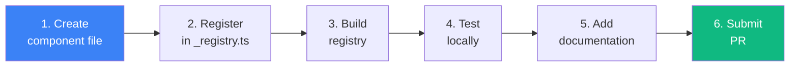

# Adding a Component

> End-to-end guide for adding a new component to pitsi/ui

## Overview



---

## Step 1: Create the Component

### UI Component

Create file in `apps/v4/registry/new-york-v4/ui/`:

```tsx
// apps/v4/registry/new-york-v4/ui/my-component.tsx
import * as React from "react"

import { cn } from "@/lib/utils"

export interface MyComponentProps extends React.HTMLAttributes<HTMLDivElement> {
  variant?: "default" | "destructive"
}

const MyComponent = React.forwardRef<HTMLDivElement, MyComponentProps>(
  ({ className, variant = "default", ...props }, ref) => {
    return (
      <div
        ref={ref}
        className={cn(
          "rounded-lg border p-4",
          variant === "destructive" && "border-destructive",
          className
        )}
        {...props}
      />
    )
  }
)
MyComponent.displayName = "MyComponent"

export { MyComponent }
```

### Block Component

For blocks, create both component and config:

```tsx
// apps/v4/registry/new-york-v4/blocks/hero/hero-custom-1.tsx
export function HeroCustom1() {
  return (
    <section className="py-20">
      <h1>Custom Hero</h1>
    </section>
  )
}
```

```typescript
// apps/v4/registry/new-york-v4/blocks/hero/hero-custom-1.config.ts
export const registryConfig = {
  name: "hero-custom-1",
  type: "registry:block",
  description: "A custom hero section",
  categories: ["hero"],
  readiness: "alpha",
  blockConfig: {
    template: "custom",
    blockType: "hero",
    order: 1,
    palette: "neutral",
    typography: "modern",
  },
}
```

---

## Step 2: Register the Component

### For UI Components

Edit `apps/v4/registry/new-york-v4/ui/_registry.ts`:

```typescript
import type { Registry } from "pitsi/schema"

export const ui: Registry["items"] = [
  // ... existing components

  {
    name: "my-component",
    type: "registry:ui",
    description: "A customizable component for displaying content",
    dependencies: [],  // npm packages
    registryDependencies: ["utils"],  // other registry items
    files: [
      { path: "ui/my-component.tsx", type: "registry:ui" }
    ],
    categories: ["display"],
    tier: "free",
    readiness: "alpha",  // Start as alpha
  },
]
```

### For Blocks

Blocks are auto-registered from `.config.ts` files during build.

### For Hooks

Edit `apps/v4/registry/new-york-v4/hooks/_registry.ts`:

```typescript
{
  name: "use-my-hook",
  type: "registry:hook",
  description: "A custom hook for...",
  files: [
    { path: "hooks/use-my-hook.ts", type: "registry:hook" }
  ],
}
```

---

## Step 3: Build the Registry

```bash
bun run registry:build
```

This command:
1. Validates all registry entries against schema
2. Generates `registry/__index__.tsx` (lazy imports)
3. Generates `public/r/*.json` (API files)
4. Generates `__blocks-metadata__.ts` (for blocks)
5. Runs lint and format

### Verify Build Output

Check that your component appears:

```bash
# Check registry index
cat apps/v4/public/r/styles/new-york-v4/my-component.json

# Should contain your component definition
```

---

## Step 4: Test Locally

### In the Docs Site

1. Start dev server: `bun run v4:dev`
2. Visit `http://localhost:4000/view/new-york-v4/my-component`
3. Verify component renders correctly

### With the CLI

```bash
# In a test project
cd /tmp && mkdir test && cd test && npm init -y

# Install using local registry
REGISTRY_URL=http://localhost:4000/r bunx pitsi@latest add my-component

# Verify files were created
cat components/ui/my-component.tsx
```

---

## Step 5: Add Documentation (Optional)

### Component Example

Create `apps/v4/registry/new-york-v4/examples/my-component-demo.tsx`:

```tsx
import { MyComponent } from "@/registry/new-york-v4/ui/my-component"

export default function MyComponentDemo() {
  return (
    <MyComponent>
      Hello from MyComponent!
    </MyComponent>
  )
}
```

Register the example:

```typescript
// apps/v4/registry/new-york-v4/examples/_registry.ts
{
  name: "my-component-demo",
  type: "registry:example",
  registryDependencies: ["my-component"],
  files: [
    { path: "examples/my-component-demo.tsx", type: "registry:example" }
  ],
}
```

### MDX Documentation

Create `apps/v4/content/docs/components/my-component.mdx`:

```mdx
---
title: MyComponent
description: A customizable component for displaying content.
---

## Installation

\`\`\`bash
pitsi add my-component
\`\`\`

## Usage

\`\`\`tsx
import { MyComponent } from "@/components/ui/my-component"

export default function Example() {
  return <MyComponent>Content here</MyComponent>
}
\`\`\`

## Props

| Prop | Type | Default | Description |
|------|------|---------|-------------|
| variant | "default" \| "destructive" | "default" | Visual variant |
| className | string | - | Additional CSS classes |
```

---

## Step 6: Submit PR

### Commit Message Format

```
feat(ui): add my-component

- Add MyComponent for displaying content
- Support default and destructive variants
- Add documentation and examples
```

### PR Checklist

- [ ] Component follows existing patterns
- [ ] TypeScript types are complete
- [ ] `bun run check` passes
- [ ] Component works in isolation
- [ ] CLI installation works
- [ ] Documentation added (if complex)

---

## Registry Entry Reference

### Complete Schema

```typescript
{
  // Required
  name: string,                    // Unique identifier
  type: RegistryItemType,          // "registry:ui", "registry:block", etc.
  files: [{
    path: string,                  // Relative to registry/style/
    type: RegistryItemType,
    target?: string,               // Override install path
  }],

  // Metadata
  title?: string,                  // Display name
  description?: string,            // Short description
  author?: string,                 // Author name

  // Dependencies
  dependencies?: string[],         // npm packages
  devDependencies?: string[],      // npm dev packages
  registryDependencies?: string[], // Other registry items

  // Configuration
  tailwind?: {
    config: {
      theme?: object,
      plugins?: string[],
    }
  },
  cssVars?: {
    light?: Record<string, string>,
    dark?: Record<string, string>,
  },
  css?: Record<string, any>,       // Raw CSS rules
  envVars?: Record<string, string>,// Environment variables

  // Categorization
  categories?: string[],           // For organization
  tier?: "free" | "pro",           // Access tier
  readiness?: "alpha" | "beta" | "production",

  // Block-specific
  blockConfig?: {
    template: string,
    blockType: string,
    order: number,
    palette: string,
    typography: string,
  },
}
```

### Readiness Levels

| Level | Meaning | User Impact |
|-------|---------|-------------|
| `alpha` | Experimental | Hidden by default, may change |
| `beta` | Feature complete | Visible, may have bugs |
| `production` | Stable | Fully supported |

---

## Common Patterns

### Using Radix Primitives

```tsx
import * as DialogPrimitive from "@radix-ui/react-dialog"

const Dialog = DialogPrimitive.Root
const DialogTrigger = DialogPrimitive.Trigger
const DialogContent = React.forwardRef<...>(...)
```

### Using Class Variance Authority

```tsx
import { cva, type VariantProps } from "class-variance-authority"

const buttonVariants = cva(
  "inline-flex items-center justify-center rounded-md",
  {
    variants: {
      variant: {
        default: "bg-primary text-primary-foreground",
        destructive: "bg-destructive text-destructive-foreground",
      },
      size: {
        default: "h-10 px-4 py-2",
        sm: "h-9 px-3",
        lg: "h-11 px-8",
      },
    },
    defaultVariants: {
      variant: "default",
      size: "default",
    },
  }
)
```

### Forwarding Refs

```tsx
const Component = React.forwardRef<HTMLDivElement, Props>(
  ({ className, ...props }, ref) => (
    <div ref={ref} className={cn("base-styles", className)} {...props} />
  )
)
Component.displayName = "Component"
```

---

## Troubleshooting

### Component not appearing in registry

1. Check `_registry.ts` entry is correct
2. Run `bun run registry:build`
3. Check for validation errors in build output

### Import errors in component

1. Use correct path aliases (`@/lib/utils`)
2. Check `registryDependencies` includes all needed items

### CLI not installing component

1. Verify JSON exists: `cat public/r/styles/new-york-v4/my-component.json`
2. Check dependencies are resolvable
3. Try with `--overwrite` flag
