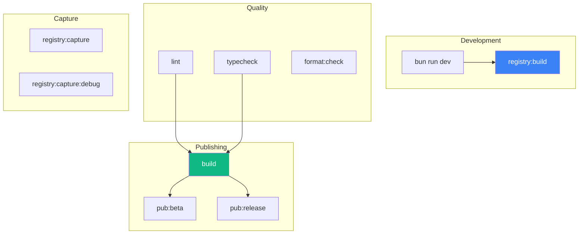
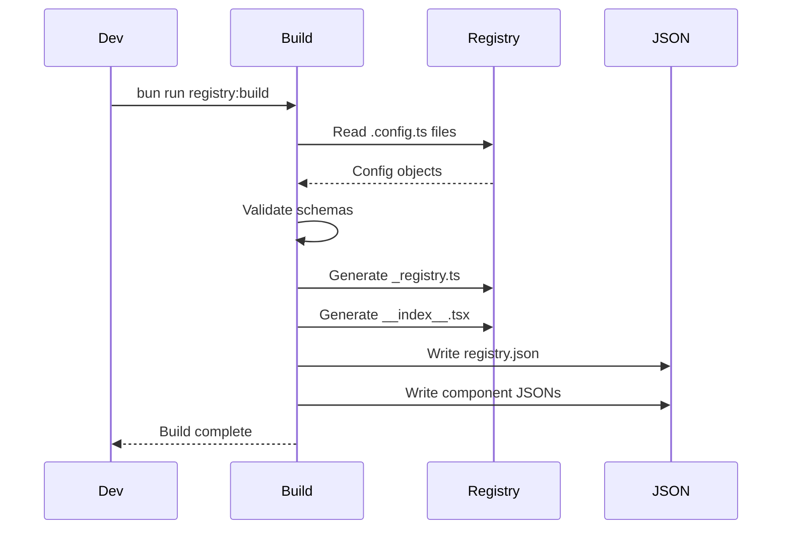
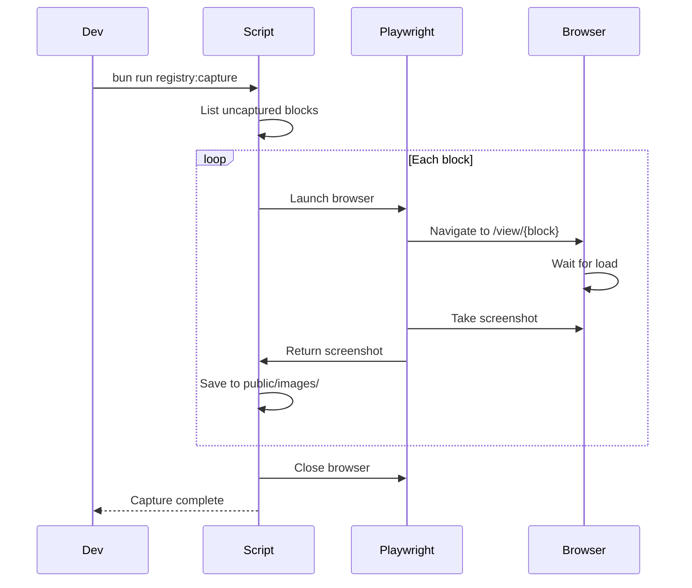
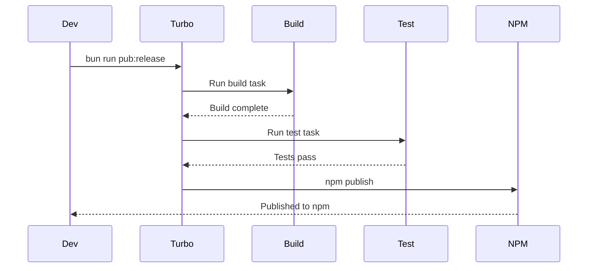

# Automated Workflows

> Scripts and automation for development, testing, and deployment

## Overview



---

## Registry Building

### Build Registry

```bash
bun run registry:build
```

**What it does:**
1. Reads all `.config.ts` files in registry directories
2. Generates `_registry.ts` barrel exports
3. Generates `__index__.tsx` with lazy component imports
4. Generates `registry.json` for CLI consumption
5. Generates `__blocks-metadata__.ts` for block viewer

**Output files:**
```
registry/new-york-v4/
├── _registry/
│   ├── _registry.ts      # Generated barrel exports
│   └── __blocks__.ts     # Block type exports
├── __index__.tsx         # Lazy component index
└── public/r/
    └── styles/
        └── new-york-v4/
            ├── registry.json
            ├── button.json
            └── ...
```

### Build with Capture

```bash
bun run registry:build -- --capture
```

Builds registry AND captures screenshots.

---

## Screenshot Capture

### Capture New/Changed Blocks

```bash
bun run registry:capture
```

**What it does:**
1. Lists all blocks in registry
2. Filters to only uncaptured blocks
3. Launches Playwright browser
4. Navigates to `/view/{block}` for each
5. Waits for full load
6. Takes screenshot
7. Saves to `public/images/blocks/`

### Force Recapture All

```bash
bun run registry:capture:force
```

Recaptures all blocks regardless of existing screenshots.

### Capture Specific Block

```bash
bun run registry:capture -- --name hero-plants-1
```

### Debug Mode

```bash
bun run registry:capture:debug
```

Runs with visible browser for debugging.

### Configuration

```typescript
const CAPTURE_CONFIG = {
  viewport: { width: 1280, height: 720 },
  deviceScaleFactor: 2,  // Retina quality
  timeout: 30000,
  baseUrl: "http://localhost:4000"
}
```

### Output Structure

```
public/images/blocks/
├── hero-plants-1.png
├── hero-fitness-1.png
├── features-1.png
├── pricing-1.png
└── ...
```

---

## Image Optimization

### WebP Conversion

Images should be in WebP format for optimal size:

```bash
# Convert PNG to WebP
cwebp -q 80 input.png -o output.webp

# Batch convert
for f in *.png; do cwebp -q 80 "$f" -o "${f%.png}.webp"; done
```

### Next.js Optimization

Images are automatically optimized by Next.js Image component:
- Automatic format selection (WebP/AVIF)
- Responsive srcset
- Lazy loading
- Blur placeholders

### Manual Optimization

```bash
# Optimize PNGs
optipng -o7 *.png

# Optimize JPGs
jpegoptim --max=80 *.jpg

# Resize images
convert input.png -resize 1280x720 output.png
```

---

## Code Quality

### Lint

```bash
bun run lint
```

Runs ESLint across all packages.

### Lint Fix

```bash
bun run lint:fix
```

Auto-fixes linting issues where possible.

### Type Check

```bash
bun run typecheck
```

Runs TypeScript type checking.

### Format Check

```bash
bun run format:check
```

Checks Prettier formatting without changes.

### Format Write

```bash
bun run format:write
```

Applies Prettier formatting.

### Full Check

```bash
bun run check
```

Runs lint + typecheck + format:check in parallel.

---

## Testing

### Run All Tests

```bash
bun run test
```

Runs all tests across packages.

### Run E2E Tests

```bash
bun run test:e2e
```

Requires dev server running.

### Run Specific Package Tests

```bash
cd packages/pitsi && bun run test
cd apps/v4 && bun test
```

### Watch Mode

```bash
bun test --watch
```

---

## Registry Validation

### Validate Registries

```bash
bun run validate:registries
```

**Checks performed:**
- Schema validation (Zod)
- File existence
- Dependency existence
- No duplicate names
- No circular dependencies

**Output:**
```
Validating registries...

  new-york-v4:
    ui: 52 items ✓
    blocks: 87 items ✓
    hooks: 8 items ✓
    lib: 3 items ✓
    examples: 45 items ✓

All registries valid!
```

---

## Publishing

### Beta Release

```bash
bun run pub:beta
```

Publishes CLI to npm with `beta` tag.

### Production Release

```bash
bun run pub:release
```

Publishes CLI to npm with `latest` tag.

### Manual Publish Flow

```bash
cd packages/pitsi
bun run build
bun run test
npm version patch  # or minor/major
npm publish
```

---

## Development Server

### Start All Dev Servers

```bash
bun run dev
```

Starts all apps in parallel using Turbo.

### Start V4 Only

```bash
bun run v4:dev
```

Starts v4 docs site on port 4000.

### Start CLI Watch

```bash
bun run pitsi:dev
```

Watches and rebuilds CLI on changes.

---

## Clean & Purge

### Purge Build Artifacts

```bash
bun run purge
```

**Removes:**
```bash
rm -rf .next
rm -rf public/r/styles/*/
rm -rf registry/__index__.tsx
rm -rf registry/__blocks__.json
rm -rf registry/__blocks-metadata__.ts
rm -rf node_modules/.cache
rm -rf .turbo
```

### Clean Install

```bash
rm -rf node_modules
bun install
```

---

## CI/CD Integration

### GitHub Actions Workflow

```yaml
name: Build

on: [push, pull_request]

jobs:
  build:
    runs-on: ubuntu-latest
    steps:
      - uses: actions/checkout@v4
      - uses: oven-sh/setup-bun@v1

      - run: bun install
      - run: bun run check
      - run: bun run build
      - run: bun run test
```

### Vercel Build

```json
{
  "buildCommand": "bun run registry:build && bun run build"
}
```

---

## Script Reference

| Script | Description |
|--------|-------------|
| `dev` | Start all dev servers |
| `v4:dev` | Start v4 docs site |
| `pitsi:dev` | Watch CLI |
| `build` | Build all packages |
| `v4:build` | Build v4 |
| `pitsi:build` | Build CLI |
| `lint` | Run ESLint |
| `lint:fix` | Fix lint issues |
| `typecheck` | Run TypeScript |
| `format:check` | Check formatting |
| `format:write` | Apply formatting |
| `check` | Full quality check |
| `test` | Run all tests |
| `registry:build` | Build registry |
| `registry:capture` | Capture screenshots |
| `registry:capture:force` | Force recapture |
| `registry:capture:debug` | Debug mode capture |
| `validate:registries` | Validate schemas |
| `purge` | Clean artifacts |
| `pub:beta` | Publish beta |
| `pub:release` | Publish release |

---

## Workflow Diagrams

### Registry Build Flow



### Capture Flow



### Release Flow


