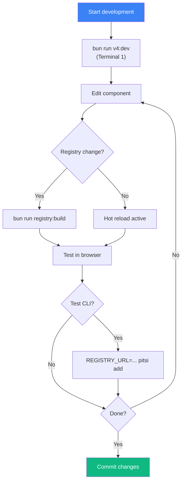

# Development Workflow

> How to set up and work with pitsi/ui locally

## Prerequisites

- **Bun** 1.1.38+ (package manager)
- **Node.js** 18+ (for compatibility)
- **Git**

---

## Initial Setup

### 1. Clone the Repository

```bash
git clone https://github.com/pitsi/ui.git pitsi-ui
cd pitsi-ui
```

### 2. Install Dependencies

```bash
bun install
```

### 3. Environment Variables

```bash
# Copy example env file
cp apps/v4/.env.example apps/v4/.env.local

# Edit with your values
# Required for full functionality:
# - DATABASE_URL (Postgres)
# - BETTER_AUTH_SECRET
# - GITHUB_CLIENT_ID/SECRET (OAuth)
# - GOOGLE_CLIENT_ID/SECRET (OAuth)
# - STRIPE_* (Payments)
```

### 4. Database Setup (Optional)

For authentication and subscriptions:

```bash
cd apps/v4
bun run db:push  # Push schema to database
```

---

## Development Servers

### Start All Services

```bash
bun run dev
```

This starts:
- **v4 docs site** on `http://localhost:4000`
- **CLI watch mode**

### Start Individual Services

```bash
# Docs site only
bun run v4:dev

# CLI watch mode
bun run pitsi:dev
```

---

## Common Tasks

### Testing CLI Against Local Registry

```bash
# In one terminal: start the docs site
bun run v4:dev

# In another terminal: use CLI with local registry
cd /tmp
mkdir test-project && cd test-project
npm init -y

# Set local registry and run CLI
REGISTRY_URL=http://localhost:4000/r bun run --cwd /path/to/pitsi-ui pitsi add button
```

### Building the Registry

After modifying components or registry definitions:

```bash
bun run registry:build
```

This:
1. Generates `_registry.ts` from `.config.ts` files
2. Builds `registry/__index__.tsx`
3. Generates `public/r/*.json`
4. Builds `__blocks-metadata__.ts`
5. Runs lint and format

### Running Tests

```bash
# All tests (requires v4:dev running)
bun run test

# CLI unit tests only
bun run pitsi:test

# v4 tests only
bun run v4:test
```

### Code Quality

```bash
# Run all checks
bun run check

# Individual checks
bun run lint
bun run typecheck
bun run format:check

# Fix issues
bun run lint:fix
bun run format:write
```

---

## Development Flow



---

## Project Structure Quick Reference

| Task | Location |
|------|----------|
| Add UI component | `apps/v4/registry/new-york-v4/ui/` |
| Add block | `apps/v4/registry/new-york-v4/blocks/` |
| Add hook | `apps/v4/registry/new-york-v4/hooks/` |
| Edit docs | `apps/v4/content/docs/` |
| Edit site component | `apps/v4/components/` |
| Edit utility | `apps/v4/lib/` |
| Edit CLI command | `packages/pitsi/src/commands/` |
| Edit registry schema | `packages/pitsi/src/registry/schema.ts` |

---

## Environment Variables Reference

### Required for Basic Development

None - the docs site works without any env vars.

### Required for Full Functionality

| Variable | Purpose |
|----------|---------|
| `DATABASE_URL` | Postgres connection string |
| `BETTER_AUTH_SECRET` | Auth secret key |
| `BETTER_AUTH_URL` | Auth callback URL |

### OAuth (Optional)

| Variable | Purpose |
|----------|---------|
| `GITHUB_CLIENT_ID` | GitHub OAuth |
| `GITHUB_CLIENT_SECRET` | GitHub OAuth |
| `GOOGLE_CLIENT_ID` | Google OAuth |
| `GOOGLE_CLIENT_SECRET` | Google OAuth |

### Payments (Optional)

| Variable | Purpose |
|----------|---------|
| `STRIPE_PUBLISHABLE_KEY` | Stripe public key |
| `STRIPE_PRIVATE_KEY` | Stripe secret key |
| `STRIPE_WEBHOOK_SECRET` | Webhook verification |

---

## Troubleshooting

### "Registry not found" when using CLI

Make sure you're:
1. Running `bun run v4:dev` first
2. Using `REGISTRY_URL=http://localhost:4000/r`
3. Running `bun run registry:build` after changes

### Type errors after pulling

```bash
bun run typecheck
# If errors persist:
rm -rf node_modules/.cache
bun install
```

### Port 4000 in use

```bash
# Find and kill process
lsof -i :4000
kill -9 <PID>
```

### Registry build fails

```bash
# Check for schema errors
bun run validate:registries

# Clean and rebuild
rm -rf apps/v4/public/r
bun run registry:build
```

---

## IDE Setup

### VS Code

Recommended extensions:
- **ESLint** - Linting
- **Prettier** - Formatting
- **Tailwind CSS IntelliSense** - Class completion
- **TypeScript Importer** - Auto imports

Settings (`.vscode/settings.json`):
```json
{
  "editor.formatOnSave": true,
  "editor.defaultFormatter": "esbenp.prettier-vscode",
  "editor.codeActionsOnSave": {
    "source.fixAll.eslint": true
  }
}
```

### Path Aliases

VS Code should auto-detect from `tsconfig.json`. If not, restart TS server:

`Cmd+Shift+P` → "TypeScript: Restart TS Server"

---

## Next Steps

- **[Adding a Component](./adding-component.md)** - Create your first component
- **[Publishing](./publishing.md)** - Release process
- **[Contributing](./contributing.md)** - Contribution guidelines
