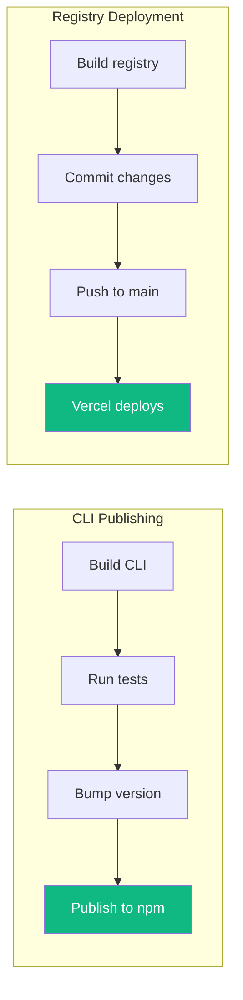
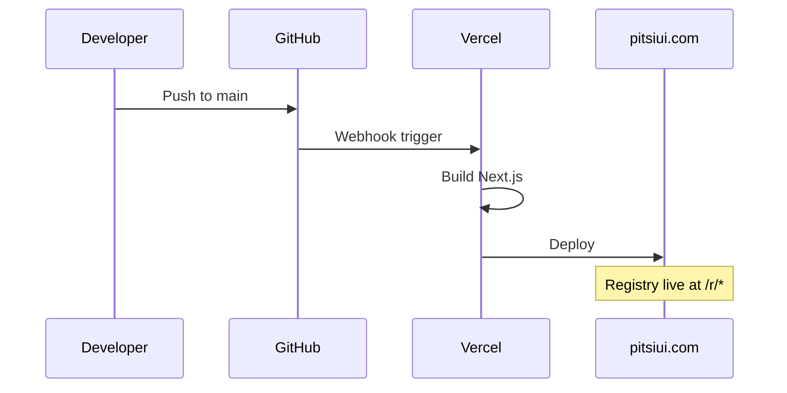

# Publishing

> How to publish the CLI and deploy registry updates

## Overview



---

## CLI Publishing

### 1. Prepare Release

```bash
# Ensure clean working directory
git status

# Build and test
bun run pitsi:build
bun run pitsi:test
```

### 2. Update Version

Edit `packages/pitsi/package.json`:

```json
{
  "version": "0.1.0"  // Bump appropriately
}
```

### Versioning Guidelines

| Change Type | Version Bump | Example |
|-------------|--------------|---------|
| Bug fix | Patch | 0.0.1 → 0.0.2 |
| New feature | Minor | 0.1.0 → 0.2.0 |
| Breaking change | Major | 0.1.0 → 1.0.0 |

### 3. Publish

#### Beta Release

```bash
bun run pub:beta
```

This publishes to npm with the `beta` tag:
- Users install with `npm install pitsi@beta`
- Won't affect `latest` tag

#### Production Release

```bash
bun run pub:release
```

This:
1. Builds the CLI
2. Runs tests
3. Publishes to npm as `latest`

### 4. Verify

```bash
# Check npm
npm view pitsi versions

# Test installation
npx pitsi@latest --version
```

---

## Registry Deployment

The registry is automatically deployed when changes are pushed to main.

### Manual Registry Build

```bash
# Build all registry files
bun run registry:build

# This generates:
# - public/r/styles/new-york-v4/*.json
# - registry/__index__.tsx
# - registry/__blocks-metadata__.ts
```

### Deployment Flow



### Verify Deployment

```bash
# Check registry is accessible
curl https://pitsiui.com/r/styles/new-york-v4/button.json

# Test with CLI
npx pitsi add button
```

---

## Release Checklist

### Before Publishing CLI

- [ ] All tests pass (`bun run pitsi:test`)
- [ ] Build succeeds (`bun run pitsi:build`)
- [ ] Version bumped in `package.json`
- [ ] Changelog updated (if applicable)
- [ ] No uncommitted changes

### Before Registry Deployment

- [ ] Registry builds without errors (`bun run registry:build`)
- [ ] All components validate (`bun run validate:registries`)
- [ ] Lint passes (`bun run lint`)
- [ ] Type check passes (`bun run typecheck`)

---

## Rollback Procedures

### CLI Rollback

If a bad version was published:

```bash
# Deprecate the bad version
npm deprecate pitsi@<bad-version> "Known issues, please use <good-version>"

# Or unpublish (within 72 hours)
npm unpublish pitsi@<bad-version>
```

### Registry Rollback

1. Go to Vercel dashboard
2. Find previous successful deployment
3. Click "Promote to Production"

Or via CLI:

```bash
# List deployments
vercel ls pitsiui

# Promote specific deployment
vercel promote <deployment-url>
```

---

## Environment Setup for Publishing

### npm Authentication

```bash
# Login to npm
npm login

# Verify
npm whoami
```

### Required Permissions

- npm publish access to `pitsi` package
- Push access to main branch
- Vercel team access (for manual deployments)

---

## Changesets (Optional)

For more structured releases, use changesets:

```bash
# Create changeset
bunx changeset

# Version packages
bunx changeset version

# Publish
bunx changeset publish
```

---

## Monitoring After Release

### Check npm Downloads

```bash
npm info pitsi
```

### Check for Issues

- GitHub Issues for bug reports
- npm downloads for adoption
- Error tracking (if configured)

### Common Post-Release Issues

| Issue | Resolution |
|-------|------------|
| "Module not found" | Check exports in package.json |
| "Version mismatch" | Clear npm cache: `npm cache clean --force` |
| "Registry not responding" | Check Vercel deployment status |
